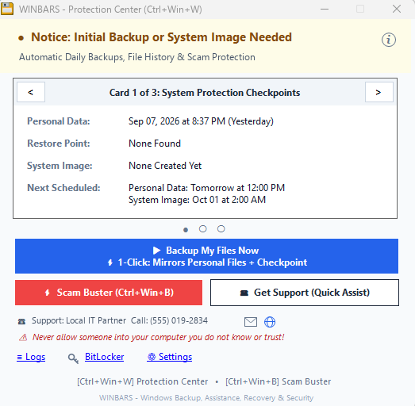
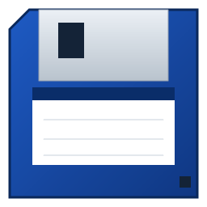
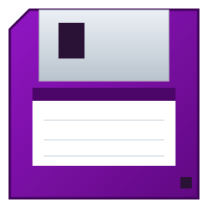

# WINBARS - Windows Backup, Assistance, Recovery & Security Suite (v0.9.5)
### *Built by a computer repair technician to prevent the disasters that bring customers back to the repair counter — 100% free, because peace of mind shouldn't cost a thing.*

<p align="center">
  <a href="https://github.com/remarkablepc/WINBARS/releases/latest"></a>
  <a href="https://microsoft.com"></a>
  <a href="https://microsoft.com"></a>
  
  
  
  
  <a href="https://www.paypal.com/ncp/payment/EKH76RTYHH24S"></a>
  <a href="https://github.com/sponsors/remarkablepc?utm_source=WINBARS"></a>
</p>

<p align="center">
  <a href="https://github.com/remarkablepc/WINBARS/releases/latest">
    
  </a>
</p>

<div align="center">

  **[📥 Download Complete Package (`WINBARS-v0.9.5.zip`)](https://github.com/remarkablepc/WINBARS/releases/latest)** &nbsp;&bull;&nbsp; **[📦 All Releases](https://github.com/remarkablepc/WINBARS/releases)** &nbsp;&bull;&nbsp; **[📜 Changelog](CHANGELOG.md)** &nbsp;&bull;&nbsp; **[📋 Release Notes](https://github.com/remarkablepc/WINBARS/releases/tag/v0.9.5)**

  <br>

  ✨ **[🍏 Non-Destructive "macOS-Style" Windows OS Refresh: Repair Windows without wiping C:\Users ➔](#macos-style-safe-overlay)**<br>
  🚨 **[🛡️ Scam Buster & RAT Interceptor: Instant Screen Unfreeze & Scam Defense ➔](#scambuster-rat-interceptor)**<br>
  🧰 **[🛠️ Boot-Failure Safety Net & Emergency Triage: 1-Click WinRE Rescue When Windows Won't Boot ➔](#boot-recovery-safety-net)**
</div>

---

> [!IMPORTANT]
> ### 💡 The Architectural Principle: Orchestration & Hardening, Not Proprietary Bloat
> WINBARS does not replace Windows with proprietary background bloatware or unproven file-sync daemons that lock your data behind recurring subscriptions. Microsoft Windows already contains 30 years of battle-tested, kernel-level recovery engines: **Robocopy, Volume Shadow Copies (VSS), DISM bare-metal imaging, wbadmin, and Task Scheduler**.
> 
> The fatal flaw has never been the native engines—it is that Windows leaves them uncoordinated and unmonitored: Windows Update silently disables File History, VSS writers crash without alert, restore points are throttled to once every 24 hours, and USB drive letter drift halts scheduled backups.
> 
> **WINBARS is the resilient orchestration and auto-healing layer that configures, schedules, monitors, and hardens these native Windows engines—ensuring your disaster recovery actually works when disaster strikes.**
>
> **WINBARS does not replace Windows recovery technologies. It makes sure they actually work when you need them.**
>
> 🛡️ **Zero Lock-In & Verifiable Host Footprint**: Every backup is 100% standard Windows files, native DISM `.wim` images, and raw VSS checkpoints—WINBARS is never required to restore your system. WINBARS installs 0 kernel drivers, 0 background services, and opens 0 network connections. See the [System Footprint & Security Audit Blueprint](docs/SYSTEM_FOOTPRINT.md).

<p align="center">
  
  <br>
  <em>WINBARS Protection Center Live Dashboard (Ctrl+Win+W), Floppy Tray Sentry, and Quick-Action Bar</em>
</p>

---

> [!TIP]
> ### 📦 100% Standalone Portable Executable (`WINBARS.exe`)
> WINBARS is distributed as a **single, self-contained standalone executable** (`WINBARS.exe`) with embedded floppy icon.
> - **Zero Runtimes / Zero Installers**: Requires no third-party runtimes, no Python, no Node, and no MSI installer. It runs natively using Windows 10/11 built-in PowerShell 5.1 and .NET WinForms.
> - **Run Portably or Provision Locally**: Run directly from a technician's USB thumb drive or portable folder, or provision permanently to `C:\Tools\WINBARS` with a single click.
> - **Flexible Footprint**: Choose between full interactive real-time protection (Mode 4), background automation (Modes 1–3), or strict **Agentless Zero-Footprint Mode (Mode 0)** leaving **0 resident third-party binaries and 0 background processes on `C:\`**.
> - **Transparent Audit Ledger (`deployment.log`)**: All configuration changes and uninstallation operations are streamed live to the console in green/yellow/red and appended to `deployment.log`.

---

## 📑 Table of Contents

0. [📜 Changelog & Version History](CHANGELOG.md)
1. [💔 Why WINBARS Was Born: 6 Real-World Nightmares](#why-winbars-was-born-6-real-world-nightmares)
2. [🛡️ How WINBARS Solves Each Problem](#how-winbars-solves-each-problem)
   - 🚨 **[Unique Defense: Scam Buster & Remote Access RAT Interceptor](#scambuster-rat-interceptor)**
   - 🧰 **[Unique Defense: Boot-Failure Safety Net & Emergency Recovery Triage](#boot-recovery-safety-net)**
3. [⚖️ Market Comparison: WINBARS vs. Legacy Backup Suites](#market-comparison-winbars-vs-legacy-backup-suites)
4. [💾 Floppy Tray Sentry & 1-Click Desktop Shortcuts](#floppy-tray-sentry--1-click-desktop-shortcuts)
5. [🚀 6 Deployment Profiles (Including Zero & Near-Zero Footprint)](#6-deployment-profiles-including-zero--near-zero-footprint)
   - 🍏 **[Unique Feature: Non-Destructive "macOS-Style" Windows OS Refresh (Safe Overlay)](#macos-style-safe-overlay)**
   - 📦 **[1-Click Custom Profile Batch Generator](#1-click-custom-profile-batch-generator)**
6. [📁 External Backup Drive & Deployment Media File Structure](#external-backup-drive--deployment-media-file-structure)
7. [❓ Frequently Asked Questions (FAQ)](#frequently-asked-questions-faq)
8. [👻 Deep Dive: The Zero-Footprint Architecture (0 Resident Files)](#deep-dive-the-zero-footprint-architecture-0-resident-files)
9. [🛡️ Enterprise Auditability & Tamper-Proof Architecture](#enterprise-auditability--tamper-proof-architecture)
10. [⌨️ Universal Global Hotkeys](#universal-global-hotkeys)
11. [🔒 Novice Protection & Technician Mode](#novice-protection--technician-mode)
12. [🚀 Quick Start & CLI Reference](#quick-start--cli-reference)
13. [🏷️ White-Labeling & Community Shop Sponsorship ($100 One-Time Token)](#white-labeling--community-shop-sponsorship-100-one-time-token)
14. [📚 Technical Documentation Directory](#technical-documentation-directory)
15. [📋 Technical Requirements](#technical-requirements)
16. [📜 Recent Highlights](#recent-highlights)
17. [⚖️ Legal & Process Interception Disclaimer](#legal--process-interception-disclaimer)
18. [📄 Software License (Closed-Source Freeware)](#software-license-closed-source-freeware)

---

## 💔 Why WINBARS Was Born: 6 Real-World Nightmares

If you have ever repaired Windows PCs for clients, friends, or family, you already know these six heartbreaking scenarios:

### 1. The "Windows 11 Silent File History Death"
> *"A customer’s hard drive died a year after upgrading to Windows 11, only to discover that **Microsoft had silently turned off File History during the upgrade with zero warning**. An entire year of irreplaceable family photos and business files was lost because Windows never said a word."*

### 2. *"There is NEVER a Restore Point When You Actually Need One!"*
> *"A bad update causes a blue screen, but System Restore is completely empty. Between Microsoft's arbitrary 24-hour throttling, silent shadow storage exhaustion, and Windows Update wiping old checkpoints, the restore point list is almost always a ghost town when disaster strikes."*

### 3. The "Surprise BitLocker" Catch-22
> *"New laptops now quietly encrypt themselves out of the box without handing the owner their 48-digit recovery key. When a routine BIOS update trips the TPM chip, the user is greeted by a blue lockout screen—and can't retrieve the key online because their two-factor authentication code is sent to the locked computer."*

### 4. The Phone Scam, Browser Siren & Remote Control Trap
> *"A full-screen popup freezes the screen with blaring audio sirens: 'VIRUS DETECTED — CALL MICROSOFT.' Panicked and unable to close the browser, everyday users call the number on screen and let offshore scammers connect via **UltraViewer, ScreenConnect, or AnyDesk**—tools so pervasive in scam call centers that UltraViewer's uninstaller literally asks: 'Did a scammer tell you to install this?' Victims watch helplessly as their bank accounts are drained while traditional antivirus sits completely silent."*

### 5. The "No Rescue USB When Windows Won't Boot" Catch-22
> *"When Windows gets stuck in a bootloop, every guide says: 'Insert your Recovery USB drive.' But everyday users never make a recovery drive while their PC is working—and once Windows refuses to boot, they can't create one. They are trapped simply because recovery tools were never pre-staged before the crash."*

### 6. The "Wipe & Reinstall" Trap: Losing Every App & Setting
> *"When Windows gets corrupted, the standard big-box verdict is always: 'Wipe the drive and start over.' Even if personal documents are saved, the user loses every installed program, customized preference, and printer driver—spending weeks hunting down lost software licenses and reinstalling their digital life."*

---

### 💬 A Note from the Creator: Dedicated to My Customers

> *"This project is dedicated to the many customers who have trusted me with their computers over the years.
>
> I didn't build WINBARS to sell a subscription, push cloud storage, or start a software company. I built it because after years of running a computer repair shop, I got tired of watching preventable computer disasters hurt good people.
>
> I watched families lose decades of photos because Windows silently stopped backing up. I watched people get locked out of their own laptops by surprise BitLocker prompts without a key. I watched perfectly healthy systems get wiped clean by big-box repair benches because there was no restore plan. And I watched terrified seniors lose money to scam call centers because Windows gave them no way to break out of a browser lockup.
>
> WINBARS is the tool I wished every customer already had running before they walked into my shop. It is completely free, closed-source freeware, with zero cloud telemetry and zero ads. If it saves your family photos, keeps you out of a scammer's hands, or saves you an expensive repair bill, it has done its job."*
>
> — **David Hewitt**, Creator of WINBARS (RemarkablePC)

> [!TIP]
> ### The Category: A Customer Disaster Protection Suite
> **Traditional security tools focus on malware. Traditional backup tools focus on scheduled jobs. WINBARS focuses on the human side.**
> 
> Most computer disasters that wipe out family photos, lock users out of their PCs with BitLocker, drain life savings to phone scammers, or trap systems in blue-screen bootloops aren't solved by an antivirus scanner or a generic file sync daemon.
> 
> WINBARS unifies **B**ackup, **A**ssistance, **R**ecovery, and **S**ecurity into a single resilient layer.
> 
> **It isn’t just trying to optimize a backup job. It’s trying to prevent tragic outcomes.**

---


## 🛡️ How WINBARS Solves Each Problem

Rather than trapping your data in fragile, proprietary backup formats, **WINBARS coordinates and hardens the native utilities already built into Windows**:

### 1. Automated System Restore Point Hardening
* **Always Unthrottled**: Disables Microsoft's 24-hour frequency throttling so checkpoints are created whenever requested.
* **Automatic Storage Management**: Automatically manages and allocates VSS shadow storage on `C:\` (15% capacity) so restore points are never purged prematurely.
* **Service Self-Healing**: Automatically tests and resets stuck VSS writers (`vssadmin list writers`) silently without disruption.
* **100% Personal File Safety**: System Restore reverts Windows system files, drivers, and registry hives. **Your personal documents, desktop files, photos, and downloads are never touched, overwritten, or deleted.**

### 2. Smart File Mirroring with 30-Day Accidental Deletion Protection
* **Multi-Threaded Robocopy Engine**: Uses native, unbuffered `robocopy.exe /ZB /MT:8` as the primary file backup engine, superseding deprecated File History.
* **Clean 1:1 Folder Mirror**: Backs up your files directly to `D:\WINBARS_Backup\UserBackups\` with original filenames and folder structures intact.
* **30-Day Safety Recycle Bin (`_DeletedArchive`)**: If you delete or rename a file on your computer, WINBARS moves the previous backup copy into an isolated 30-day safety folder before mirroring. Accidental deletions can be restored with a single click.
* **Multi-User Account Protection**: Automatically backs up all user accounts on the machine (`C:\Users`), not just the active user.

### 3. Browser Profile & Desktop Email Preservation
* **100% Local Continuity**: Preserves bookmarks, extensions, and local configuration for Google Chrome, Microsoft Edge, Mozilla Firefox, Brave, and other Gecko/Chromium browsers.
* **Desktop Mail Protection**: Automatically captures Microsoft Outlook local `.pst` archives and Mozilla Thunderbird mailbox stores.
* **Privacy Guarantee**: Data is stored **100% locally on your backup drive**. WINBARS never reads, decrypts, uploads, or transmits personal browsing history or account passwords to any cloud service.

### 4. BitLocker Recovery Card & Emergency Vault
* **Printable Emergency Card (`BitLocker_Emergency_Card.html`)**: Generates a clean, segmented, easy-to-read emergency card containing your exact 48-digit BitLocker recovery key so you are never locked out.
* **AES-256 Disaster Vault**: Securely archives recovery keys to `D:\WINBARS_Backup\BitLocker_Keys\BitLocker_Vault.enc` using PBKDF2 (100,000 iterations) and HMAC-SHA256.
* **1-Click WinRE / WinPE Unlock**: If a PC fails to boot, enter your Windows user password in the WinRE recovery console to unlock `C:\` and temporarily suspend BitLocker for one reboot, bypassing the 48-digit prompt.

<a id="scambuster-rat-interceptor"></a>
### 5. Scam Buster & Remote Access Interceptor
* **Instant Scam Freeze (`Ctrl + Win + B` or `Ctrl + Win + K`)**: Immediately closes rogue full-screen browser traps across 25+ browsers, silences audio sirens, and clears session crash reload loops.
* **Real-Time Remote Access Interceptor**: Continuously monitors for 25+ remote access tools frequently weaponized by phone and pop-up scammers (AnyDesk, TeamViewer, ScreenConnect, UltraViewer, RustDesk, LogMeIn, SupRemo, etc.). When a remote tool launches, an urgent interception dialog appears with 4 user choices:
  1. **`[STOP] Disconnect & Block`**: Instantly kills the remote software process and drops the connection immediately.
  2. **`Allow Once`**: Grants temporary permission for the current session only without persisting changes.
  3. **`Always Allow (Whitelist)`**: Permanently whitelists the application on this machine so authorized tools (e.g. corporate IT) launch without prompts.
  4. **`Snooze 2 Hrs (Tech Working)`**: Temporarily mutes the interceptor for 120 minutes while a trusted repair technician performs service, automatically re-arming sentry mode once the timer elapses.
* **Notification Spam Defuser**: Surgically purges rogue Web Push notification subscriptions from scam domains without affecting legitimate notifications (Gmail, calendar, news).
* **Architecture Note on Profiles**: The active real-time ScamBuster and Remote Tool Interceptor sentry runs continuously in **Profile 4 (`FullInteractive`)**. In **Profiles 1–3 and Zero-Footprint**, the system maintains **0 resident background processes**; ScamBuster can be triggered on-demand via shortcut, hotkey, or directly from the technician's USB drive.

### 6. OneDrive Alert Guard & Local Folder Protection
* **Silences Deceptive "Not Backed Up" Scare Banners**: Windows 10 and 11 frequently inject confusing yellow and red warning cards in Windows Settings Home and File Explorer claiming your PC is "not backed up" simply because you do not pay for a Microsoft OneDrive cloud subscription. WINBARS defuses these banners so clients and family members are never misled.
* **Blocks Known Folder Move (KFM) Hijacking**: OneDrive periodically displays aggressive wizards urging users to "back up" their Desktop, Documents, and Pictures. If clicked, OneDrive silently diverts local folders into Microsoft's free 5 GB cloud container, quickly runs out of space, and begins holding file saving hostage behind a Microsoft 365 paywall. WINBARS enforces `KFMBlockOptIn = 1` to halt these takeover prompts.
* **100% Non-Destructive**: Normal OneDrive file synchronization is never disabled or broken. Users who legitimately use OneDrive for school, work, or team sharing continue to enjoy full functionality. Only deceptive upsell banners, library hijacking, and takeover prompts are silenced.
* **Deployment Profile Rules**: **Enabled by default across ALL deployment modes (Modes 0 through 4 and Custom Profiles)**, because every mode provides complete, verified WINBARS protection. Mode 0 (`ZeroFootprint`) maintains its strict 0-file guarantee because registry policies place **0 executable files on disk**. Technicians can toggle it `[OFF]` via key `[0]` on the Pre-Flight screen if desired.

### 7. Master Baseline Checkpoints & Bare-Metal Images (`SystemImage_OS_and_Programs_*.wim`)
* **Universal "OS & Programs Only" Architecture**: All system images captured by WINBARS are explicitly labeled `SystemImage_OS_and_Programs_YYYY-MM-DD_HHmm.wim` (and `..._baseline.wim`), with internal DISM metadata stating *"Windows & Programs Only (OS/Drivers/Apps)"*. This completely prevents the dangerous bench assumption that personal user data is trapped inside a monolithic WIM container.
* **Dual-Layer Speed & Safety Split**:
  - **The WIM Container**: Captures Windows OS, drivers, `Program Files`, `ProgramData`, and user registry hives (`NTUSER.DAT`, `AppData\Roaming`), creating a clean, bootable 15–25 GB image.
  - **The Open File Vault**: Client personal data (Desktop, Documents, Pictures, Videos, Downloads) is mirrored 1:1 via multi-threaded Robocopy into `\Users\` on the external backup drive, uncompressed, browsable, and immediately drag-and-drop restorable on any PC, Mac, or Linux computer.
* **Critical Technician Safeguard (Double-Confirmation WinPE Restore)**: When applying a system image in WinPE via `Apply-SystemImage_WinPE.bat`, the recovery assistant enforces a **two-step confirmation protocol**:
  1. `STEP 1/2`: Prompts the technician to confirm they have verified or backed up existing `C:\Users` client files to external storage.
  2. `STEP 2/2`: Requests explicit `YES` confirmation before re-formatting or applying the image to target drive `C:\`.
* **Turnkey Offline Rescue Suite on Every Backup Drive**:
  - `README_RECOVERY.txt`: Emergency triage "Start Here" box with step-by-step restoration procedures.
  - `HOW_TO_RESTORE.html`: A beautifully styled, zero-dependency offline HTML guide that non-technical users can double-click on any working computer or mobile phone.
  - `Create-RescueUSB.bat`: An automated tool sitting on the backup drive root that turns any blank 4GB+ USB drive into a dedicated UEFI-bootable Windows recovery drive.
* **Technician Hardware & Driver Staging**: Before attempting risky hardware or driver replacements (such as conflicting I2C HID touchscreen/touchpad drivers, GPU firmware updates, or network stack overrides), technicians can capture a dedicated **Baseline System Restore Point** (`WINBARS.exe -Action RestorePoint -Baseline -Description "Pre-I2C Driver Fix"`).
* **`[📌 BASELINE]` Visual Badging**: Baseline checkpoints are explicitly badged across all WINBARS repair menus and the WinRE blue screen recovery console, ensuring technicians can immediately identify known-good master states before testing experimental vendor drivers.
* **VSS Shadow Headroom Expansion**: Baseline creation automatically sizes the VSS shadow quota (15%) and instructs WINBARS retention routines to skip the baseline during FIFO pruning to maximize checkpoint longevity.
* **Permanent Master Setup Images**: Images tagged with `-Baseline` are permanently immune to automated retention pruning on both `C:\SystemImages` and external storage, providing an indestructible factory rollback target even after major Windows OS feature updates.

<a id="boot-recovery-safety-net"></a>
### 8. Boot-Failure Safety Net & Unified Emergency Recovery Triage
* **The Real-World Boot Failure Dilemma**: When a PC gets stuck in a blue-screen loop, online manuals instruct users to "boot from your recovery USB". But in reality, everyday users never create a recovery drive ahead of time, and once Windows refuses to boot, they cannot create one on the dead machine. Furthermore, the classic `F8` Safe Mode key was disabled by Microsoft over a decade ago in Windows 8, 10, and 11 to achieve fast boot times.
* **Automatic Native WinRE Pre-Staging**: WINBARS guarantees that recovery tools are pre-staged directly into the Windows Recovery Environment (WinRE) on the host disk before disaster strikes. Even if Windows fails to boot, crashes in a blue-screen loop, or cannot start, the native recovery partition already holds the tools needed to roll back.
* **1-Click Next-Boot WinRE Trigger (`reagentc /boottore`)**:
  * If a client reports instability, system sluggishness, or a driver glitch, a single click or command (`WINBARS.exe -BootRecoveryMenu` or `EMERGENCY_RECOVERY.bat`) arms `reagentc /boottore`.
  * The computer reboots **directly into the Windows Recovery Environment on the very next start**, and automatically returns to normal fast boot afterward. Zero USB needed, zero BIOS menu navigation, and zero scary permanent boot menus.
* **Boot-Failure Safety Net Toggles (Technician Control)**:
  * **2-Second Boot Manager Menu (`-EnableBootMenu` / `-DisableBootMenu`)**: Adds a brief 2-second countdown to the Windows Boot Manager (`{bootmgr}`) offering a direct prompt to press `F8` or enter Advanced Options if Windows ever hangs.
  * **Legacy F8 Boot Policy (`-EnableLegacyF8` / `-DisableLegacyF8`)**: Restores the classic `F8` prompt on startup (`bootmenupolicy Legacy`).
  * **Safe-by-Default Design**: Both toggles remain **OFF by default** during standard client deployments. Everyday non-technical users are terrified by unexpected boot screens and prompt screens on morning startup. Technicians can toggle either option anytime via the CLI or Pre-Flight menu for volatile test hardware or high-risk driver experiments.
* **Unified Emergency Recovery Triage (`EMERGENCY_RECOVERY.bat`)**:
  * **One Unmissable Entry Point**: Instead of scattering 8 conflicting batch files on the backup drive, the drive root contains a single, guided rescue launcher: `EMERGENCY_RECOVERY.bat` (and companion `RECOVERY_START_HERE.bat`).
  * **Live Windows & WinPE Dual-Context Support**: Whether double-clicked on a live secondary PC or launched from a WinPE Command Prompt (`Shift + F10`), the launcher dynamically adapts.
  * **Intelligent Diagnostic Pre-Flight**:
    1. *Windows Partition Detection*: Tests drive letters for `\Windows\System32\ntoskrnl.exe` to find the true OS drive, avoiding WinPE `X:\` or shifted drive confusion.
    2. *S.M.A.R.T. Physical Disk Health*: Queries physical drive status (`wmic diskdrive get status` / PowerShell) to warn if the internal drive is physically dying before attempting software repairs.
    3. *BCD Bootloader Audit & Auto-Rebuild*: Tests whether the Boot Configuration Data store is intact; if damaged or missing, offers a 1-click `bcdboot <WinDrive>:\Windows` rebuild.
    4. *WinRE Status & Self-Healing*: Checks if WinRE is enabled; if disabled, auto-enables via `reagentc /enable` and provides the 1-click `/boottore` launch option.
    5. *Guided Recovery Ladder*: Directs the technician or user to the least invasive fix: System Restore $\rightarrow$ Registry Rollback $\rightarrow$ BCD Rebuild $\rightarrow$ Non-Destructive Safe Overlay OS Refresh $\rightarrow$ Bare-Metal Wipe.

---

### 🔧 Technical Resiliency Engine: 5 Failure-Mode Defenses

To guarantee enterprise-grade survivability without bloated third-party drivers or black-box agents, WINBARS incorporates five specialized defensive engineering patterns:

1. **Mid-Sync Disconnect Defense (USB Yank / Sudden Power Loss)**:
   - **Atomic Staging (Write-Temp-Then-Swap)**: All JSON configurations, manifests, and telemetry are written to .tmp.<guid>, verified for byte-size, and swapped atomically (Set-WinbarsAtomicFile in PowerShell, WinbarsIO.SafeWriteAllText in C#).
   - **Robocopy Restartable Mode (/ZB)**: Uses packet-level restartable mode with automatic backup token fallback. If a 40 GB Outlook .pst or virtual disk is disconnected mid-stream, Robocopy resumes from the exact packet on the next pass rather than restarting from zero.
   - **Transaction Canary (.winbars_sync_in_progress)**: Dropped at the target drive root before mirroring starts. If an abrupt disconnect occurs, WINBARS detects the canary on the next boot, alerts the desktop, and executes a full recovery sweep.

2. **Orphaned VSS & Junction Point Hygiene**:
   - **Strict try/finally Lifecycle**: Snapshot creation, junction mounts (C:\ProgramData\WINBARS\VssMount_*), read routing, and teardowns are enclosed in an unskippable try { ... } finally { Dismount-Vss; Remove-Canary } construct.
   - **Startup Garbage Collector (Clean-OrphanedVssMounts)**: Proactively scans for and unmounts lingering directory junctions via native cmd /c rmdir, and purges unmanaged temporary shadow copies older than 24 hours.
   - **Native COM Self-Repair (Repair-WinbarsVssSubsystem)**: If third-party backup software leaves broken COM provider keys, WINBARS re-registers native Windows VSS DLLs (ole32.dll, vss_ps.dll, swprv.dll) in-memory without requiring an OS reboot.

3. **Process Locking & Migration Data Clash Shield**:
   - **Frozen VSS Snapshot Reads**: Bypasses live locks on open Outlook PSTs, Edge/Chrome databases, and Word/Excel documents during backups.
   - **Test-ConflictingProcessesForRestore**: Before restoring browser profiles, email stores, or AppData, WINBARS intercepts running applications (chrome, msedge, firefox, outlook, thunderbird, excel, winword, qbw32) and prompts for clean shutdown to eliminate silent SQLite/PST corruption.

4. **Drive Letter Drift & Volume Collision Immunity**:
   - **6-Tier Hardware Auto-Discovery Hierarchy**: Dynamically resolves target drives across reboots and USB hub changes (Volume GUID -> Serial -> Label -> Directory Structure -> Preferred Letter -> First Ready External). Never breaks when Windows shifts D: to E:.

5. **Silent Task Failure Defense Under SYSTEM**:
   - **Windows Application Event Log**: Automatically logs Event IDs 1001 (Success), 1002 (Failure), and 1003 (Warning) directly under Source WINBARS in eventvwr.msc.
   - **Session 0 to Desktop IPC Incident Queue**: Background scheduled tasks write structured failure telemetry to incidents.json. The user-session desktop Tray Sentry polls this queue and triggers native Windows balloon/toast notifications (notifyIcon.ShowBalloonTip).
   - **Remote SMB / UNC & Cloud Canary Mirroring**: Verifies unbuffered .winbars_remote_canary.sha256 tokens on network NAS targets, disconnecting the share (net use ... /delete) if tampering is detected to halt ransomware lateral spread.

---

## ⚖️ Market Comparison: WINBARS vs. Legacy Backup Suites

| Feature / Capability | WINBARS (v0.9.5) | Proprietary Suites (Acronis, Macrium, Veeam) | Windows Native Alone |
| :--- | :---: | :---: | :---: |
| **Pricing & Licensing** | **100% Free** *(+$100 Lifetime Shop Branding)* | $50–$189/yr per PC (Subscription / Paid) | Included with Windows |
| **Architectural Model** | **100% Native OS Engines** (Zero Resident) | Heavy Background Daemons & Filter Drivers | Native Windows |
| **Vendor File Lock-In** | **Zero Lock-In** (1:1 NTFS Mirror + `.wim`) | **Total Lock-In** (`.tibx`, `.mrimg`, `.vbk`) | None (Timestamp suffixes) |
| **Restore Without Software** | ✅ **Drag-and-drop on any PC / Mac / Linux** | ❌ Requires proprietary software installed | ⚠️ Partial (Catalog dependent) |
| **Resident RAM Footprint** | **0 MB** *(Modes 0, N, 1)* / **~15–18 MB** *(Modes 2–4 with Hotkey/Sentry)* | ~120 MB – 1.2 GB (Multiple background daemons) | Dynamic OS Cache |
| **Kernel Drivers & BSOD Risk** | **Zero Kernel Drivers** (100% Native Win32 API) | ⚠️ High Risk (CBT filter drivers cause upgrade BSODs) | Native Windows Drivers |
| **Agentless Zero-Footprint** | ✅ **Supported (Mode 0 & 1)**: 0 resident software on host | ❌ Impossible (Requires agent installation) | ❌ Not available |
| **Crash & Yank Safety** | ✅ **Atomic Staging + Robocopy `/ZB` + Canary** | Proprietary Journaling (Index corruption risk) | ❌ Truncates open PST/DBs |
| **VSS Self-Healing** | ✅ **Frozen Snapshot Junctions + Auto COM Repair** | Proprietary VSS Provider (Fails silently on crash) | ⚠️ Fragile (Silent failure) |
| **Storage Agnostic** | ✅ **USB, Internal SSD, NAS / UNC, & Cloud Folders (Dropbox/Drive)** | Proprietary Cloud or Local Containers | USB / Dedicated Share |
| **Ransomware Canary Defense**| ✅ **Dual-Layer Honeypot + SHA-256 Tripwire** | Behavioral Scanner (High false positives) | None |
| **Scam & Siren Shield** | ✅ **Built-in ScamBuster (`Ctrl + Win + B`)** | ❌ None | ❌ None |
| **Remote RAT Interceptor** | ✅ **Detects & Blocks AnyDesk, TeamViewer, RustDesk** | ❌ None | ❌ Blindspot (Signed tools allowed) |
| **Drive Letter Drift Shield** | ✅ **6-Tier Auto-Discovery (`D:` $\rightarrow$ `E:`)** | ⚠️ Halts until manually reconfigured | ❌ Completely halts backups |
| **Shop Branding for Techs** | ✅ **1-Time $100 Lifetime Token** (Unlimited PCs) | ❌ MSP tiers cost $10k+ / year | ❌ None |

#### 🔑 Key Takeaways:
1. **Vs. Macrium Reflect & Acronis Cyber Protect**:
   * *The Problem*: Legacy backup giants lock your irreplaceable files inside massive, proprietary container files (`.mrimg` or `.tibx`). If the software license lapses, or if the container suffers a 1-byte CRC corruption, your entire backup is lost. Furthermore, their kernel filter drivers frequently cause boot-loop Blue Screens after major Windows 11 feature upgrades.
   * *The WINBARS Advantage*: WINBARS creates transparent, standard 1:1 file mirrors and native Microsoft `.wim` images. You can plug your external hard drive into **any computer on earth** and immediately browse, copy, and restore your files in Windows Explorer or macOS Finder without installing a single piece of software.
2. **Vs. Native Windows Tools Alone**:
   * *The Problem*: Windows includes File History, System Restore, and `wbadmin`, but Microsoft has left them unmaintained. File History was silently disabled in Windows 11 upgrades without notifying users; System Restore is throttled to once every 24 hours; VSS writers lock up; and external drive letter changes (`D:` moving to `E:`) silently cause backups to fail indefinitely.
   * *The WINBARS Advantage*: WINBARS acts as the intelligent conductor: it self-heals VSS writers, removes the 24-hour throttle, guarantees shadow storage headroom, auto-discovers shifted drive letters, and safely preserves deleted files in a 30-day safety recycle bin.
3. **The Tech-Scam Blindspot (Why WINBARS Complements, Not Replaces, Antivirus)**:
   * *Important Distinction*: **WINBARS is not an antivirus or anti-malware suite, and it does not replace Windows Defender or your existing AV software.** Instead, it defends against an entirely different threat vector that antivirus engines fundamentally cannot address: social engineering and weaponized legitimate tools.
   * *The Problem*: Modern phone scammers and pop-up boiler rooms **do not use malware or viruses**. They create full-screen browser traps with blaring audio sirens, convincing victims to call a toll-free number. The scammer instructs the victim to download legitimate, digitally signed commercial remote support tools (UltraViewer, ScreenConnect, AnyDesk, TeamViewer). Because these tools are legitimate and digitally signed, antivirus software correctly permits them.
   * *The WINBARS Sentry Layer*: WINBARS operates as an assistive safety layer alongside your antivirus: an instant browser freeze hotkey (`Ctrl+Win+B`) that terminates locking browser processes, silences audio sirens across 25+ browsers, and clears Chromium crash-recovery flags to prevent reload loops on restart, plus a real-time Remote Access Interceptor that catches AnyDesk/UltraViewer launches and gives the user an unmistakable **`[STOP] Disconnect & Block`** button.
4. **The Cloud Strategy (Zero IAM / API Key Friction)**:
   * *The Problem*: Legacy backup tools claim "cloud backup" by forcing users through enterprise AWS S3, Wasabi, or Azure portals—demanding 40-character secret keys, complex IAM bucket permissions, and monthly billing for API requests and egress. If a credit card expires, backups stop silently.
   * *The WINBARS Advantage*: Almost every home and business client already has **Dropbox, Google Drive, Microsoft OneDrive, or Sync.com** installed. By simply pointing a WINBARS backup destination to your local cloud sync folder (e.g. `D:\Dropbox\Backups`), the official cloud client handles encrypted off-site transport, delta chunking, and mobile access automatically. **Zero secret keys, zero IAM policies, and zero extra bills.**

---

## 💾 Floppy Tray Sentry & 1-Click Desktop Shortcuts

The background system tray icon renders a classic floppy disk that dynamically changes color to reflect system status at a glance:

| Tray Floppy | State Name | What It Means |
| :---: | :--- | :--- |
|  🟢 | **Emerald Green** | **All Systems Protected**: Daily restore points active, file backups up to date, and canaries intact. |
|  🟣 | **Signature Purple** | **Backup or Sync in Progress (Action Color)**: Purple is the suite's signature action color. Indicates an active file mirror, system restore point creation, or system image capture. Returns to 🟢 when complete. |
|  🔵 | **Classic Blue** | **Protection Center / Ready**: Idle state for the Protection Center and desktop utilities. |
|  🟡 | **Amber Gold** | **Notice / Local Mode**: External backup drive is unplugged (local snapshot active) or backup is due. |
|  🔴 | **Crimson Red** | **Attention Required**: S.M.A.R.T. drive degradation, NTFS bad block event, or service failure. |

### 🖥️ 1-Click Desktop Shortcuts

#### Managed Suite Profiles (Installed Mode)
When deployed in Managed mode (`FullInteractive`), WINBARS provisions up to 4 self-elevating desktop shortcuts:
* **`WINBARS Protection Center` ( **Classic Blue Floppy Disk**)**:
  * Opens the live System Health dashboard displaying backup status, restore points, S.M.A.R.T. disk telemetry, and BitLocker keys.
* **`Backup Personal Data` ( **Signature Purple Floppy Disk**)**:
  * Double-clicking immediately launches the **Dual Progress Bar Window** (Overall Completion 0–100% + Active Step Progress) for an on-demand personal file and profile mirror pass.
* **`Create System Restore Point` (🛡️ Windows Security Shield)**:
  * Immediately captures an unthrottled System Restore Point with native toast confirmation.
* **`Create System Image` (💽 System Drive Image)**:
  * Immediately launches DISM bare-metal system imaging.

#### Near-Zero Footprint Profile (Stealth Native Automation)
When deployed in Near-Zero Footprint mode (`[N]`), WINBARS leaves **0 background EXEs or running daemons** on the target PC while giving the customer standard, unbranded desktop links:
* **`Backup Personal Files` ( **Signature Purple Floppy Disk**)**: Triggers native robocopy sync pass.
* **`Windows System Restore` ( **Classic Blue Floppy Disk**)**: Launches native `rstrui.exe` for instant OS rollback.
* **`Browse Backup Files` (📁 Windows Folder Icon)**: Double-clicking dynamically resolves the backup drive letter and opens Windows File Explorer directly into the backed-up `Users` folder. Users can easily browse and drag-and-drop restored files with zero third-party tools.
* **Start Menu Folder (`System Backup & Recovery`)**: Generic unbranded Start Menu group containing 5 native Windows tools (*Backup Personal Files*, *Windows System Restore*, *Create System Image*, *Browse Backup Files*, *All-In-One Backup & Recovery*). For business and corporate clients where third-party utility branding is restricted. Uses 100% native Windows Task Scheduler and generic shortcuts (`System Backup & Recovery`) so the automation blends seamlessly into Windows as a built-in system capability.

#### Agentless Zero-Footprint Profile (Mode 0 — Pure Native Mode)
When deployed in Agentless Zero-Footprint mode (`[0]`), WINBARS leaves **0 resident binaries or background daemons on `C:\`**. All scheduled backup tasks execute autonomously via native Windows Task Scheduler (`robocopy.exe`, `wbadmin.exe`, VSS), requiring **zero resident software and no USB drive to remain connected**. On-demand technician tasks and configuration adjustments can be run at any time directly from the technician's portable USB drive.

### ⚙️ Modern Tabbed Settings & Protection Console (Tray Sentry)

Accessible by clicking the **Gear icon** in the Floating Quick-Action Bar or selecting **Protection Settings...** from the Tray Sentry menu:

```
┌─ WINBARS — Settings & Protection Console ───────────────────────────────┐
│ [>>] Active Profile: [Mode 4 — Total Protection (Full Sentry + Tray)]   │
├─────────────────────────────────────────────────────────────────────────┤
│ [ General ]  [ Schedules ]  [ Disk Management ]                         │
├─────────────────────────────────────────────────────────────────────────┤
│ GENERAL TAB:                                                            │
│   • [v] Show System Tray Icon in taskbar notification area              │
│         (Tip: When hidden, Ctrl+Win+W or relaunch WINBARS to restore)   │
│         • Mode 0/N Guardrail: Disabled/Locked to preserve 0 host files  │
│         • Mode 3 <-> 4 Bridge: Checking elevates to Mode 4; unchecking  │
│           cleanly returns profile to Mode 3 (Headless Full)             │
│   • [v] Enable Floating Quick-Action Bar on tray click                  │
│   • Notification Level: [ Warnings & Errors Only (Recommended — Quiet) ]│
│     [!] Security Guardrail: Warnings and error alerts cannot be disabled│
│   • [v] Enable audible alarms for critical ransomware & security alerts │
│                                                                         │
│ SCHEDULES TAB (Timing Adjustments Only — Never Disables):               │
│   • Restore Point Time (HH:mm) & Cadence (Daily / 3-Day / Weekly)       │
│   • Daily File Sync / FileHistory Mirror Time (HH:mm)                   │
│   • Bare-Metal DISM System Image Time (HH:mm) & Monthly Day (1–28)      │
│   • Auto-Sync: Saving immediately refreshes Windows Task Scheduler      │
│                                                                         │
│ DISK MANAGEMENT TAB (With 1-Drive Minimum Guardrail):                   │
│   • Interactive ListView: Target Path, Label, Role (Primary), Status    │
│   • Add Destination: Supports drive letters (E:) and paths (E:\Backups) │
│     • Mode 1/2 Elevation: Adding a destination prompts to enable file   │
│       sync and elevates profile to Mode 4 (or Mode 3 if headless)       │
│   • Set as Primary: Promotes any selected destination to Primary        │
│   • Remove Destination: Guardrail prevents removing the final drive     │
│     (Technician override permitted in Tech Mode with warning prompt)    │
│   • Silent Local Fallback: If no drive attached, bare-metal images save │
│     silently to C:\SystemImages without false-alarm warning toasts      │
└─────────────────────────────────────────────────────────────────────────┘
```

#### 🛡️ Built-in Security Guardrails & Fallbacks:
1. **Never-Mute Guardrail for Errors & Warnings**: Standard settings strictly prohibit turning off warning or error alerts. Users can select between *Warnings & Errors Only (Recommended — Quiet)* and *All Notifications (Detailed)*, eliminating dangerous silent failure traps.
2. **System Tray Icon Visibility Toggle**: Users who prefer a clean notification area can hide the tray icon. The sentry displays a confirmation reminding them of the `Ctrl+Win+W` universal hotkey, while background scheduling, hotkey interceptors, and USB patrols remain active.
3. **1-Drive Minimum Guardrail & Technician Override**: Ordinary users cannot delete the last configured backup drive. In Tech Mode (or via CLI `-RemoveBackupDrive "D:" -Force`), technicians can clear drives when decommissioning or re-imaging a machine.
4. **Silent Bare-Metal Local Fallback (`C:\SystemImages`)**: If no secondary or external drive is attached during a scheduled image pass, WINBARS captures the bare-metal DISM image cleanly to `C:\SystemImages` at `INFO` level without raising false-alarm warning toasts.
5. **Frozen VSS Snapshot Capture**: Bare-metal DISM captures are bound to a temporary Volume Shadow Copy mount (`New-VssSnapshotMount`), guaranteeing 100% crash consistency and completely bypassing open-file lock collisions.


### 📊 Smart On-Demand Progress Engine
* **Desktop Shortcut**: Shows the live Dual Progress Bar immediately from start to finish (`-ShowProgress`).
* **Tray Menu & Automated Backups**: Run quietly in the background without stealing window focus. The tray icon turns **🟣 Purple**, and the top menu item dynamically shows `🟣 Status: Backup in Progress (X%)... Click to Show`. Clicking it opens the progress window on demand.

---

### 🚀 6 Deployment Profiles: The Two-Tier Architecture Split

WINBARS is architecturally divided into two distinct tiers: **Native Windows Modes (0, N, 1)** that leave **zero installed software and zero resident third-party EXEs** on the host PC, and **Managed Suite Modes (2, 3, 4)** that provision the local utility (`C:\Tools\WINBARS`) with desktop shortcuts and sentry integration:

| Deployment Tier | Profile & Mode | Scope & Host Footprint | Key Capabilities & Targets |
| :--- | :--- | :--- | :--- |
| **Tier 1: Native Windows / Zero-Software**<br>*(0 Resident Third-Party EXEs)* | **Mode 0: ZeroFootprint** | Strict corporate compliance; 0 resident files on `C:\` | 100% native Windows Task Scheduler (`robocopy`, `wbadmin`, VSS) running from external backup media. |
| ^ | **Mode N: NearZeroFootprint** | Stealth native automation; generic unbranded desktop shortcuts | Unbranded shortcuts (`Backup Personal Files`, `System Restore`); 0 resident EXEs. |
| ^ | **Mode 1: SystemUndo** *(Bench Baseline)* | Universal Service Warranty; 0 resident EXEs | Daily unthrottled System Restore, 10% VSS quota, RegBack, and optional baseline image. |
| **Tier 2: Managed Suite Modes**<br>*(Installed Suite in `C:\Tools\WINBARS`)* | **Mode 2: LocalDisasterGuard** | Local bare-metal image + desktop shortcuts | On-demand local `.wim` imaging for laptops without external drives; custom WinRE tile. |
| ^ | **Mode 3: HeadlessFull** | Silent daily Robocopy + drive alerts | Automated background scheduling, multi-drive rotation, missing drive notifications. |
| ^ | **Mode 4: TotalProtection** | Full suite + Floppy Tray Sentry + ScamBuster | Real-time monitoring, live GUI, panic hotkey (`Ctrl+Win+B`), RAT blocker & PUP shield. |

### 📊 Master Deployment Profile Decision Matrix

| Profile & Mode | Best For (Target Persona) | What It Protects & Hardens | Host Footprint & Software Status |
| :--- | :--- | :--- | :---: |
| **Mode 0: `ZeroFootprint`** ⭐ | **Strict Corporate Audits & MSP Compliance** | Daily System Restore + Robocopy File Mirror (30-day retention) + `wbadmin` Bare-Metal Image + BitLocker Keys. | **0 Resident Files**<br>*(0 bytes on C: — runs from backup drive)* |
| **Mode N: `NearZeroFootprint`** 👻 | **Corporate Workstations & Vendor-Neutral Setups** | Mode 0 + generic unbranded desktop shortcuts (`Backup Personal Files`, `System Restore`, `Browse Backups`). | **0 Resident EXEs**<br>*(Generic Shortcuts Only)* |
| **Mode 1: `SystemUndo`** ⏪ | **Shop Bench Tune-Ups & Routine Warranty Service** | **The Universal Service Warranty**: Daily unthrottled System Restore, 10% VSS quota, RegBack, and optional baseline image (`_baseline.wim`). | **0 Installed Software**<br>*(0 Resident EXEs — 100% Native Windows)* |
| **Mode 2: `LocalDisasterGuard`** 💽 | **Mobile Laptops, Students & Single-Drive PCs** | Mode 1 + Local Partition Bare-Metal DISM Image (`.wim`) for offline recovery without an external drive. | **Local Suite**<br>*(C:\Tools\WINBARS)* |
| **Mode 3: `HeadlessFull`** 🏢 | **Silent Workstations, Accounting & Medical Clinics** | Mode 1 + Daily Robocopy User File Sync + Scheduled Bare-Metal Images + Missing Drive Alerts. | **Local Suite**<br>*(C:\Tools\WINBARS)* |
| **Mode 5+: Custom Profiles** 🛠️ | **Specialized Enterprise & Multi-Drive Deployments** | Tailored components via `custom_profiles.json` or interactive Pre-Flight toggles (`[0-9]`). | **Configurable** |

### ⚡ One-Click Batch Deployers & Zero-Drift Seamless Mode Switching

WINBARS includes double-clickable batch installers in the repository root (and `dist/`) for instant bench provisioning:
* `Install-Mode0-ZeroFootprint.bat`: 100% native Windows Task Scheduler automation; 0 resident host files.
* `Install-ModeN-NearZeroFootprint.bat`: Mode 0 with unbranded generic shortcuts.
* `Install-Mode1-SystemUndo.bat`: Universal Service Warranty baseline (unthrottled restore points + VSS auto-heal).
* `Install-Mode2-LocalDisasterGuard.bat`: On-demand local bare-metal DISM `.wim` imaging for single-drive PCs/laptops.
* `Install-Mode3-HeadlessFull.bat`: Silent daily Robocopy + monthly system image + drive alerts.
* `Install-Mode4-TotalProtection.bat`: Full interactive Protection Center, Floppy Tray Sentry, and ScamBuster.
* `Reset-Suite.bat`: **Factory Reset & Reprovisioning Utility**: Clears all WINBARS scheduled tasks, sentries, and drive pairings back to out-of-box state while keeping `C:\Tools\WINBARS`, branding, and customer data 100% intact.

> [!TIP]
> **Zero-Drift Mode Switching**: Switching between modes (e.g. from Mode 4 to Mode 1, or Mode 2 to Mode 3) is **completely seamless**. Every installer `.bat` and menu action automatically tears down previous background sentries and unregisters stale tasks before arming the newly chosen mode—guaranteeing zero "zombie" tasks or configuration drift. All batch deployers accept `/Reset` to perform a full factory clear before applying the mode.

<a id="1-click-custom-profile-batch-generator"></a>
#### 📦 1-Click Custom Profile Batch Generator (`Export-CustomProfileInstaller`)

Need to deploy a tailored setup across 20 office PCs without re-configuring options every time? WINBARS allows technicians to design custom deployment recipes and instantly export them as standalone, self-elevating batch installers:

* **Instant Export**:
  * In the **Pre-Flight Menu (`[P]`)**: Toggle components `[0-9]` to your exact client specifications, then press **`[S]`** to save and generate `Install-Custom-<ProfileName>.bat`.
  * In the **Custom Profile Manager (`[X]`)**: Manage, inspect, and export any saved recipe with a single keystroke.
  * Via **CLI**: `WINBARS.exe -ExportCustomProfileInstaller "MedicalClinic"`
* **Zero-Dependency Staging**:
  * Automatically copies `WINBARS.exe` (and companion assets) alongside the installer.
  * Injects the custom configuration into `C:\ProgramData\WINBARS\custom_profiles.json`.
  * Automatically applies the profile, registers Task Scheduler routines, and configures sentries with zero technician prompts.
* **Portable Technician Appliance**:
  * Copy `Install-Custom-<ProfileName>.bat` and `WINBARS.exe` onto any technician USB stick. Plug into a new client machine, double-click the `.bat`, and the entire bespoke configuration is provisioned in under 15 seconds.

---

### 💿 WinPE Disaster Recovery: Where Do the Restore Hooks Live?
<a id="macos-style-safe-overlay"></a>

Every WINBARS bare-metal capture generates `Apply-SystemImage_WinPE.bat`—an interactive DISM restore engine that discovers `.wim` images, inspects metadata, auto-detects target partitions, applies the image via `dism.exe /Apply-Image`, and repairs boot records via `bcdboot.exe`.

> [!TIP]
> ### 🍏 Have you ever wished Windows had a non-destructive OS reinstall like macOS?
> On a Mac, booting into Recovery Mode and choosing **"Reinstall macOS"** refreshes core system files and default apps while leaving your user account, desktop files, and personal data 100% untouched. For 30 years, Windows users have been denied this simplicity—forced to choose between a destructive disk wipe or a fragile in-place upgrade that fails if Windows won't boot.
>
> **WINBARS brings true macOS-style non-destructive recovery to Windows**: Because WINBARS bare-metal `.wim` images cleanly capture Windows OS binaries, drivers, and Program Files while excluding `\Users`, selecting **Option [1] Safe Overlay** in `Apply-SystemImage_WinPE.bat` refreshes your entire operating system and program files safely in-place while leaving **`C:\Users\` (all personal files, documents, photos, desktop profiles, and browser data) 100% untouched and intact on disk**—no secondary data restore required!

* **Mode 0 & Mode N (Zero-Footprint):**
  * Disaster recovery scripts live **exclusively on the external backup drive** (`<Drive>:\SystemImages\Apply-SystemImage_WinPE.bat`). 
  * Host `C:\` remains 100% sterile.
* **Mode 1 (SystemUndo — Bench Warranty Baseline):**
  * **0 installed software / 0 resident EXEs.** 
  * Primary recovery is **native Windows System Restore built directly into the WinRE blue recovery menu** (`Troubleshoot` $\rightarrow$ `Advanced Options` $\rightarrow$ `System Restore`).
  * If a baseline image was captured, `Apply-SystemImage_WinPE.bat` sits in `C:\SystemImages\` ready for execution via Command Prompt.
* **Mode 2 (Local Disaster Guard for Laptops):**
  * Pre-staged **directly on the local disk** (`C:\SystemImages\Apply-SystemImage_WinPE.bat`) + custom WinRE recovery tile. 
  * If a laptop crashes while traveling, boot into WinRE Command Prompt (`Shift + F10`) and restore immediately—zero external media needed.
* **The 4-Level Disaster Recovery Triage Ladder (Least Invasive to Most Invasive):**
  * **Level 1: Native Windows System Restore (WinRE Recovery Menu)**
    * *When to use*: Boot failures after a Windows Update, driver conflict, or corrupted service.
    * *Action*: Boot to WinRE $\rightarrow$ `Troubleshoot` $\rightarrow$ `Advanced Options` $\rightarrow$ `System Restore`. Reverts system binaries with **zero risk to personal client files**.
  * **Level 2: Offline Registry Rollback (`Restore_Registry_WinPE.bat`)**
    * *When to use*: Corrupted registry hives (`SYSTEM`, `SOFTWARE`, `SAM`) causing blue screens or preventing System Restore from loading.
    * *Action*: In WinRE Command Prompt, run `Restore_Registry_WinPE.bat` to restore clean registry snapshots.
  * **Level 3: Non-Destructive Safe Overlay OS Refresh (`Apply-SystemImage_WinPE.bat` Option [1])**
    * *When to use*: Severely damaged Windows binaries, broken component store, or post-malware OS corruption.
    * *Action*: Boot standard Windows USB $\rightarrow$ `Shift + F10` $\rightarrow$ run `Apply-SystemImage_WinPE.bat` $\rightarrow$ choose **Option [1] Safe Overlay**. Overlays Windows OS and Program Files from `.wim` while leaving **`C:\Users\` 100% intact on disk**.
  * **Level 4: Bare-Metal Clean Wipe & Re-Format (`Apply-SystemImage_WinPE.bat` Option [2])**
    * *When to use*: Drive replacement (new SSD) or catastrophic ransomware where total disk reformat is required.
    * *Action*: Run `Apply-SystemImage_WinPE.bat` $\rightarrow$ choose **Option [2] Bare-Metal Clean Wipe** (enforces mandatory two-step confirmation before wiping).

---

### 📊 Deployment Mode vs. Feature Capability Matrix

Which deployment profile is right for your machine or client? The matrix below outlines exactly what capabilities each mode activates, with zero horizontal scrolling required:

| Capability | M0<br>Zero | MN<br>Near | M1<br>Undo | M2<br>Local | M3<br>Full | M4<br>Total |
| :--- | :---: | :---: | :---: | :---: | :---: | :---: |
| **Host Files on C:** | <nobr>0 Bytes</nobr> | <nobr>0 EXEs</nobr> | <nobr>0 EXEs</nobr> | <nobr>C:\Tools</nobr> | <nobr>C:\Tools</nobr> | <nobr>C:\Tools</nobr> |
| **Background RAM** | <nobr>0 MB</nobr> | <nobr>0 MB</nobr> | <nobr>0 MB</nobr> | <nobr>~12 MB</nobr> | <nobr>~12 MB</nobr> | <nobr>~16 MB</nobr> |
| **WINBARS Branding** | <nobr>❌ None</nobr> | <nobr>❌ None</nobr> | <nobr>❌ None</nobr> | <nobr>✅ Yes</nobr> | <nobr>✅ Yes</nobr> | <nobr>✅ Yes</nobr> |
| **Desktop Shortcuts** | <nobr>❌ None</nobr> | <nobr>✅ Native</nobr> | <nobr>❌ None</nobr> | <nobr>✅ Yes</nobr> | <nobr>✅ Yes</nobr> | <nobr>✅ Yes</nobr> |
| **Automated Daily Sync** | <nobr>✅ Daily</nobr> | <nobr>✅ Daily</nobr> | <nobr>❌ None</nobr> | <nobr>❌ None</nobr> | <nobr>✅ Daily</nobr> | <nobr>✅ Daily</nobr> |
| **System Restore (Unthrottled)** | ✅ | ✅ | ✅ | ✅ | ✅ | ✅ |
| **Robocopy 1:1 File Mirror** | ✅ | ✅ | ❌ | ❌ | ✅ | ✅ |
| **30-Day Safety Recycle Bin** | ✅ | ✅ | ❌ | ❌ | ✅ | ✅ |
| **BitLocker Card & Vault** | <nobr>✅ USB</nobr> | <nobr>✅ USB</nobr> | <nobr><abbr title="Exported to local manifest only if Day-1 baseline image is captured">Local*</abbr></nobr> | <nobr>✅ Local</nobr> | <nobr>✅ Both</nobr> | <nobr>✅ Both</nobr> |
| **Emergency Recovery Launcher** | <nobr>✅ USB</nobr> | <nobr>✅ USB</nobr> | <nobr>✅ USB</nobr> | <nobr>✅ Local</nobr> | <nobr>✅ Both</nobr> | <nobr>✅ Both</nobr> |
| **Native WinRE Boot Hook** | ❌ | ❌ | ❌ | ✅ | ✅ | ✅ |
| **VSS Subsystem Auto-Heal** | ❌ | ❌ | ❌ | ✅ | ✅ | ✅ |
| **Bare-Metal DISM Image** | <nobr>✅ USB</nobr> | <nobr>✅ USB</nobr> | <nobr><abbr title="Optional Day-1 local baseline image (_baseline.wim) if disk space >= 25 GB">Local*</abbr></nobr> | <nobr>✅ Local</nobr> | <nobr>✅ Both</nobr> | <nobr>✅ Both</nobr> |
| **Safe Overlay OS Refresh** | <nobr>✅ USB</nobr> | <nobr>✅ USB</nobr> | <nobr><abbr title="Available from Day-1 local baseline image if captured">Local*</abbr></nobr> | <nobr>✅ Local</nobr> | <nobr>✅ Both</nobr> | <nobr>✅ Both</nobr> |
| **Silence OneDrive Cloud Nags** | ❌ | ❌ | ❌ | ✅ | ✅ | ✅ |
| **Ransomware Canary** | <nobr>✅ USB</nobr> | <nobr>✅ USB</nobr> | <nobr>❌ None</nobr> | <nobr>✅ Local</nobr> | <nobr>✅ Both</nobr> | <nobr>✅ Both</nobr> |
| **Protection Hotkey (`Ctrl+Win+W`)** | ❌ | ❌ | ❌ | ✅ | ✅ | ✅ |
| **Panic Hotkey (`Ctrl+Win+B`)** | ❌ | ❌ | ❌ | ✅ | ✅ | ✅ |
| **Remote RAT Interceptor** | ❌ | ❌ | ❌ | ❌ | ❌ | ✅ |
| **Floppy Tray Sentry** | ❌ | ❌ | ❌ | ❌ | ❌ | ✅ |

> [!NOTE]
> **Legend & Operational Explanations**:
> - `✅` **Active & Scheduled**: Fully configured, scheduled, or monitored under this profile.
> - `❌` **Not Provisioned**: Omitted by design to maintain a strict zero-resident or near-zero footprint policy.
> - `*` **Optional / On-Demand**: Feature is optional during technician setup (e.g. Mode 1 offers an optional one-time baseline image `_baseline.wim` if disk space $\ge 25\text{ GB}$; hover over tooltip for details).
> - **What is "Unthrottled System Restore"?**: In standard Windows, Microsoft limits System Restore checkpoint creation to once every 24 hours (`SystemRestorePointCreationFrequency = 1440`). If a computer installs an update in the morning and a bad driver in the afternoon, Windows silently refuses to create a second restore point. WINBARS unthrottles this limit (`Frequency = 0`) so checkpoints are captured whenever requested, while guaranteeing 10% shadow storage headroom so restore points are never purged prematurely.
> - **Safe Overlay OS Refresh**: Allows non-destructive restoration of the Windows OS and Program Files from a `.wim` image directly over `C:\` while leaving `C:\Users\` 100% untouched on disk (Option [1] in `Apply-SystemImage_WinPE.bat`). Available whenever a DISM image is present (USB, Local, or Both).
> - **Silence OneDrive Cloud Nags**: Configures group policies and registry flags to silence Windows/OneDrive "Not Backed Up" nagging alerts and prevents OneDrive from hijacking known user folders without user consent. (Active in Managed Modes 2–4).
> - **Native WinRE Boot Hook**: Registers a native recovery button into the Windows Recovery Environment boot menu (`reagentc.exe` / `WinreConfig.xml`) pointing to `C:\Tools\WINBARS\WINBARS.exe`. Stealth Modes (0, N, and 1) preserve 100% host sterility by leaving Windows boot files untouched.
> - **Zero WINBARS App Branding (Modes 0, N, 1)**: Modes 0, N, and 1 leave **zero vendor branding or shop logos** on the client machine. Mode 0 is completely sterile; Mode N deploys generic unbranded shortcuts (*"Backup Personal Files"*, *"Windows System Restore"*); Mode 1 operates invisibly behind native Windows tools. Modes 2, 3, and 4 display standard WINBARS suite branding, or your shop's custom white-label branding ($100 lifetime shop token).
> - **Malware & Ransomware Protection**: Across all modes with file mirroring (Modes 0, N, 3, 4), the **30-Day Safety Recycle Bin (`_DeletedArchive`)** and cryptographic canary tripwires guarantee that if malicious scripts attempt to alter or encrypt files, clean uncorrupted copies are safely isolated before any sync operation completes.

---

### 💡 Cumulative Architecture: Key Distinctions
* **Cumulative Tiering**:
  * **Stealth Modes (0, N, 1)** require zero resident third-party binaries on `C:\`.
  * **Mode 1 (`SystemUndo`)** establishes the rapid OS rollback foundation: unthrottled daily restore points, native Windows Task Scheduler automation, and an optional permanent baseline system image (`C:\SystemImages\_baseline.wim` if disk space $\ge 25$ GB).
  * **Mode 2 (`LocalDisasterGuard`)** builds on Mode 1 by provisioning `WINBARS.exe` to `C:\Tools\WINBARS`, adding desktop suite access, universal hotkeys (`Ctrl+Win+B` / `Ctrl+Win+W`), and monthly bare-metal DISM system images (`.wim`).
  * **Mode 3 (`HeadlessFull`)** adds automated differential Robocopy file sync to external drives, multi-drive rotation, and missing drive connection prompts.
  * **Mode 4 (`TotalProtection`)** adds the persistent Floppy Disk Tray sentry in the notification area, active real-time ScamBuster remote tool interceptor, and organization partner branding.
* **Universal Hotkey Sentry**:
  * In **Modes 2 through 4**, the emergency panic hotkey (`Ctrl+Win+B`) and Protection Center hotkey (`Ctrl+Win+W`) are available.
  * In **Stealth Modes (0, N, 1)**, strict 0-resident-binary policy is enforced: zero resident processes running in the background.
* **ScamBuster & Remote Access Interceptor**:
  * **Mode 4 (`FullInteractive`)** is the **only** profile that maintains an active, continuous background sentry listening for browser sirens and intercepting unauthorized remote access tools (AnyDesk, TeamViewer, UltraViewer, RustDesk) in real time.
* **GUI Dialog Availability Across All Profiles**:
  * Regardless of which profile is installed, whenever `WINBARS.exe` is launched directly (or with `-GUI` / `-StatusCard`), it immediately opens the **Protection Center Live Dashboard**. The dashboard includes a live **Installation & Profile Status Banner** (`✔ INSTALLED` or `⚠ NOT INSTALLED • Running from USB / Portable`) indicating the active profile.

*Switch profiles anytime via `WINBARS.exe -SetProfile <ProfileName>` or through the interactive technician menu (`[P]`).*

### 📋 Profile Capabilities Breakdown (Info Modal & CLI Inspector)

WINBARS provides a comprehensive breakdown for each of the 6 deployment styles explaining **What it DOES**, **What it Does NOT Do**, and **Togglable Settings**:

* **In the GUI Protection Center**:
  Click the deployment profile pill (`▶ [Profile Name]`) in the status bar to launch the interactive **Deployment Profile Capabilities Breakdown** modal with multi-tab comparisons across all 6 profiles (Modes 0, N, 1, 2, 3, and 4).
* **In the CLI Profile Manager (`[P]`)**:
  * Selecting any profile (0–4 and Mode N) presents the detailed capability card and prompts for explicit confirmation (`Apply Profile X to this machine? (Y/n)`) before executing changes.
  * Press **`[I]`** to inspect or compare all 6 profiles sequentially or individually without applying them.

---

<a id="external-backup-drive--deployment-media-file-structure"></a>
## 📁 External Backup Drive & Deployment Media File Structure

When a client or technician plugs their external backup drive into any computer or inspects a machine protected by WINBARS, what does the filesystem look like? 

WINBARS is built on an uncompromising design principle: **Zero mystery files, zero cluttered roots, and zero proprietary lock-in.** 

---

### 1. The External Backup Drive (`E:\`)

In a crisis, a panic-stricken user staring at an external drive with 10 conflicting `.bat` files will freeze or run the wrong script. WINBARS organizes the external drive with **one clear, unmissable entry point** while organizing auxiliary tools into dedicated subfolders:

```text
E:\ (External Backup Storage Drive)
│
├── 📄 EMERGENCY_RECOVERY.bat          <-- ⭐ THE SINGLE guided emergency recovery entry point
├── 📄 RECOVERY_START_HERE.bat         <-- Convenient pointer directly launching EMERGENCY_RECOVERY
├── 📄 README_RECOVERY.txt             <-- Clean plaintext offline restoration instructions
├── 📄 HOW_TO_RESTORE.html             <-- Interactive offline HTML rescue walkthrough (opens in any browser)
├── 📄 Toggle_Backup_Drive_Visibility.bat <-- 1-Click script to cloak or uncloak backup drive in File Explorer
│
├── 📁 UserBackups\                    <-- Uncompressed 1:1 file mirror (drag-and-drop on any PC / Mac / Linux)
│   ├── Desktop\
│   ├── Documents\
│   ├── Pictures\
│   ├── Videos\
│   ├── Music\
│   └── AppData_Local_Custom\         <-- Browser profiles (Chrome, Edge, Firefox) & Outlook PST stores
│
├── 📁 _DeletedArchive\                <-- 30-day safety isolation for deleted or modified files
│   ├── 2026-09-10\
│   ├── 2026-09-11\
│   └── 2026-09-12\
│
├── 📁 BitLocker_Keys\                 <-- Offline BitLocker emergency cards & encrypted vault
│   ├── BitLocker_Emergency_Card.html  <-- Printable card with exact 48-digit numerical recovery key
│   └── BitLocker_Vault.enc            <-- AES-256 encrypted key vault
│
├── 📁 Boot_Rescue\                    <-- BCD store backups and 1-click bootloader repair
│   ├── BCD_Backup                     <-- Binary BCD hive snapshot
│   ├── BCD_Configuration_Audit.txt    <-- Plaintext bootloader configuration ledger
│   └── Restore_BCD_WinPE.bat          <-- WinPE 1-click BCD import & bcdboot rebuilding assistant
│
├── 📁 SystemImages\                   <-- DISM Bare-Metal Images (OS, Drivers & Program Files Only)
│   ├── SystemImage_OS_and_Programs_2026-09-12.wim
│   ├── SystemImage_OS_and_Programs_baseline.wim
│   └── Apply-SystemImage_WinPE.bat    <-- 2-step confirmed WinPE restore tool (Safe Overlay vs Bare-Metal)
│
└── 📁 Backup_Logs\                    <-- Robocopy sync logs and offline registry snapshots
    ├── Sync_History.log               <-- Append-only Robocopy mirror ledger
    ├── Run-ZeroFootprintSync.ps1      <-- (Used in Mode 0/N: Host C: remains 100% sterile)
    └── Registry_Snapshots\
        ├── Latest\ (SYSTEM, SOFTWARE, SAM, SECURITY, DEFAULT)
        └── Restore_Registry_WinPE.bat  <-- 1-click WinPE offline registry rollback
```

#### Key Architecture Highlights:
* **The "One-Door" Crisis Entry Point**: Non-technical users only ever need to double-click `EMERGENCY_RECOVERY.bat` (or `RECOVERY_START_HERE.bat`). The script automatically scans for the Windows partition, checks physical drive health (S.M.A.R.T.), audits BCD integrity, tests WinRE, and guides the user through the 4-level triage ladder.
* **100% Vendor-Free Data Access**: Open `UserBackups\` on a Mac, Chromebook, or Linux box—every document, photo, and spreadsheet is sitting right there in its original format. No WINBARS software needed.
* **Separation of Concerns**: Auxiliary WinPE tools like `Apply-SystemImage_WinPE.bat` and `Restore_Registry_WinPE.bat` live neatly alongside the data they restore (`SystemImages\` and `Registry_Snapshots\`), completely preventing root directory clutter.

---

### 2. The Host Machine Footprint (`C:\`)

Depending on your chosen deployment tier, the target PC's internal storage is strictly organized:

#### Tier 1: Native Windows / Zero-Footprint (Modes 0, N, and 1)
```text
C:\ (Internal System Drive)
│
└── 0 Resident Third-Party Executables or Background Daemons!
    ├── Mode 0: 0 bytes and 0 resident files on C:\ (all automation executes from external drive)
    ├── Mode N: Only 3 generic unbranded shortcuts on Desktop (points to native Windows tools)
    └── Mode 1: 0 installed files; only registers unthrottled System Protection in Windows Task Scheduler
```

#### Tier 2: Managed Suite Modes (Modes 2, 3, and 4)
```text
C:\
├── 📁 Tools\WINBARS\                  <-- Main Suite Directory (Self-Contained Executable & Assets)
│   ├── WINBARS.exe                    <-- Standalone compiled orchestrator (< 1 MB)
│   ├── assets\                        <-- UI floppy tray icons & branding artwork
│   │   ├── floppy_green.png
│   │   ├── floppy_purple.png
│   │   └── app_icon.png
│   └── docs\                          <-- Offline blueprints and security documentation
│       └── SYSTEM_FOOTPRINT.md
│
├── 📁 ProgramData\WINBARS\            <-- Shared Local Machine Configuration & Telemetry
│   ├── custom_profiles.json           <-- Active deployment profile definition and component toggles
│   ├── partner_branding.json          <-- Shop white-labeling & technician branding assets
│   ├── incidents.json                 <-- Session 0 to Desktop IPC event queue (Tray Sentry alerts)
│   ├── deployment.log                 <-- Append-only setup and uninstallation audit ledger
│   └── VssMount_*\                    <-- Ephemeral VSS junction mount (auto-dismounted after sync)
│
└── 📁 SystemImages\                   <-- (Optional: Mode 2 Local Disaster Guard or Offline Baseline)
    ├── SystemImage_OS_and_Programs_baseline.wim
    └── Apply-SystemImage_WinPE.bat    <-- Local offline WinPE restore tool
```

---

## ❓ Frequently Asked Questions (FAQ)

### Q: Why isn't WINBARS open-source?
WINBARS is distributed as a pre-compiled, self-contained standalone executable (`WINBARS.exe`) for two core reasons:
* **Preventing Predatory Exploitation**: In the Windows utility ecosystem, open-source recovery scripts are frequently cloned, bundled into ad-supported download wrappers, or repackaged into predatory monthly "driver booster" subscriptions that exploit everyday users for free native Windows capabilities. Keeping the orchestrator compiled ensures WINBARS remains clean, local, and 100% free.
* **Tamper-Proof Reliability**: Distributing as an immutable binary prevents well-meaning users or rogue scripts from corrupting recovery logic, eliminates PowerShell `ExecutionPolicy` friction, and guarantees identical, reliable behavior across client workstations.

**Can I audit what WINBARS does?**  
Yes, completely. WINBARS operates with full host transparency: zero outbound network connections, zero kernel filter drivers, and all recurring operations run through native Windows Task Scheduler using standard Windows binaries (`robocopy.exe`, `wbadmin.exe`, `powershell.exe`). You can independently inspect every task, file, and registry key—see the [System Footprint & Security Audit Blueprint](docs/SYSTEM_FOOTPRINT.md).

### Q: Why is WINBARS distributed as a compiled standalone executable (`WINBARS.exe`)?
1. **Resilience Against Accidental Modification**: Packaging as a standalone application protects mission-critical automation from well-meaning end users, family members, or tier-1 support technicians who might inadvertently right-click "Edit", introduce syntax errors, or break recovery schedules.
2. **Zero Scripting & Policy Friction**: Bypasses PowerShell Execution Policy restrictions (`Restricted`, `AllSigned`) out-of-the-box. Users and technicians can run it immediately without modifying system security policies or opening PowerShell command consoles.
3. **Turnkey Technician Deployment**: Everything is self-contained in a single executable under 1 MB. No Python runtimes, no Node.js bloat, and no multi-file dependency trees. Copy `WINBARS.exe` to a USB drive and protect any machine in 15 seconds.
4. **Distinct System & Process Identity**: Windows Task Scheduler, Defender, and Task Manager see a distinct, named application (`WINBARS.exe`) with dedicated tray icons and process accounting, rather than an anonymous background PowerShell host.

### Q: Is WINBARS sending any data to the cloud, or using telemetry?
**No. Absolutely zero.** WINBARS operates under a strict, verifiable zero-telemetry policy:
* **Zero Telemetry**: No tracking scripts, no analytics pings, no advertising SDKs, and no usage monitoring.
* **Zero Cloud Dependence**: No online accounts, no email signups, and no cloud logins required.
* **100% Offline & Air-Gapped Capable**: Works completely offline. Every backup, restore point, log file, and BitLocker recovery key remains strictly on your local PC and your personal external storage drive.

### Q: Can I restore my files if WINBARS is uninstalled or if my PC dies?
**Yes, 100%. This is the "Zero Vendor Lock-In" guarantee.**
WINBARS never traps your data inside proprietary container files:
* Mirrored files in `D:\WINBARS_Backup\UserBackups\` are standard Windows files. You can plug your backup drive into **any PC, Mac, or Linux computer** and drag-and-drop your files directly.
* System images are standard Microsoft DISM `.wim` files readable by native Windows setup media.
* BitLocker recovery cards are standard offline `.html` documents you can view in any browser.

### Q: Does a System Restore Point affect my personal files?
**No, absolutely not.** System Restore Points in WINBARS use native Windows Volume Shadow Copies (`rstrui.exe`, `Checkpoint-Computer`). They function 100% like traditional Windows System Restore points: they revert Windows system files, drivers, and registry settings, but your personal documents, family photos, desktop files, downloads, and emails are **never modified or removed** by a System Restore.

### Q: How does WINBARS handle cloud backups? Why not use AWS S3?
WINBARS takes a pragmatic, client-friendly approach to the cloud:
* **The Problem with Direct S3 / Cloud SDKs**: Proprietary backup suites require users to sign up for AWS S3, Wasabi, or Backblaze B2, configure complex IAM access keys and bucket policies, and pay monthly bills for API requests and egress. If a credit card expires or an IAM policy breaks, backups halt silently—and recovering files requires technical S3 browser tools.
* **The Native Cloud Folder Solution**: Almost every user or business already runs **Dropbox, Microsoft OneDrive, Google Drive, or Sync.com**. In WINBARS, simply select your local cloud sync folder as a backup destination (e.g., `D:\Dropbox\Backups` or `C:\Users\<Name>\Google Drive\Backups`). 
* **The Best of Both Worlds**: WINBARS handles the frozen VSS snapshot, unthrottled Robocopy mirror, and 30-day accidental deletion protection, while your official Dropbox or Google Drive client handles the encrypted off-site cloud transport, differential chunking, and mobile access. **Zero secret keys, zero IAM policies, and zero additional cloud bills.**

---

## 👻 Deep Dive: The Agentless Zero-Footprint Architecture (0 Resident Binaries)

The **Zero-Footprint profile** was engineered specifically for computer repair technicians, managed service providers (MSPs), and power users who need to set up bulletproof, recurring disaster protection on a customer's or family member's PC **without leaving third-party background software, resident executables, or persistent scripts on the target machine (`C:\`)**.

Everything needed to perform daily backups, resolve drive shifts, log history, and execute emergency rollbacks lives **directly on the external backup storage drive**.

### 🌟 12 Core Pillars of the Zero-Footprint Engine:

1. **0 Resident Third-Party Binaries on Target Machine (`C:\`) (Agentless Native Design)**:
   * No `WINBARS.exe`, no background daemons, and no persistent scripts are installed on the internal system drive.
   * The primary automated runner script (`Run-ZeroFootprintSync.ps1`) and backup logs (`Sync_History.log`) reside entirely within `D:\Backup_Logs\` on the external backup drive.
2. **100% Native Windows Task Scheduler Automation**:
   * Uses standard Windows tasks registered cleanly in `\WindowsBackup\` running with `NT AUTHORITY\SYSTEM` (highest integrity):
     * **`\WindowsBackup\SystemRestorePoint`**: Runs daily at configured time + system startup. Disables Windows 24-hour throttling (`SystemRestorePointCreationFrequency = 0`) and guarantees 10% VSS shadow storage headroom.
     * **`\WindowsBackup\UserProfileSync`**: Runs daily to mirror `C:\Users` (and any configured secondary drives) directly to the external drive.
     * **`\WindowsBackup\SystemImageBackup`**: Runs monthly via native `wbadmin.exe` capturing bare-metal DISM system images.
3. **Dynamic Drive Drift Shield (Auto-Discovery)**:
   * When external USB drives are unplugged and reconnected, Windows often reassigns them different drive letters (e.g. `D:` shifts to `E:` or `F:`).
   * The Task Scheduler command and the sync runner dynamically query `Win32_LogicalDisk` for the signature marker (`\Backup_Logs\Run-ZeroFootprintSync.ps1` or `.winbars_target`), automatically resolving the active drive letter on the fly with zero dropped backups.
4. **Smart 1:1 Robocopy Mirror with Active Volume Shadow Copy (VSS) Snapshot Mount**:
   * **Bypassing In-Use & Exclusively Locked Files**: Traditional live mirroring with `robocopy.exe /ZB` uses backup semantics to bypass NTFS ACLs, but it can still fail on exclusively locked files (such as active Outlook `.pst`/`.ost` stores, running browser SQLite databases like Chrome/Edge `History` and `Cookies`, active accounting databases, or running VM disks).
   * **Automated VSS Mountpoint (`mklink /D`)**: WINBARS automatically binds live Robocopy passes directly to a temporary Volume Shadow Copy snapshot mount (`New-VssSnapshotMount` via `Win32_ShadowCopy` and `mklink /D`). Robocopy mirrors cleanly from the frozen VSS snapshot volume, guaranteeing 100% consistent, non-corrupted reads of active databases with zero locked-file errors. Once the mirror pass completes, the temporary junction and shadow copy are cleanly unmounted and released.
   * **Accidental Deletion Protection (`_DeletedArchive`)**: Before mirroring, a non-destructive pre-scan moves any files deleted or modified on the PC into timestamped isolation folders (`_DeletedArchive\YYYY-MM-DD\`). Expired archives (> 30 days) are pruned automatically.
   * **Low Disk Space Headroom Guard**: If the backup drive drops below 10 GB free, an accelerated prune cleans archives older than 7 days; if space drops below 2 GB, the sync pauses safely to protect data integrity.
5. **Conflict-Safe Smart Swap & Race Condition Shield**:
   * **Bi-Directional USB Editing**: If a user or technician edits or creates documents directly on the external backup drive while away from the office, WINBARS detects the newer timestamp upon connection.
   * **Active File-In-Use Detection (Race Condition Shield)**: Before touching any file on the PC, WINBARS performs an active kernel sharing test (`[System.IO.File]::Open` with exclusive lock detection).
     * **When the PC Document is Open/Locked**: If a user left a document open in Word, Excel, or another program on the PC while editing a copy on the USB, WINBARS **never overwrites or moves** the live document. Instead, it saves the newer USB version alongside it as:
       `FileName (Conflict from USB - <COMPUTERNAME> - YYYY-MM-DD_HHmmss).ext`, logs a clear warning, and raises a Windows Toast notification.
     * **When the PC Document is Closed**: The older PC version is safely archived with machine identity as:
       `FileName (Older PC Copy - <COMPUTERNAME> - YYYY-MM-DD).ext` and mirrored into `_DeletedArchive`, before promoting the newer USB file to active and updating Windows Explorer Recent shortcuts.
6. **USB-Hosted RegBack & Native WinPE Rescue Script**:
   * Every backup pass creates an offline, atomic registry hive snapshot (`SYSTEM`, `SOFTWARE`, `SAM`, `SECURITY`, `DEFAULT`) in `D:\Backup_Logs\Registry_Snapshots\Latest\`.
   * **WinPE / WinRE Rescue Script (`Restore_Registry_WinPE.bat`)**: A standalone, zero-dependency batch script generated directly inside the registry snapshots folder. If Windows blue-screens or fails to boot, open Command Prompt in Windows Recovery Environment, run the script from the USB, and restore clean registry hives in 5 seconds with dynamic Windows drive detection.
   * Enables native Windows automatic RegBack key (`EnableRegistryBackup = 1`).
7. **Boot Configuration Data (BCD) Backup & 1-Click WinRE Rescue Subsystem**:
   * Generates atomic binary BCD hives (`BCD_Backup`) and plaintext human-readable configuration ledgers (`BCD_Configuration_Audit.txt`) alongside System Restore points, DISM system images, and on external USB drives (`Boot_Rescue\`).
   * **1-Click WinRE Rescue Batch Script (`Restore_BCD_WinPE.bat`)**: Located right inside the rescue directory. Resolves BSOD bootloops, corrupted BCD stores, and missing bootloader entries directly from Windows Recovery Environment Command Prompt. Features dynamic Windows drive letter detection (`TARGET_WIN`), pre-restore rollback backup, direct BCD import, and automated `bcdboot` fallback rebuilding.
8. **Automated BitLocker Recovery Key Archival**:
   * Automatically discovers active BitLocker encryption keys across all fixed drives and archives the 48-digit numerical passwords to `D:\BitLocker_Recovery_Key.txt` and `D:\Backup_Logs\BitLocker_Recovery_Key.txt`.
   * If a motherboard swap, TPM glitch, or BIOS update locks the machine, the user can read their recovery password from the USB drive on any phone, tablet, or secondary PC.
9. **Explorer Cloaking & Drive Stealth Architecture**:
   * Prevents non-technical users from accidentally deleting backup files or getting confused by external drive letters by hiding the backup volume in Windows Explorer (`This PC`) via native `NoDrives` policy.
   * Scheduled tasks, Robocopy, and wbadmin continue accessing the cloaked drive normally in the background.
   * **1-Click USB Toggle Script (`Toggle_Backup_Drive_Visibility.bat`)**: Located right on the root of the USB drive. Anyone with physical access can double-click this script to instantly cloak or uncloak the drive on any PC without installing any software.
10. **Unbranded Disaster Recovery & Restoration Guide (`README_RECOVERY.txt`)**:
   * A clear, unbranded plain-text document created at the root of the backup drive detailing step-by-step instructions for 1:1 file restoration, recovering deleted files from `_DeletedArchive`, running WinRE registry rollback, and bare-metal imaging.
11. **Configurable Native Toast Notifications**:
    * Clean Windows 10/11 native toast notifications without any background processes:
      * **`All`** (Recommended Default): Toast notifications on backup completion, warnings, or errors.
      * **`WarningsAndErrors`**: Completely silent on success; notifies only if an error or low space occurs.
      * **`Disabled`** (Stealth Mode): 0 notifications; all execution details logged strictly to file.
12. **Technician Audit Profile & USB Adjustment Menu**:
    * Setup saves client metadata to `ZeroFootprint_Profiles\<COMPUTERNAME>.json` on the technician's USB drive.
    * Reconnecting the USB drive to the workstation and launching WINBARS automatically detects the machine's profile and opens the **Zero-Footprint Adjustment Menu** (`[P]`), allowing quick adjustments to sources, schedules, notification modes, drive cloaking, or clean uninstallation.

---

## 🛡️ Enterprise Auditability & The "Third Path" Architecture

Power users, sysadmins, and enterprise security auditors can understandably be skeptical of closed-source system utilities running with elevated privileges (`NT AUTHORITY\SYSTEM`). WINBARS disarms this concern by pioneering a completely new distribution paradigm:

### 💡 The "Third Path": Protecting the Work While Providing 100% Native Transparency

Traditionally, developers and sysadmins have been forced into a false dichotomy:
1. **Traditional Open Source**: The raw code is exposed, but bad actors routinely scrape, clone, and repackage scripts with adware or crypto-miners on third-party download portals. Furthermore, exposed `.ps1` and `.bat` files are frequently modified or broken by well-meaning clients, and strict PowerShell `ExecutionPolicy` settings (`Restricted` / `AllSigned`) silently kill unattended background tasks.
2. **Traditional Closed Source**: The binary is protected against repackaging, but it introduces the "black-box" dilemma—forcing administrators to blindly trust an opaque binary running with SYSTEM rights, proprietary background services, kernel-mode filter drivers, and vendor-locked backup formats.

**WINBARS pioneers a Third Path: The Auditable Appliance Model.**

> *"I created this Third Path to protect years of engineering from unauthorized adware repackagers and prevent curious users from accidentally breaking exposed scripts—while simultaneously giving users, sysadmins, and security auditors 100% glass-box transparency into every single operation executed on the machine."*

Under this architecture:
* **The Binary is an Immutable Appliance**: `WINBARS.exe` protects project integrity, eliminates PowerShell execution policy blockers, and guarantees deterministic execution without code breakage or tamper risk.
* **The Host Operations are 100% Native & Auditable**: WINBARS installs 0 proprietary services, 0 kernel filter drivers, and 0 network telemetry daemons. Every single action is executed through documented, standard Windows native binaries (`robocopy`, `dism`, `vssadmin`, `reagentc`, `bcdedit`, `bcdboot`, `wbadmin`, `schtasks`, `rstrui`).
* **Open Command Audit Trail**: Every command string, parameter, and operational rationale is published openly in the [System Footprint & Native Command Execution Reference](docs/SYSTEM_FOOTPRINT.md#8-complete-native-windows-engine--command-execution-reference).
* **Zero Vendor Lock-In**: Backups are standard NTFS folders, native Volume Shadow Copies, and standard `.wim` files. WINBARS is never required to restore your system or data.

### 1. Transparent Host Auditability Over Code Secrecy
* While the compilation wrapper is packaged as a standalone binary to protect project integrity, **the operations WINBARS schedules on the target machine are completely transparent, un-obfuscated, and independently auditable**.
* WINBARS installs zero proprietary background services, zero kernel-mode filter drivers, and zero network telemetry hooks.
* Technicians can open Windows Task Scheduler (`taskschd.msc`), navigate to `\WindowsBackup\`, and inspect every registered job, schedule trigger, command line, and execution argument.
* On the backup target drive, every generated helper script (`Run-ZeroFootprintSync.ps1`, `Run-ManualTask.ps1`, `Toggle_Backup_Drive_Visibility.bat`, `README_RECOVERY.txt`) is 100% human-readable plaintext. There are no proprietary database blobs—all data remains 1:1 accessible using native Windows tools.

### 2. The "Tamper-Proof" Bench Appliance Angle
* In bench operations, IT support shops and MSPs face a frustrating reliability problem: well-meaning clients, curious power users, or junior staff inspecting exposed `.ps1` or `.bat` script files, accidentally deleting a quotation mark or altering arguments, and silently killing automated disaster recovery schedules for months.
* Packaging WINBARS as an immutable standalone executable (`WINBARS.exe`) provides a **tamper-proof operational appliance**. It protects the client from accidentally breaking their own disaster recovery setup, eliminates PowerShell `ExecutionPolicy` conflicts (`Restricted` / `AllSigned`), and guarantees deterministic execution across reboots.
* **System Footprint & Verification**: For the line-item inventory of every file path, registry key, scheduled task, Sysinternals verification guide, and the full native command audit table, see the [System Footprint & Security Audit Blueprint](docs/SYSTEM_FOOTPRINT.md).

---

## ⌨️ Universal Global Hotkeys

WINBARS uses the non-conflicting `Ctrl + Win` modifier family for instant emergency access:

* **`Ctrl + Win + W` $\rightarrow$ WINBARS Protection Center**:
  Summons the live system health dashboard displaying restore point age, backup status, storage health, and one-click quick actions.
  *(If another application claims this shortcut, WINBARS automatically cascades to `Ctrl + Win + P` $\rightarrow$ `Ctrl + Alt + W` without errors).*
* **`Ctrl + Win + B` $\rightarrow$ Emergency Scam Buster**:
  Instantly closes rogue browser lockups, silences audio sirens, defuses Chromium crash loops, and terminates weaponized remote access tools across 25+ web browsers.
* **`Ctrl + Win + Q` $\rightarrow$ Quick Assist Remote Support**:
  Presents a verified support contact prompt and anti-scam security notice before launching native Microsoft Quick Assist (`quickassist.exe`) for authorized remote screen-sharing. *(Fallback: `Ctrl + Win + A`).*
* **Technician Mode Configurable Hotkeys**:
  All three hotkeys can be customized in Tech Mode (`config.json` -> `Hotkeys` or CLI Setup Menu) with dynamic Win32 collision probing (`Test-HotkeyComboAvailable`). Alt/AltGr combinations are strictly barred to prevent international keyboard layout dead-key conflicts.
* **Technician Mode & Tech Console**:
  Novice-safe by default. Unlocked inside the Protection Center dialog by pressing `Ctrl + T` or triple-clicking (3x) the status bar/pill.

---

## 🔒 Novice Protection & Technician Mode

To prevent accidental misconfiguration or confusion when end users and novices access the Protection Center GUI (`Ctrl + Win + W`):

1. **Hidden Advanced Menu by Default**:
   * The advanced `⚙ Tech Console` link and CLI access are hidden by default when the dialog opens. Novices see a clean, friendly interface with simple 1-click actions (*Create Backup Now*, *Emergency System Restore*, *Restore Files*, *Settings*, and *BitLocker Recovery Keys*).
2. **Unlocking Technician Mode**:
   * **Mouse**: Triple-click (3x) the status bar/pill (`✔ INSTALLED` / `⚠ NOT INSTALLED`).
   * **Keyboard**: Press `Ctrl + T` while the Protection Center dialog is focused.
3. **Unlocked State & Instant Relocking**:
   * Once unlocked, the status bar shifts to amber: `[TECH MODE UNLOCKED] • Click to Lock` and reveals the `⚙ Tech Console` link.
   * **1-Click Lock**: Clicking the amber pill/bar immediately locks Technician Mode back to safe Novice Mode.
   * **Per-Session Security**: Technician Mode is strictly in-memory and is never persisted to disk. Closing and reopening the dialog always resets it back to protected Novice Mode.

---

## 🚀 Quick Start & CLI Reference

### 0. Turnkey One-Click Batch Launchers (`.bat`)
For rapid field deployment from a technician flash drive, WINBARS includes standalone batch scripts that execute common actions with 0–2 questions:

| Batch Launcher | Target Profile / Operation | Prompts | Unattended Switches |
| :--- | :--- | :---: | :--- |
| **`Run-WINBARS.bat`** | Main Interactive Technician Launcher & Self-Elevation | Menu | N/A (Interactive Hub) |
| **`Install-Mode0-ZeroFootprint.bat`** | Mode 0: Zero Footprint (100% native Windows automation) | 2 | `/?`, `/Quiet`, `/Vanilla`, `/Data:<Path>`, `/Image:<Path>` |
| **`Install-ModeN-NearZeroFootprint.bat`** | Mode N: Near-Zero Footprint (Stealth native automation) | 2 | `/?`, `/Quiet`, `/Vanilla`, `/Data:<Path>`, `/Image:<Path>` |
| **`Install-Mode1-SystemUndo.bat`** | Mode 1: System Undo (Daily restore points & VSS auto-heal) | **1** | `/?`, `/Quiet`, `/Vanilla`, `/Baseline:Y\|N` |
| **`Install-Mode2-LocalDisasterGuard.bat`** | Mode 2: Local Disaster Guard (Local partition DISM image) | **0** | `/?`, `/Quiet`, `/Vanilla`, `/Brand:"Name"` |
| **`Install-Mode3-HeadlessFull.bat`** | Mode 3: Headless Full (Silent Robocopy + images) | 2 | `/?`, `/Quiet`, `/Vanilla`, `/Brand:"Name"`, `/Data:<Path>`, `/Image:<Path>` |
| **`Install-Mode4-TotalProtection.bat`** | Mode 4: Total Protection (Tray sentry + Scam Buster) | 2 | `/?`, `/Quiet`, `/Vanilla`, `/Brand:"Name"`, `/Data:<Path>`, `/Image:<Path>` |
| **`Capture-Baseline.bat`** | Capture Permanent Baseline System Image (`_baseline.wim`) | 1 | `/?`, `/Quiet`, `/Pin:Y\|N`, `/Label:"Text"` |
| **`Create-RestorePoint.bat`** | Immediate Atomic System Restore Point | **0** | `/?`, `/Quiet`, `/Pin:Y\|N`, `/Label:"Text"` |
| **`Toggle_Backup_Drive_Visibility.bat`** | Cloak or Unhide Backup Volume in File Explorer | **0** | `/?` |
| **`Apply-SystemImage_WinPE.bat`** | WinRE / WinPE Bare-Metal System Image Restore | Dynamic | Interactive (DISM / BCDBoot) |
| **`Uninstall.bat`** | Complete Suite & Task Removal | **0** | `/?`, `/Quiet` |

> 💡 **Batch Script CLI Syntax**: All installers support `/?` for built-in help, `/Quiet` for unattended execution, `/Vanilla` for unbranded deployment, and `/Brand:"Name"` to apply shop branding. See the [Full CLI Reference](docs/CLI_REFERENCE.md) for 1-line automation examples.

### 1. Technician Launcher Menu (`Run-WINBARS.bat`)
When running from a USB drive or local technician directory, launch `Run-WINBARS.bat` for the streamlined 6-option operational menu:

```text
============================================================
  WINBARS - WINDOWS BACKUP, ASSISTANCE, RECOVERY & SECURITY
============================================================
 Current Location: E:\WINBARS
 Branding Status:  -Branded (or -Vanilla)
============================================================
 SELECT ACTION:
============================================================
 [1] Deploy Zero-Footprint Profile (0 resident files on PC) [Default]
 [2] Launch Technician Interactive Console & Setup Wizard
 [3] Run Backup Now (On-Demand File Mirror & Restore Point)
 [4] Disaster Recovery Center (WinPE / Blue Screen / File Restore)
 [5] Toggle Backup Drive Visibility (Explorer Cloak)
 [6] Open WINBARS Protection Center (GUI Dashboard)
 [I] Install / Provision Suite to C:\Tools\WINBARS
 [0] Exit
============================================================
```
* **Option 1 (Zero-Footprint)**: Deploys 100% native Windows Task Scheduler automation (`\WindowsBackup\`) with 0 resident files on `C:\`. Runs completely unbranded.
* **Option 2 (Technician Console)**: Detects if `branding.json` is present and prompts the technician whether to apply shop branding or deploy vanilla. Also prompts to provision locally to `C:\Tools\WINBARS` if desired.
* **Option 3 (On-Demand Backup)**: Executes an immediate unbuffered Robocopy file mirror and unthrottled System Restore Point with the Dual Progress Bar.
* **Option 4 (Disaster Recovery)**: Launches the emergency restoration and WinPE recovery center.
* **Option 5 (Toggle Cloaking)**: Toggles backup drive letter visibility in Windows Explorer (`This PC`) using native `NoDrives` policy.
* **Option 6 (GUI Dashboard)**: Opens the interactive Protection Center live health dashboard.

### 2. Interactive Console Dashboard
Double-click `WINBARS.exe` or select Option 2 to launch the technician console:

```text
==========================================================
   WINBARS - Windows Backup, Assistance, Recovery & Security Suite (v0.9.5)
==========================================================
 Active Deployment Profile : [FullInteractive]
 Runner Execution Location : [C:\Tools\WINBARS]

 [P] Deployment Profile & Silent Mode Manager   [FullInteractive]
 [U] Quick In-Place Suite Update & Task Refresh [C:\Tools\WINBARS • v0.9.5]
 [1] Suite Setup, Auto-Heal & Task Management   [4/4 Tasks Active]
 [2] Run Backup Passes Now (On-Demand)          [Target: D:\ (207.2 GB Free)]
 [3] System Recovery & File Restoration Helpers [WINBARS_Baseline_2026-09-08_1510]
 [4] Self-Diagnostics & System Health Check     [Hardware S.M.A.R.T. & VSS]
 [5] Log Management & Retention Utilities       [Logs: C:\ProgramData\WINBARS\Logs]
 [6] Ransomware Canary Shield & Alert Guard     [Alert Guard Active]
 [H] Toggle Backup Destination Drive Cloaking   [Drive D: Visible]
 [0] Exit Suite
```

### 3. Visual Quick-Scan CLI Reference

> 💡 **Audience & Operational Scope Legend**:
> - 🟢 **Client-Safe / General**: Safe for non-technical users, desktop shortcuts, and routine backup automation.
> - 🛠️ **[Tech Only]**: Advanced administrative controls (bootloader & BCD modification, factory reset, forced unregistration, baseline pinning, unattended flags).

| <nobr>Operational Domain</nobr> | Command Syntax | Description & Execution Details |
| :--- | :--- | :--- |
| <nobr>**⚡ 1-Click Backup**</nobr> | `WINBARS.exe -Action FastBackup` | 🟢 Runs quiet fast backup (mirrors personal files + creates System Checkpoint). |
| <nobr>**📊 Visual Backup**</nobr> | `WINBARS.exe -Action FastBackup -ShowProgress` | 🟢 Launches live Dual Progress Bar showing file & byte-level sync in real-time. |
| <nobr>**🛡 System Checkpoint**</nobr> | `WINBARS.exe -Action RestorePoint` | 🟢 Creates hardened, unthrottled atomic Windows System Restore Point. |
| <nobr>**💾 Bare-Metal Image**</nobr> | `WINBARS.exe -Action SystemImage` | 🟢 Captures crash-consistent DISM `.wim` bare-metal image to target or `C:\SystemImages`. |
| <nobr>**📦 Complete Backup**</nobr> | `WINBARS.exe -Action All` | 🟢 Runs full 3-tier pass (Restore Point + Personal File Mirror + DISM Image). |
| <nobr>**🚀 Deploy Mode 0**</nobr> | `WINBARS.exe -Profile ZeroFootprint` | 🟢 Deploys 100% native Windows automation with **0 resident files on C:\**. |
| <nobr>**👻 Deploy Mode N**</nobr> | `WINBARS.exe -Profile NearZeroFootprint` | 🟢 Deploys stealth native automation with **0 background EXEs** and unbranded shortcuts. |
| <nobr>**🛡 Deploy Mode 1**</nobr> | `WINBARS.exe -Profile SystemUndo` | 🟢 Deploys daily System Restore hardening + VSS auto-heal (rapid OS rollback). |
| <nobr>**🛡 Deploy Mode 2**</nobr> | `WINBARS.exe -Profile LocalDisasterGuard` | 🟢 Mode 1 + local recovery partition bare-metal DISM image (laptops/single-drive). |
| <nobr>**🛡 Deploy Mode 3**</nobr> | `WINBARS.exe -Profile HeadlessFull` | 🟢 Mode 1 + daily external Robocopy file sync + image archive (silent workstations). |
| <nobr>**🛡 Deploy Mode 4**</nobr> | `WINBARS.exe -Profile TotalProtection` | 🟢 Mode 3 + signature Floppy Tray Sentry + ScamBuster active watchdog + GUI. |
| <nobr>**🔄 Switch Mode**</nobr> | `WINBARS.exe -SwitchMode <Profile>` | 🛠️ **[Tech Only]** Zero-drift mode transition: purges old profile tasks and applies new profile cleanly. |
| <nobr>**🧹 Factory Reset**</nobr> | `WINBARS.exe -ResetSuite` | 🛠️ **[Tech Only]** Clears all scheduled tasks, sentries, and configs to factory defaults without uninstallation. |
| <nobr>**👁 Cloak Drive**</nobr> | `WINBARS.exe -ToggleDriveCloaking` | 🛠️ **[Tech Only]** Toggles backup target drive visibility in Windows Explorer (*This PC*). |
| <nobr>**💾 Disk Destinations**</nobr> | `WINBARS.exe -ListBackupDrives` | 🟢 Displays formatted table of registered destinations, capacity, and online health. |
| <nobr>**➕ Add Destination**</nobr> | `WINBARS.exe -AddBackupDrive E:` | 🟢 Registers backup destination (`E:` or custom directory `E:\Backups`). |
| <nobr>**➖ Remove Target**</nobr> | `WINBARS.exe -RemoveBackupDrive D: [-Force]` | 🛠️ **[Tech Only]** Removes target (enforces 1-drive minimum; `-Force` for technician override). |
| <nobr>**🔄 Refresh Triggers**</nobr> | `WINBARS.exe -Action UpdateTriggers` | 🛠️ **[Tech Only]** Dynamically updates Task Scheduler triggers to match current schedule. |
| <nobr>**🚨 ScamBuster**</nobr> | `WINBARS.exe -ScamBuster` | 🟢 Terminates browser lockups, sinkholes scam domains, and clears sirens (`Ctrl+Win+B`). |
| <nobr>**📋 Emergency Card**</nobr> | `WINBARS.exe -EmergencyCard` | 🟢 Generates printable BitLocker Disaster Recovery Emergency Card (`.html`). |
| <nobr>**🖥 Remote Support**</nobr> | `WINBARS.exe -QuickAssist` | 🟢 Displays verified technician contact card, then launches Microsoft Quick Assist (`Ctrl+Win+Q`). |
| <nobr>**🧰 Boot Recovery**</nobr> | `WINBARS.exe -BootRecoveryMenu` | 🛠️ **[Tech Only]** Arms `reagentc /boottore` to restart directly into the WinRE Resurrection Center on next boot. |
| <nobr>**⏱️ 2s Boot Menu**</nobr> | `WINBARS.exe -EnableBootMenu` / `-DisableBootMenu` | 🛠️ **[Tech Only]** Enables/disables a 2-second boot manager countdown window for crash rescue. |
| <nobr>**⌨️ Legacy F8 Menu**</nobr> | `WINBARS.exe -EnableLegacyF8` / `-DisableLegacyF8` | 🛠️ **[Tech Only]** Toggles classic Windows 7-style `F8` Safe Mode boot prompt policy (`bootmenupolicy Legacy`). |
| <nobr>**🛠 Rescue USB Media**</nobr> | `Create-RescueUSB.bat` / `WINBARS.exe -RescueUsb` | 🛠️ **[Tech Only]** Prepares UEFI bootable WinRE flash drive with WINBARS tools & offline drivers. |
| <nobr>**💿 Bare-Metal WinPE**</nobr> | `Apply-SystemImage_WinPE.bat` | 🛠️ **[Tech Only]** Interactive DISM restore in WinRE (`Shift+F10` in Setup) with auto `bcdboot` repair. |
| <nobr>**📊 Protection Center**</nobr> | `WINBARS.exe -GUI` / `-StatusCard` | 🟢 Opens Protection Center Live Dashboard (`Ctrl+Win+W`). |
| <nobr>**🧹 Complete Removal**</nobr> | `WINBARS.exe -Uninstall` | 🛠️ **[Tech Only]** Cleanly removes all scheduled tasks, desktop shortcuts, and tray sentry. |

### 4. Field Automation Quick-Combos (Unattended Technician Examples)

```cmd
REM --- Benchmark Warranty Baseline (Mode 1: 0 Software / 0 EXEs Installed) ---
Install-Mode1-SystemUndo.bat /Baseline:Y /Quiet

REM --- Strict Corporate Mode 0 (Zero-Footprint — 0 Bytes on C:\) ---
Install-Mode0-ZeroFootprint.bat /Data:D:\UserData /Image:D:\Images /Quiet /Vanilla

REM --- Quiet Office Mode 3 (Headless Background Automation) ---
Install-Mode3-HeadlessFull.bat /Data:E:\Backups /Brand:"Acme_IT" /Quiet

REM --- Senior / VIP Workstation Mode 4 (Floppy Tray + Scam Sentry) ---
Install-Mode4-TotalProtection.bat /Brand:"TechPros" /Quiet

REM --- Immediate Atomic System Restore Point Checkpoint ---
Create-RestorePoint.bat /Pin:Y /Label:"Pre-Driver_Tuneup" /Quiet

REM --- Dedicated UEFI Bootable WinRE Rescue USB Creator ---
Create-RescueUSB.bat /Drive:E: /Quiet

REM --- Clean Suite Removal (Unregisters All Tasks & Shortcuts) ---
Uninstall.bat /Quiet
```

---

## 🏷️ White-Labeling & Community Shop Sponsorship ($100 One-Time Token)

### Custom Shop Identity & Direct Client Support Channels

For independent repair shops, system integrators, and MSPs, keeping your contact information front-and-center ensures clients reach your bench when issues arise rather than falling prey to online search scams or fake tech support call centers.

Community sponsorship of **$100 (one-time)** funds continued development and open-source maintenance of the WINBARS project. As an appreciation perk for sponsoring shops, RemarkablePC issues a digitally signed, offline `branding.json` token that seamlessly integrates your shop's identity into client-facing components.

```
   ┌────────────────────────────────────────────────────────┐
   │           Protected by ACME Computer Repair            │
   │     Managed Safeguards, System Recovery & Security     │
   ├────────────────────────────────────────────────────────┤
   │  [Call Support: 555-0199]   [Visit Helpdesk Web]       │
   │  [Launch Remote Support]    [Backup Personal Data]     │
   └────────────────────────────────────────────────────────┘
```

### 💼 Technical Integration & Architecture

1. **Air-Gapped Cryptographic Signature (ECDSA-SHA256)**:
   * Your branding token is cryptographically signed using an asymmetric ECDSA-SHA256 key pair and AES-256 integrity checks.
   * Signature verification runs **100% locally and offline** via native Windows `.NET / CNG` cryptographic APIs.
   * Zero outbound telemetry, zero licensing servers, and zero connectivity dependencies. Deployments remain fully valid indefinitely, even in isolated air-gapped environments.

2. **Client-Facing Integration Touchpoints**:
   * **Protection Center (`Ctrl + Win + W`)**: Displays your shop name, hotline, and emergency contact details on the main dashboard header and assistance tabs.
   * **Verified Remote Support Gateway**: Precedes Microsoft Quick Assist (or your shop's custom remote portal) with a branded verification dialog displaying your verified phone, website, and anti-scam warnings so clients never give codes to unsolicited callers.
   * **BitLocker Emergency Recovery Card**: Formatted emergency key printouts embed your shop's support contact and recovery instructions.
   * **Scam Sentry Interceptor (Mode 4)**: Unsolicited remote access alerts instruct the user to immediately disconnect and dial your verified shop hotline.

3. **Perpetual Technician Usage**:
   * A single token covers all workstations serviced by your bench or shop without per-seat license counts or renewal subscriptions.

### 🛠️ Obtaining and Deploying a Shop Token

1. **Request a Token**: Visit the [RemarkablePC Community Sponsorship Portal](https://www.paypal.com/ncp/payment/EKH76RTYHH24S) and provide your shop name, support phone number, and helpdesk URL.
2. **Receive `branding.json`**: You will receive a validated, digitally signed token file tailored to your organization.
3. **Deploy via USB Bench Toolkit**:
   * Place `branding.json` in the root folder alongside `WINBARS.exe`.
   * When launching `Run-WINBARS.bat` or applying deployment profiles, WINBARS automatically detects, validates, and installs the shop branding token into `C:\Tools\WINBARS\branding.json`.
   * Branded identity can also be bundled directly into standalone technician builds using the `-BrandingPath` parameter.

---

## 📚 Technical Documentation Directory

For complete architectural diagrams, WinRE configuration guides, and implementation specifications, see the documentation files in [`/docs/`](docs/):

* 📐 [Architecture & Data Flow Manual](docs/ARCHITECTURE.md)
* 🔍 [System Footprint & Security Audit Blueprint](docs/SYSTEM_FOOTPRINT.md)
* 🔑 [BitLocker AES-256 Disaster Vault Guide](docs/BITLOCKER_VAULT.md)
* 🛑 [Scam Sentry & Remote Access Interceptor](docs/SCAM_SENTRY.md)
* 🚑 [WinRE Blue Screen & Disaster Recovery Manual](docs/DISASTER_RECOVERY.md)
* ⌨️ [Full Command-Line CLI Reference](docs/CLI_REFERENCE.md)
* 🏷️ [White-Labeling & Store Branding Guide](docs/WHITE_LABELING.md)

---

## 📋 Technical Requirements

* **Operating System**: Windows 10 (1809+), Windows 11 (all versions), Windows Server 2016/2019/2022/2025.
* **Engine Framework**: Microsoft PowerShell 5.1+, Windows Management Instrumentation (WMI/CIM), Volume Shadow Copy Service (VSS), DISM (`dism.exe`), Robocopy (`robocopy.exe`).
* **Hardware S.M.A.R.T.**: Works with NVMe SSDs, SATA SSDs, and mechanical hard drives via native Windows storage drivers.
* **Binary Size**: Standalone executable $\approx 640$ KB with zero external runtime dependencies.

---

## 📜 Recent Highlights

For the full detailed release history, see [CHANGELOG.md](CHANGELOG.md).

### 🚀 Feature-Complete Milestone & Triage Hardening (v0.9.5)
- **4-Level Disaster Recovery Triage Ladder & Safe Overlay**: Interactive console and WinPE support for non-destructive macOS-style OS refresh (`dism /apply-image` preserving `C:\Users` & data) alongside System Restore, RegBack, and bare-metal imaging.
- **ScamBuster Dynamic Sinkhole & Full-Screen Popup Interceptor**: Defuses browser lockups and automatically sinkholes offending scam domains into the local hosts file (`0.0.0.0`) so repeat visits safely fail.
- **PUP-Guard & Push-Notification Sanitizer**: Automated auditing of rogue startup persistence, browser hijackers, and spam web push notifications.
- **Smart Drive Warning & Ignore Engine**: Eliminates nagging prompt loops on internal drives with intelligent drive classification and "Always ignore this drive" policy.
- **Factory Reset & Zero-Drift Mode Switching**: Dedicated `Reset-Suite.bat` and `-SwitchMode` engine cleans legacy tasks across all versions and transitions seamlessly between deployment modes without ghost jobs or drift.
- **WinRE Boot Hooks**: Embeds technician diagnostic and recovery hooks directly into the Windows Recovery Environment boot menu.

### 🧱 B-A-R-S Modular Refactor & Technician Hotkey Engine (v0.9.0)
- **Modular Domain Architecture**: Codebase decomposed into discrete domain modules under `src/` (Backup, Assistance, Recovery, Security, GUI, CLI, Core) with automated zero-dependency single-file bundling.
- **Dynamic Hotkey Collision Probing**: Tech-mode configurable hotkeys with live Win32 P/Invoke probing to guarantee zero conflicts with Windows reserved shortcuts and international AltGr layouts.
- **Comprehensive Reliability Hardening**: Atomic state and configuration saves, headless execution guards, and recursive path protection.

### 🛡️ Master USB Audit Vault & Technician Field Automation (v0.8.2)
- **Automatic USB Audit Vault**: Automatically mirrors deployment and execution logs back to your master technician flash drive under `WINBARS\Logs\Audits\<PC>_<USER>_<YYYYMMDD>.log`.
- **Intelligent Install Awareness**: Instantly detects pre-existing installations across all modes (`Minimal`, `LocalDisasterGuard`, `HeadlessFull`, `FullInteractive`) with automated task signature deduction.
- **Mode 2 Single-Drive Realism**: Tailors hero action `[2]` and on-demand passes for single-drive laptops (`C:\SystemImages`), omitting irrelevant external drive checks.
- **Zero-Question Installer**: Seamless pre-flight toggles for `[K]` Shortcuts, `[B]` Immediate Baseline Image Capture, and auto-initialized `[9]` Branding.
- **Single-Drive Cloaking Guardrail**: Prohibits cloaking `C:` to ensure operating system drive visibility is always preserved.

---

## ⚖️ Legal & Process Interception Disclaimer

WINBARS is an orchestration and disaster recovery framework that automates and hardens native Windows system utilities (DISM, VSS, WMI, Robocopy, BitLocker, and WinRE). 

WINBARS also provides proactive end-user defense mechanisms:
1. **Scam Buster Emergency Kill Switch (`Ctrl+Win+B`)**: Instantly terminates active browser processes to break malicious full-screen locks and looping audio sirens (process-level kill and audio mute; does not perform real-time web-content filtering or network inspection).
2. **Remote Access Interceptor**: Detects newly launched third-party remote administration tools (such as AnyDesk, TeamViewer, UltraViewer, ScreenConnect, and RustDesk) and presents an immediate confirmation banner to the local user.

### Operation Under Explicit Human Direction
* **Human Agency**: All process terminations and remote tool disconnects executed by WINBARS operate **strictly at the explicit direction and affirmative consent of the local user** (e.g., manually depressing hotkeys or clicking `[STOP] Disconnect & Block`), or according to policies configured by the system administrator.
* **Audit Trail**: Every intercept event, user response (`[STOP] Disconnect & Block`, `[Allow Once]`, `[Always Whitelist]`, `[Snooze]`), and emergency browser kill action is permanently recorded with microsecond timestamps in `C:\ProgramData\WINBARS\Logs\Security_Audit.log` and on the connected backup drive (`Backup_Logs\Security_Audit.log`). This provides an immutable, tamper-evident audit record proving that any interrupted session was user-initiated rather than rogue automation.
* **Session State Protection**: When Scam Buster terminates browser processes, it defuses the Chromium crash-recovery loop (`"exit_type": "Normal"` / `"exited_cleanly": true`) so browser reload loops cannot re-arm on next launch, while staging tab session files into `%LOCALAPPDATA%\WINBARS\BrowserSessionRescue\` rather than permanently deleting them, preserving legitimate work for technician recovery.

### 🛡️ Disclaimer of Warranties & Limitation of Liability

THE SOFTWARE IS PROVIDED "AS IS", WITHOUT WARRANTY OF ANY KIND, EXPRESS OR IMPLIED, INCLUDING BUT NOT LIMITED TO THE WARRANTIES OF MERCHANTABILITY, FITNESS FOR A PARTICULAR PURPOSE, AND NON-INFRINGEMENT.

IN NO EVENT SHALL THE AUTHOR, COPYRIGHT HOLDERS, OR CONTRIBUTORS BE LIABLE FOR ANY CLAIM, DAMAGES, LOSS OF DATA, SYSTEM DOWNTIME, CORRUPTION, OR OTHER LIABILITY, WHETHER IN AN ACTION OF CONTRACT, TORT, OR OTHERWISE, ARISING FROM, OUT OF, OR IN CONNECTION WITH THE SOFTWARE OR THE USE OR OTHER DEALINGS IN THE SOFTWARE.

ALL BACKUPS, RESTORES, PROCESS TERMINATIONS, AND DISASTER RECOVERY DRILLS ARE EXECUTED AT THE USER'S OWN DISCRETION AND RISK. USERS AND SYSTEM ADMINISTRATORS REMAIN SOLELY RESPONSIBLE FOR INDEPENDENTLY VERIFYING ARCHIVE INTEGRITY, BACKUP SCHEDULE CADENCE, AND STORAGE HARDWARE READINESS.

* **No Obligation of Support or Maintenance**: WINBARS is distributed free of charge. The author and copyright holders have no obligation to provide technical support, customer assistance, maintenance, patches, or future updates. Any technical advice, documentation, or guidance provided is offered purely as a courtesy without warranty or service level agreement (SLA) of any kind.

---

## 📄 Software License (Closed-Source Freeware)

WINBARS is licensed as **100% Free for Personal & Commercial Use** under proprietary freeware terms:
* **Freeware / Unlocked**: All backup, bare-metal imaging, registry restoration, BitLocker vaulting, canary sentinels, and emergency features are 100% unlocked and free of artificial paywalls or nagware.
* **Closed-Source Executable Wrapper**: The compiled binary (`WINBARS.exe`) and system tray sentry are proprietary freeware. Decompilation, disassembly, reverse engineering, and standalone resale are prohibited.
* **Transparent Host Orchestration**: All Task Scheduler jobs, WinPE rescue scripts, and backup orchestrations deployed to target systems consist of transparent, un-obfuscated scripts that IT technicians can inspect and verify.
* **Sponsor Branding Perk** *(Minimum $100 donation)*: While donations and sponsorships of any amount are welcome, commercial IT repair shops and MSPs who sponsor the project at the $100+ tier may optionally receive a cryptographically signed Shop Branding Token (`WINBARS-TOK-...`) via the [White-Labeling checkout portal](#white-labeling--community-shop-sponsorship-100-one-time-token) to display their custom shop branding in the UI across unlimited client machines. All core features remain 100% functional without a token.
* See [LICENSE.txt](LICENSE.txt) for complete legal terms.