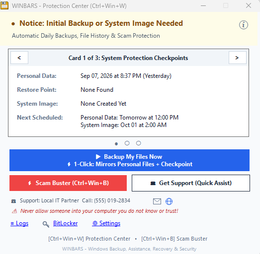

# WINBARS — Windows Backup Assistance and Recovery Suite (v0.12.22-beta)
### *Autonomous Windows disaster recovery, automated personal file mirroring, bare-metal DISM imaging, master baseline checkpoints, and anti-scam protection across 5 flexible deployment tiers — built by a computer repair technician, free for personal and commercial use.*

<p align="center">
  <a href="https://github.com/remarkablepc/WINBARS/releases/latest"></a>
  <a href="https://microsoft.com"></a>
  <a href="https://microsoft.com"></a>
  
  
  
  
  
  <a href="#coming-soon-winbars-guard"></a>
  <a href="https://www.paypal.com/ncp/payment/EKH76RTYHH24S"></a>
  <a href="https://github.com/sponsors/remarkablepc?utm_source=WINBARS"></a>
</p>

<p align="center">
  <sub>⚠️ <b>Public Beta Release (v0.12.22-beta)</b>: This build is verified for technician bench deployment and field validation. All core features (bare-metal DISM progress & controls, BitLocker master key pre-arming, multi-channel [U] updates, and ScamBuster anti-fraud) are fully operational.</sub>
</p>

<p align="center">
  
  <br>
  <em>WINBARS Protection Center Live Dashboard (Ctrl+Win+W), Floppy Tray Sentry, and Quick-Action Bar</em>
</p>

<div align="center">

  <a href="https://github.com/remarkablepc/WINBARS/releases/latest">
    
  </a>
  <br><br>

  **[📥 Download Complete Package (`WINBARS-v0.12.22-beta.zip`)](https://github.com/remarkablepc/WINBARS/releases/latest)** &nbsp;•&nbsp; **[📦 All Releases](https://github.com/remarkablepc/WINBARS/releases)** &nbsp;•&nbsp; **[📜 Changelog](CHANGELOG.md)** &nbsp;•&nbsp; **[📋 Release Notes](https://github.com/remarkablepc/WINBARS/releases/tag/v0.12.22-beta)**

  <br>

  💻 **Technician Remote Launch (PowerShell Admin)**: `irm winbars.remarkablepc.com | iex`

  <br>

  ✨ **[🍏 Non-Destructive OS Refresh](#macos-style-safe-overlay)** &nbsp;•&nbsp;
  🚑 **[💾 1-Click WinRE Hook](#native-winre-boot-hook)** &nbsp;•&nbsp;
  🩺 **[🛠️ Auto Health Check](#windows-health-check)** &nbsp;•&nbsp;
  🚨 **[🛡️ Scam Buster & RAT Guard](#scambuster-rat-interceptor)** &nbsp;•&nbsp;
  🔐 **[🔑 BitLocker Vaults](#bootloader-bitlocker-safety-net)**

</div>

---

> [!IMPORTANT]
> ### 💡 The Core Principle: Orchestration & Hardening, Not Proprietary Bloat
> **WINBARS does not reinvent wheels with proprietary code; it acts as an intelligent conductor for Microsoft’s enterprise-grade tools—coordinating, scheduling, and hardening them so disaster recovery actually works when disaster strikes.**
> 
> Microsoft Windows already contains 30 years of battle-tested, kernel-level recovery engines: **Robocopy, Volume Shadow Copies (VSS), DISM bare-metal imaging, and Task Scheduler**. 
> 
> The flaw has never been the engines—it's that Windows leaves them uncoordinated: updates quietly disable File History, restore points are throttled to once every 24 hours, and USB drive letter changes halt backups without alert.
> 
> 🛡️ **Zero Lock-In & Verifiable Host Footprint**: Backups are standard Windows files and native `.wim` images. WINBARS is never required to restore your system. It installs 0 kernel drivers, 0 Windows NT services, and zero unsolicited network telemetry. See the [System Footprint & Security Audit Blueprint](docs/SYSTEM_FOOTPRINT.md).

---

<a id="why-winbars-was-born-6-real-world-nightmares"></a>
## 💔 Why WINBARS Was Born: 6 Real-World Nightmares

If you have ever repaired Windows PCs for clients, business fleets, or family, you already know these six recurring failure points:

### 1. The "Windows 11 Silent File History Death"
> *"A customer’s hard drive died a year after upgrading to Windows 11, only to discover that **Microsoft had silently turned off File History during the upgrade with zero warning**. An entire year of irreplaceable family photos and business files was lost because Windows never said a word."*

### 2. *"There is NEVER a Restore Point When You Actually Need One!"*
> *"A bad update causes a blue screen, but System Restore is completely empty. Between Microsoft's arbitrary 24-hour throttling, silent shadow storage exhaustion, and Windows Update wiping old checkpoints, the restore point list is almost always a ghost town when disaster strikes."*

### 3. The "Surprise BitLocker" Catch-22
> *"New laptops now quietly encrypt themselves out of the box without handing the owner their 48-digit recovery key. When a routine BIOS update trips the TPM chip, the user is greeted by a blue lockout screen—and can't retrieve the key online because their two-factor authentication code is sent to the locked computer."*

### 4. The Phone Scam, Browser Siren & Remote Control Trap
> *"A full-screen popup freezes the screen with blaring audio sirens: 'VIRUS DETECTED — CALL MICROSOFT.' Panicked and unable to close the browser, everyday users call the number on screen and let offshore scammers connect via **ScreenConnect or UltraViewer**—tools so pervasive in scam call centers that UltraViewer's uninstaller literally asks: 'Did a scammer tell you to install this?' Victims watch helplessly as their bank accounts are drained while traditional antivirus sits completely silent."*

### 5. The "No Rescue USB When Windows Won't Boot" Catch-22
> *"When Windows gets stuck in a bootloop, every guide says: 'Insert your Recovery USB drive.' But everyday users never make a recovery drive while their PC is working—and once Windows refuses to boot, they can't create one. They are trapped simply because recovery tools were never pre-staged before the crash."*

### 6. The "Wipe & Reinstall" Trap: Losing Every App & Setting
> *"When Windows gets corrupted, the standard big-box verdict is always: 'Wipe the drive and start over.' Even if personal documents are saved, the user loses every installed program, customized preference, and printer driver—spending weeks hunting down lost software licenses and reinstalling their digital life."*

---

### 💬 A Note from the Creator: Dedicated to My Customers

> *"This project is dedicated to the many customers who have trusted me with their computers over the years.
>
> I didn't build WINBARS to sell a subscription, push cloud storage, or start a software company. I built it because after years of running a computer repair shop, I got tired of watching preventable computer disasters hurt good people.
>
> I watched families lose decades of photos because Windows silently stopped backing up. I watched people get locked out of their own laptops by surprise BitLocker prompts without a key. I watched perfectly healthy systems get wiped clean by big-box repair benches because there was no restore plan. And I watched terrified seniors lose money to scam call centers because Windows gave them no way to break out of a browser lockup.
>
> WINBARS is the tool I wished every customer already had running before they walked into my shop. It is completely free, closed-source freeware, with zero cloud telemetry and zero ads. If it saves your family photos, keeps you out of a scammer's hands, or saves you an expensive repair bill, it has done its job."*
>
> — **RemarkablePC**, Creator of WINBARS

---

<a id="how-winbars-solves-the-6-nightmares"></a>
## 🛡️ How WINBARS Solves the 6 Nightmares

How WINBARS addresses each failure scenario natively—and exactly which deployment modes deliver them:

### 1. The "Windows 11 Silent File History Death" âž” **Self-Healing Daily Mirror**
* 🏷️ **Active in: Modes 0, N, 3, 4** *(Modes 0 & N run portable from USB; Modes 3 & 4 run automated daily. Modes 1 & 2 intentionally omit personal file sync to focus purely on local OS rollback without requiring an external hard drive).*
* **The Solution**: Automatically mirrors your personal files (Documents, Desktop, Photos, Videos) to an external drive daily with a **30-Day Safety Recycle Bin (`_DeletedArchive`)**. If Windows silently disables File History or reassigns drive letters, WINBARS auto-heals the connection and alerts you. Best of all, personal files are saved with standard names—plug your drive into **any computer** (Windows, Mac, Linux) and drag-and-drop your files with zero software required.
* 🔗 [Deep Dive: Architecture & Data Flow Manual](docs/ARCHITECTURE.md) • [Zero-Footprint Guide](docs/ZERO_FOOTPRINT.md)

### 2. "There is NEVER a Restore Point When You Need One!" âž” **Unthrottled Checkpoints**
* 🏷️ **Active in: Modes 1, 2, 3, 4** *(Daily automated scheduled checkpoints; also triggered on-demand in Modes 0 & N via USB).*
* **The Solution**: Removes Microsoft's arbitrary 24-hour limit, reserves dedicated shadow storage headroom so points are never purged early, and auto-captures a clean checkpoint on a scheduled daily task and before detected Windows Update activity. When disaster strikes, you will always have clean, healthy restore points waiting.
* **AutoHeal Sentry** *(Modes 1–4)*: WINBARS doesn't just configure these protections once and walk away. A background sentry (`AutoHeal`) silently re-verifies them on each boot and on a regular schedule — checking VSS writer health, shadow storage quota, the 24-hour throttle registry key, Long Path support, and the silent-BitLocker prevention policy. If Windows Update or a third-party tool ever silently reverts any of these, AutoHeal detects the drift and re-applies the correct settings automatically, with no user action required.
* 🔗 [Deep Dive: WinRE Blue Screen & Disaster Recovery Manual](docs/DISASTER_RECOVERY.md)

### 3. The "Surprise BitLocker" Catch-22 âž” **Familiar Password/PIN Unlock in WinRE**
* 🏷️ **Active in: Modes 2, 3, 4** *(Desktop Emergency Card, AES-256 Vault `BitLocker_Vault.enc`, and 1-click WinRE password/PIN unlock with 1-reboot TPM auto-reseal).*
* **The Solution**: Automatically archives your 48-digit key and generates a printable, high-contrast **Emergency Recovery Card**. More importantly, if your PC locks at the blue BitLocker screen, the WINBARS WinRE recovery wizard lets you **unlock the drive using your familiar Windows login password or PIN** (via an AES-256 encrypted vault). Once verified, WINBARS unlocks `C:` and temporarily suspends encryption for **exactly one reboot** (`-RebootCount 1`)—Windows boots straight to your normal desktop and automatically re-seals the TPM chip!
* **Silent Auto-Encryption Prevention**: Windows 11 (24H2) silently turns on background Device Encryption on modern hardware without displaying the 48-digit recovery key. WINBARS configures native registry policy (`PreventDeviceEncryption = 1`) across **Modes 1, 2, 3, and 4** to prevent this silent trap, while preserving full manual control to turn BitLocker on when desired.
* *(Note on **Mode 1 & External Backup Media Compliance**: In accordance with HIPAA (45 CFR § 164.312), GDPR, and enterprise security standards, raw 48-digit recovery keys are **never stored as unencrypted plaintext on external backup drives**. Keys on external media are cryptographically secured at rest using the Shop Master Public Key (`BitLocker_Recovery_Key.enc` + `ShopVault\`) or AES-256 encryption (`BitLocker_Recovery_Key.aes`). Local administrative copies in `C:\SystemRecovery\` are strictly locked down with elevated NTFS ACLs (`SYSTEM` & `Administrators` only) and secured by the host's underlying BitLocker volume encryption).*
* *(Note on the **Shop & Enterprise Master Keys** *(optional, advanced)*: A repair shop or business can generate 30-year RSA-2048 Data Recovery Agent (DRA) key pairs using `tools/Generate-MasterKey.bat`. The tool exports the private key (`.pfx`), public cert (`.cer`), and Base64 token directly to the Desktop. Public certificates (`.cer`) are auto-discovered from `certs/`, `branding/`, or embedded directly in JSON (`MasterCertificateBase64`). Technicians have complete granular control: toggle co-custody anytime via the Pre-Flight menu (`[M]`) or CLI (`-NoShopKey`). Master keys are **100% functional standalone** and require neither a branding token nor internet connectivity. When enrolled, authorized private keys (`*.pfx`, kept safe offline in secure vaults) can unlock any enrolled client PC in a disaster without customer credentials using `tools/Unlock-BitLocker-With-MasterKey.bat`. See the [BitLocker Master Key Guide](docs/BITLOCKER_MASTER_KEYS.md) and [BitLocker Vault Guide](docs/BITLOCKER_VAULT.md) for full architectural details).*
* 🔗 [Deep Dive: BitLocker Master Key & Enterprise DRA Guide](docs/BITLOCKER_MASTER_KEYS.md)
* 🔗 [Deep Dive: BitLocker AES-256 Disaster Vault Guide](docs/BITLOCKER_VAULT.md)

### 4. The Phone Scam & Browser Siren Trap âž” **Scam Buster & Remote Access Interceptor**
* 🏷️ **Active in: Modes 2, 3, 4** *(All three modes run **continuous real-time background protection** that monitors for 25+ weaponized remote access tools and full-screen browser traps, automatically muting audio sirens. **Modes 2 & 3** run as a **Silent Guardian** without taskbar icons or office clutter; **Mode 4** adds visual interactive prompt modals, the Floppy Tray sentry, and the live GUI).*
* **The Solution**: 
  * **Continuous Proactive Defense (Modes 2, 3, 4)**: Everyday users and seniors often freeze when deafening sirens blare. The background sentry inspects foreground windows for borderless fullscreen browser traps with scam keywords ("Virus Detected", "Call Microsoft"). The moment one appears, it **automatically mutes the blaring audio sirens**, clears the browser's crash-state so reopening Chrome or Edge **never reloads the scam tab**, and in Mode 4 displays an emergency overlay asking if you want to reclaim your PC.
  * **Real-Time Remote Access RAT Interceptor (Modes 2, 3, 4)**: Continuously watches for 25+ remote support tools (ScreenConnect, UltraViewer, AnyDesk, TeamViewer, RustDesk, etc.) commonly weaponized by offshore scam call centers. In Modes 2 & 3, it silences and blocks unauthorized remote takeovers in the background; in Mode 4, it pops up an immediate visual warning with a 1-click **`[STOP] Disconnect & Block`** button.
  * **Universal Emergency Hotkey (`Ctrl + Win + B`)**: In Modes 2, 3, and 4, press **`Ctrl + Win + B`** at any time to immediately kill all running browser processes across 25+ browsers, silence all audio, and clear reload loops.
* *(Note: Modes 0, N, and 1 omit ScamBuster entirely to maintain a strict zero-resident-binary footprint).*
* 🔗 [Deep Dive: Scam Sentry & Remote Access Interceptor](docs/SCAM_SENTRY.md)

### 5. The "No Rescue USB" Catch-22 âž” **Pre-Staged Emergency Recovery (+ Optional Rescue USB)**
* 🏷️ **Active in: Modes 1, 2, 3, 4** *(Local pre-staging on internal drive in `C:\SystemRecovery` / `C:\SystemImages`); **Modes 0 & N** store 100% of recovery tools strictly on the external Backup Drive, never creating `C:\SystemRecovery` or touching `C:\`.*
* **The Solution**: Rather than hoping you made a rescue USB before disaster struck, WINBARS pre-stages emergency recovery tools directly onto your PC (`C:\SystemRecovery` in Modes 1–4) and hooks into the native Windows Recovery Environment Troubleshoot menu (`reagentc` in Modes 2–4). Even with no USB in the house, you can roll back registry hives, rebuild bootloaders, and repair Windows.
* **Modes 0 & N — Recovery from Backup Drive**: In zero-footprint modes, all rescue tools live exclusively on the Backup Drive root. If you ever plug in your backup drive after a crash, you'll see `RECOVERY_START_HERE.bat` — a single double-click that auto-detects your Windows drive, checks disk health, and walks you through the full recovery ladder.
* **Optional Bootable Rescue USB**: You can also promote any external backup drive into a full bootable Windows PE Rescue USB (`WINBARS.exe -RescueUsb`), making the backup drive itself your recovery media — no separate flash drive needed.
* 🔗 [Deep Dive: WinRE Blue Screen & Disaster Recovery Manual](docs/DISASTER_RECOVERY.md)

### 6. The "Wipe & Reinstall" Trap âž” **macOS-Style Safe Overlay Refresh**
* 🏷️ **Active in: Modes 0, N, 1\*, 2, 3, 4** *(Modes 2, 3, and 4 feature **Dual Baseline Mirroring** via Preflight Option `[J]`: keeping 1 permanent baseline image locally in `C:\SystemImages` AND on the external backup drive, while subsequent scheduled rotating images strictly target external storage to prevent host disk congestion; Mode 1\* offers an optional baseline image; Modes 0 & N store images **strictly on the external Backup Drive**, never touching `C:\`).*
* **The Solution**: Big-box stores wipe your entire hard drive when Windows gets corrupted, erasing all your programs and preferences. WINBARS captures bare-metal `.wim` images that exclude personal data, allowing you to reinstall a factory-clean Windows OS and your programs in under 5 minutes while leaving **all personal documents, photos, desktop profiles, and browser data 100% untouched on disk**.
* 🔗 [Deep Dive: WinRE Blue Screen & Disaster Recovery Manual](docs/DISASTER_RECOVERY.md)

---

## 📑 Table of Contents

1. [💔 Why WINBARS Was Born: 6 Real-World Nightmares](#why-winbars-was-born-6-real-world-nightmares)
2. [🛡️ How WINBARS Solves the 6 Nightmares](#how-winbars-solves-the-6-nightmares)
3. [🚀 Choose Your Protection Profile (Decision Matrix)](#choose-your-protection-profile)
4. [âš¡ Quick Start & Remote Web Launch](#quick-start)
5. [💾 Floppy Tray Sentry & Global Hotkeys](#floppy-tray-sentry--global-hotkeys)
6. [🛡️ Key Protections at a Glance](#key-protections-at-a-glance)
   - 🍏 [macOS-Style Non-Destructive OS Refresh](#macos-style-safe-overlay)
   - 🚑 [Native WinRE Boot Hook & Blue-Screen Rescue Console](#native-winre-boot-hook)
   - 🚨 [Scam Buster & Remote Access RAT Interceptor](#scambuster-rat-interceptor)
   - 🔐 [Bootloader Auto-Heal & BitLocker Emergency Vaults](#bootloader-bitlocker-safety-net)
   - 🩺 [Automated Windows Health Check (SFC & DISM Auto-Repair)](#windows-health-check)
   - 🛡️ [Air-Gapped Target Isolation & Ransomware Shielding](#air-gap-protection)
   - 🧪 [Archive Integrity Scrubbing & Bit-Rot Sentry](#archive-scrubbing)
   - 💽 [Automated WinPE Driver Harvester & Rescue USB](#winpe-driver-harvester)
   - 🔍 [Radical Command Transparency (CLI & Offline Tools)](#command-transparency)
7. [💡 Why WINBARS is Different: The 4 Guarantees](#why-winbars-is-different-the-4-guarantees)
8. [❓ Frequently Asked Questions (FAQ)](#frequently-asked-questions-faq)
9. [🏷️ Shop White-Labeling & Community Sponsorship](#shop-white-labeling--community-sponsorship)
10. [📚 Complete Technical Documentation Directory](#technical-documentation-directory)
11. [⚖️ Disclaimer & Legal Notice](#disclaimer-and-legal)
12. [📋 Requirements & License](#requirements--license)

---

<a id="choose-your-protection-profile"></a>
## 🚀 Choose Your Protection Profile

WINBARS provides 6 tailored deployment profiles to fit any home, business, or repair bench workflow:

| Profile & Purpose | Best For | Core Protections & Hardening | Footprint on `C:\` |
| :--- | :--- | :--- | :--- |
| **Mode 0: `ZeroFootprint`** ⭐<br>*(Forensic sterility)* | **Audits & Compliance** | Portable System Restore checkpoint + Robocopy file mirror (30-day safety retention) + bare-metal image + BitLocker keys to USB. | **0 Files on `C:\`**<br>*(No `C:\SystemRecovery` folder; rescue tools live on USB only)* |
| **Mode N: `NearZeroFootprint`** 👻<br>*(Native Windows automation)* | **Workstations & Vendor-Neutral** | Mode 0 + unbranded desktop shortcuts + scheduled automated file sync & daily health check. | **Shortcuts Only**<br>*(No `C:\SystemRecovery` folder; all tools on Backup Drive)* |
| **Mode 1: `SystemUndo`** ⏪<br>*(Zero third-party binaries)* | **Shop Bench Service & Tune-Ups** | **The Universal Service Warranty**: Daily unthrottled System Restore, 10% VSS quota, RegBack, and local recovery scripts. | `C:\SystemRecovery\`<br>*(3 text scripts; 0 resident EXEs)* |
| **Mode 2: `LocalDisasterGuard`** 💽<br>*(Single-drive disaster recovery)* | **Laptops & Single-Drive PCs** | Mode 1 + local bare-metal DISM image (`.wim`) + silent background Scam & RAT Watchdog (auto-mute sirens) + hotkeys. | `C:\Tools\WINBARS\`<br>`C:\SystemRecovery\` |
| **Mode 3: `HeadlessFull`** 🏢<br>*(Silent multi-drive automation)* | **Workstations, Accounting & Clinics** | Mode 2 + daily external Robocopy file sync + scheduled bare-metal images + silent office Scam/RAT defense. | `C:\Tools\WINBARS\`<br>`C:\SystemRecovery\` |
| **Mode 4: `TotalProtection`** 🛡️<br>*(Visual observability & control)* | **Everyday Users, Family & Seniors** | Mode 3 + Floppy Tray Sentry (dynamic health colors & live tooltips) + interactive GUI dashboard. | `C:\Tools\WINBARS\`<br>`C:\SystemRecovery\` |

> `*` **Note on Mode 1**: Only unbranded emergency recovery scripts (`EMERGENCY_RECOVERY.bat`, `Restore_Registry_WinPE.bat`, `BitLocker_Recovery_Key.txt`) and an optional baseline `.wim` reside in `C:\SystemRecovery\`. Mode 1 installs **0 resident EXEs and 0 background processes**—permanently locking out ScamBuster daemons, tray sentries, and hotkeys to maintain total transparency, uphold clean bench standards, and ensure the client's PC remains completely free of third-party software. (In contrast, **Modes 0 and N never create `C:\SystemRecovery` at all**; all rescue tools, logs, and bare-metal images reside strictly on the external Backup Drive).
>
> 🩺 **Fully Adjustable Health Check Schedules**: The default Windows Health Check cadence (Weekly on 30m idle for desktop modes 2–4, Daily at 03:00 AM for stealth modes N & 1) is **100% customizable**. Technicians can change trigger modes (`Daily`, `Weekly`, or `Idle`), execution times, frequency intervals, or idle threshold minutes anytime in `config/config.json` or on the fly via CLI: `WINBARS.exe -ConfigureHealthCheck -Interval 14 -Time 02:00` (or toggle on/off with `-EnableHealthCheck` / `-DisableHealthCheck`).
>
> 🛡️ **Zero Windows Services Guarantee**: Across ALL modes (0 through 4), WINBARS installs **zero Windows Services (`services.msc`)**, zero kernel drivers, and zero system daemons. Modes 0, N, and 1 operate with **0 resident background processes / 0 MB RAM** using pure native Windows Task Scheduler. Modes 2, 3, and 4 run solely as a lightweight user-session background process (`WINBARS.exe`, ~12–16 MB RAM) via `HKCU\Software\Microsoft\Windows\CurrentVersion\Run`, which exits cleanly whenever the user logs off.
>
> 💡 **Additive Feature Progression & Tailored 1-Click Actions**:
> - **Monotonic Hierarchy**: Moving up the ladder (1 $\rightarrow$ 2 $\rightarrow$ 3 $\rightarrow$ 4) strictly adds capabilities. Modes 2, 3, and 4 all feature active Scam & RAT Watchdog defense (instantly muting audio sirens and blocking unauthorized remote tools). Modes 2 & 3 run this as a **Silent Guardian** (no taskbar clutter), while Mode 4 adds the iconic **Floppy Tray Sentry** and full interactive dashboard.
> - **Mode-Aware Actions & Shortcuts**: Every 1-click action button and desktop shortcut strictly reflects what is available in the current mode. For example, in **Mode 2 (Single-Drive)**, the primary action button captures a local bare-metal System Image and System Restore Point—automatically omitting external file mirror prompts since no secondary drive exists.
> - **Floppy Tray Toggle**: The Floppy Tray Sentry is **Default ON** in Mode 4, **Default OFF** in Modes 2 & 3 (toggable via Pre-Flight `[8]`), and **Hard-Locked OFF** in Modes 0, N, and 1.
>
> 🔍 *Need the granular 22-feature comparison matrix and custom profile generator details? See [Deployment Profiles in Detail](docs/DEPLOYMENT_MODES.md).*

<a id="coming-soon-winbars-guard"></a>
### 🛍️ Coming Soon to the Microsoft Store: WINBARS Guard

<p align="left">
  
  
  
  
  
</p>

> *"Quiet, automated peace of mind for your Windows PC. Install it once, let Guard handle the rest."*

Looking for an effortless, family-friendly backup and anti-scam shield for non-technical users? **WINBARS Guard** is the consumer edition currently in development for the **Microsoft Store**—built directly on the complete disaster recovery and defense architecture of **Mode 4 (`TotalProtection`)**.

* **Store Edition**: Available as a one-time purchase on the Microsoft Store (no subscriptions, no recurring monthly fees).
* **Support Model**: Supported exclusively through our open **[GitHub Discussions Community](https://github.com/remarkablepc/WINBARS/discussions)**. To keep support sustainable and eliminate high-overhead ticketing, there is **no 1-on-1 private phone or email support**.
* **WINBARS vs. Guard**: While **WINBARS Guard** is packaged for Microsoft Store convenience, **WINBARS** on GitHub remains **100% free closed-source freeware** for personal and commercial bench use across all Modes (0 through 4), with an optional **$100 lifetime donation token** for repair shops wishing to display their custom business branding across dialogs.

**Guard Capabilities & Protections:**
* **Smart External Drive Detection & Auto-Sync**: Simply plug in your USB backup drive. Guard automatically recognizes it, secures your personal files (Documents, Desktop, Photos) with a 30-day deleted file safety net, and sleeps when disconnected.
* **Smart BitLocker Key Rescue**: Automatically backs up your critical 48-digit BitLocker encryption key to your external drive, ensuring you are never locked out of your own computer after a firmware or Windows update.
* **Emergency F4 Startup Recovery**: Press **`F4`** during startup if Windows ever fails to boot. Guard pre-stages an instant recovery hook into the Windows bootloader (with automatic F7 fallback), allowing you to roll back bad updates or restore your system without needing a bootable USB.
* **Instant Scam Defusal & Audio Silencer**: If a fake virus alarm freezes your screen with blaring sirens, press **`Ctrl + Win + B`**. Guard instantly mutes the speakers, terminates locked browser processes, halts unauthorized remote support tools, and displays a calming, togglable reassurance card.
* **100% Transparent Consumer Integrity**: Zero hidden developer menus, zero secret CLI commands, zero background adware, and zero telemetry. Runs natively in Windows with a featherweight memory footprint (~25–35 MB).
* **Universal Ecosystem Cross-Compatibility**: Backups created by WINBARS Guard are standard Windows files and `.wim` images that can be seamlessly inspected and restored interchangeably using WINTools, WINBARS, or native Windows utilities.

---

### âš¡ Turnkey Root Launchers, Installers & Utilities
- **Root Fast-Launchers (`Run-WINBARS.bat`)**:
  - `[0]`, `[N]`, `[1]`, `[2]`, `[3]`, `[4]` &mdash; **Instant Fast-Path Deployment**: Select any profile to view its tailored targets, drive capacity validation (`[PASS]` / `[WARN: Low Space]`), and 1-click confirmation screen (`[ENTER]` to deploy, `[S]` to deploy + capture baseline image, `[E]` to edit paths & schedules, `[B]` to cancel).
  - Direct technician shortcuts: `0S`, `NS`, `1S`, `2S`, `3S`, `4S` (Deploy + Immediate Baseline System Image) and `0E`–`4E` (Open Pre-Flight Editor directly).
  - `[S]` &mdash; **Capture Baseline System Image Now** (instant standalone DISM `.wim` capture).
- **1-Click Mode Batch Installers (`installers/`)**:
  - `installers/Install-Mode0-ZeroFootprint.bat` &nbsp;&bull;&nbsp; `installers/Install-ModeN-NearZeroFootprint.bat`
  - `installers/Install-Mode1-SystemUndo.bat` &nbsp;&bull;&nbsp; `installers/Install-Mode2-LocalDisasterGuard.bat`
  - `installers/Install-Mode3-HeadlessFull.bat` &nbsp;&bull;&nbsp; `installers/Install-Mode4-TotalProtection.bat`
  - `installers/Uninstall.bat` *(Complete suite teardown: cleanly wipes scheduled tasks, shortcuts, and sentry)*
- **BitLocker Certificate Vault (`certs/`)**:
  - Drop public BitLocker Data Recovery Agent certificates (`*.cer`) here for automatic discovery and enrollment on client PCs.
- **Bench, Operational & Recovery Tools (`tools/`)**:
  - `tools/Whitelist-WINBARS.bat` *(Windows Defender Whitelist Utility: adds folder & process exclusions to prevent false alerts)*
  - `tools/Generate-MasterKey.bat` &nbsp;&bull;&nbsp; `tools/Unlock-BitLocker-With-MasterKey.bat` &nbsp;&bull;&nbsp; `tools/Verify-MasterKey-Password.bat`
  - `tools/Reset-Suite.bat` *(Factory Reset Utility: cleanly wipes tasks and sentries while preserving client data)*
  - `tools/Capture-Baseline.bat` &nbsp;&bull;&nbsp; `tools/Apply-SystemImage_WinPE.bat` &nbsp;&bull;&nbsp; `tools/Create-RescueUSB.bat`
  - `tools/Toggle_Backup_Drive_Visibility.bat` *(Cloaks or uncloaks backup drives in Windows Explorer)*
  - `tools/web-deploy/` *(1-line remote IRM web deployment blueprints for `winbars.remarkablepc.com` and `macpc.remarkablepc.com`)*

---

<a id="quick-start"></a>
## âš¡ Quick Start

### 🌐 Option A: 1-Click Remote Web Launch (PowerShell)
Technicians can launch or deploy WINBARS directly on any bench or client PC without downloading ZIP archives manually:
```powershell
# In an elevated PowerShell prompt (Run as Administrator):
irm winbars.remarkablepc.com | iex

# Direct GitHub raw fallback (if custom domain is unreachable):
irm https://raw.githubusercontent.com/remarkablepc/WINBARS/main/install.ps1 | iex
```
> 💡 *Supports unattended technician flags: e.g., `irm winbars.remarkablepc.com | iex -PassthruArgs "-Profile LocalDisasterGuard"` or `-PassthruArgs "-Action FastBackup -ShowProgress"`.*
>
> ⚠️ **Field Testing Notice**: *WINBARS v0.12.x is currently undergoing technician bench validation. Supervised deployment is recommended prior to v1.0.0 General Availability.*

### 💾 Option B: Offline Flash Drive Setup (3 Steps)

1. **Download & Extract**:
   Download the latest [`WINBARS-v0.12.22-beta.zip`](https://github.com/remarkablepc/WINBARS/releases/latest) and extract it to a USB flash drive or your computer.
2. **Launch Setup**:
   Right-click `Run-WINBARS.bat` and select **Run as administrator** (or run `WINBARS.exe`).
3. **Select Your Mode**:
   Choose your preferred deployment profile (e.g., press `[2]` for Local Disaster Guard, or double-click `installers\Install-Mode4-TotalProtection.bat` for full interactive protection).

> 💡 *For unattended batch flags and command-line automation, see the [CLI Reference](docs/CLI_REFERENCE.md).*

<details>
<summary><b>🛠️ Click to expand Quick CLI & Automation Reference</b></summary>
<br>

| Operational Domain | Command Syntax | Description |
| :--- | :--- | :--- |
| **âš¡ 1-Click Backup** | `WINBARS.exe -Action FastBackup` | Mirrors personal files + creates System Checkpoint. |
| **📊 Visual Backup** | `WINBARS.exe -Action FastBackup -ShowProgress` | Launches live Dual Progress Bar in real-time. |
| **🛡 System Checkpoint** | `WINBARS.exe -Action RestorePoint` | Creates unthrottled atomic System Restore Point. |
| **💾 Bare-Metal Image** | `WINBARS.exe -Action SystemImage` | Captures DISM `.wim` image (Windows + Apps + Drivers) to target or `C:\SystemRecovery` (Modes 1–4; Modes 0 & N write strictly to Backup Drive). Pass `-NoLocalCopy` to save host disk space and store exclusively on external drive. Automatically skips local copy if `C:` has < 25 GB free. |
| **💽 Any Volume Image** | `WINBARS.exe -Action CaptureVolumeImage` | Captures standalone DISM `.wim` of any drive/partition (VSS frozen). |
| **📦 Complete Backup** | `WINBARS.exe -Action All` | Runs full 3-tier pass (Restore Point + Files + Image). |
| **🧪 Archive Scrubbing** | `WINBARS.exe -Action VerifyArchives` | Verifies DISM WIM headers & computes SHA-256 integrity checksums. |
| **💽 WinPE Rescue USB** | `WINBARS.exe -Action RescueUsb` | Builds bootable WinPE drive with automated host driver harvesting & injection. |
| **🩺 Feature Diagnostics** | `WINBARS.exe -Action Diagnostics` | Runs profile-aware audit with PASS / WARN / FAIL / N/A scorecard. |
| **🩹 Windows Health Check** | `WINBARS.exe -WindowsHealthCheck` | On-demand SFC + DISM scan with live progress bars. Results logged to Windows Event Viewer. |
| **⚙️ Configure Health Check** | `WINBARS.exe -ConfigureHealthCheck`<br>`-Interval 14 -Time 02:00` | Set scan interval (days), scheduled time (Modes N/1), or idle threshold (Modes 2–4). |
| **🗂️ Toggle Health Check** | `WINBARS.exe -EnableHealthCheck` / `-DisableHealthCheck` | Enable or disable the scheduled SFC/DISM health scan task. |
| **📋 Event Log Toggle** | `WINBARS.exe -EnableEventLog` / `-DisableEventLog` | Enable or disable Windows Event Viewer integration (Application log). |
| **🏷️ Event Log Branding** | `WINBARS.exe -ConfigureEventLog`<br>`-SourceName "TechPros PC Care"` | Override the Event Log source name for white-label deployments. |
| **🚀 Deploy Mode 0** | `WINBARS.exe -Profile ZeroFootprint` | 100% native Windows automation (0 files on `C:\`). |
| **👻 Deploy Mode N** | `WINBARS.exe -Profile NearZeroFootprint` | Stealth native automation with unbranded shortcuts. |
| **⏪ Deploy Mode 1** | `WINBARS.exe -Profile SystemUndo` | Daily System Restore hardening + VSS auto-heal. |
| **💽 Deploy Mode 2** | `WINBARS.exe -Profile LocalDisasterGuard` | Mode 1 + local DISM image (.wim) + silent Scam/RAT watchdog + hotkeys. |
| **🏢 Deploy Mode 3** | `WINBARS.exe -Profile HeadlessFull` | Mode 2 + daily external Robocopy file sync + scheduled images. |
| **🛡️ Deploy Mode 4** | `WINBARS.exe -Profile TotalProtection` | Mode 3 + Floppy Tray Sentry (dynamic health status) + live GUI dashboard. |
| **🔄 Switch Mode** | `WINBARS.exe -SwitchMode <Profile>` | Zero-drift transition: tears down old tasks cleanly. |
| **🧹 Factory Reset** | `WINBARS.exe -ResetSuite` | Clears scheduled tasks and configs to factory defaults. |
| **🚨 ScamBuster** | `WINBARS.exe -ScamBuster` | Terminates browser lockups and clears sirens (`Ctrl+Win+B`). |
| **📋 Emergency Card** | `WINBARS.exe -EmergencyCard` | Generates printable BitLocker Emergency Card (`.html`). |
| **🔒 Block Auto-BitLocker** | `WINBARS.exe -BlockSilentBitLocker` | Sets `PreventDeviceEncryption=1` to block silent 24H2 encryption trap. |
| **🔓 Allow Auto-BitLocker** | `WINBARS.exe -AllowSilentBitLocker` | Removes `PreventDeviceEncryption` policy (allows automatic BitLocker). |
| **🧰 Boot Recovery** | `WINBARS.exe -BootRecoveryMenu` | Reboots directly into WinRE on next startup. |
| **🧹 Complete Removal** | `WINBARS.exe -Uninstall` | Cleanly removes all scheduled tasks, shortcuts, and sentry. |

```cmd
REM --- Unattended Technician Batch Examples ---
installers\Install-Mode1-SystemUndo.bat /Baseline:Y /Quiet
installers\Install-Mode0-ZeroFootprint.bat /Data:D:\UserData /Quiet
installers\Install-Mode4-TotalProtection.bat /Brand:"TechPros" /Quiet
installers\Uninstall.bat /Quiet
```

> 📖 *For complete command parameters and trigger switches, see the [Full CLI Reference](docs/CLI_REFERENCE.md).*

</details>

---

<a id="floppy-tray-sentry--global-hotkeys"></a>
## 💾 Floppy Tray Sentry & Global Hotkeys

In **Mode 4 (`TotalProtection`)**, WINBARS places a classic floppy disk icon in the system notification area that dynamically reflects system health at a glance:

| Tray Floppy | Status | Meaning | Live Hover Tooltip |
| :---: | :--- | :--- | :--- |
|  🟢 | **Emerald Green** | **All Systems Protected**: Daily restore points active, file backups up to date. | `WINBARS: All Systems Protected` |
|  🟣 | **Signature Purple** | **Backup in Progress**: Active file mirror, restore point, or image creation. | `WINBARS: Backup in Progress (45%)...` |
|  🟡 | **Amber Gold** | **Notice / Local Mode**: External backup drive unplugged or backup due. | `WINBARS: External Backup Drive Unplugged`<br>*(or: `System Restore Point Needed`)* |
|  🔴 | **Crimson Red** | **Attention Required**: S.M.A.R.T. disk degradation or backup task issue. | `WINBARS: Attention Required (Check Logs)` |

> 🔵 **Classic Blue Floppy (`app.ico`)**: The static application icon embedded into `WINBARS.exe` and the desktop/Start Menu shortcut for **WINBARS Protection Center** / **Windows System Restore**. The active notification tray sentry strictly uses 🟢 Green, 🟣 Purple, 🟡 Amber, and 🔴 Red to reflect live operational health.
>
> 💡 **Instant Observability**: Simply hover your mouse over the floppy icon at any time to see the exact real-time system condition without opening a single dashboard or menu.

### ⌨️ Universal Global Hotkeys
Available in Modes 2 through 4 for emergency assistance:
* **`Ctrl + Win + W` $\rightarrow$ WINBARS Protection Center**: Opens the live System Health dashboard, backup status, and 1-click tools.
* **`Ctrl + Win + B` $\rightarrow$ Emergency Scam Buster**: Instantly closes frozen full-screen browsers, kills audio sirens, and clears crash-reload loops.
* **`Ctrl + Win + Q` $\rightarrow$ Quick Assist Remote Support**: Displays verified support details before launching Microsoft Quick Assist for remote screen sharing.

### 🎛️ Floating Quick-Action Bar & Protection Center Dual Actions
Left-clicking or hovering over the Floppy Tray Sentry provides instant access to the streamlined **5-Button Quick-Action Bar**:
* **`[Backup Files]`**: Instant multi-threaded Robocopy mirror of personal files (Documents, Desktop, Photos, Videos) to the backup drive with a 30-day deleted archive safety net.
* **`[Win & Apps]`**: Fast bare-metal DISM system image capturing Windows OS + installed applications + drivers (System Image).
* **`[Restore]`**: Guided interactive restore launcher for recovering personal files or rolling back system images.
* **`[Dashboard]`**: Launches the full **WINBARS Protection Center** live dashboard (`Ctrl + Win + W`).
* **`[Remote Support]`**: Displays verified technician contact details and launches Microsoft Quick Assist (`Ctrl + Win + Q`).

Inside the **Protection Center (`Ctrl + Win + W`)**, the primary action is split into two dedicated, side-by-side buttons:
* **`[â–¶ Backup My Files]`** (Blue): Triggers personal file mirroring and an unthrottled System Restore Point.
* **`[📦 Win & Programs]`** (Purple): Captures a bare-metal DISM system image of Windows and installed programs (`.wim`).

Both buttons feature instant click debounce with immediate visual progress feedback to eliminate multi-click delays. In addition, the storage sentry dynamically detects connected backup drives even if Windows shifts drive letters or drops volume mount assignments.

---

<a id="key-protections-at-a-glance"></a>
## 🛡️ Key Protections at a Glance

WINBARS unifies **B**ackup, **A**ssistance, **R**ecovery, and **S**ecurity into a single, cohesive safety net. Here are six of its unique standout capabilities:

<a id="macos-style-safe-overlay"></a>
### 🍏 1. Non-Destructive "macOS-Style" Safe Overlay OS Refresh
On a Mac, booting into Recovery Mode and choosing **"Reinstall macOS"** refreshes core system files and default apps while leaving your user account, desktop files, and personal data 100% untouched. For 30 years, Windows users have been denied this simplicity—forced to choose between a destructive disk wipe or an in-place upgrade that fails if Windows won't boot.

**WINBARS brings true macOS-style non-destructive recovery to Windows**: Because WINBARS bare-metal `.wim` images cleanly capture Windows OS binaries, drivers, and Program Files while excluding `\Users`, selecting **Option [1] Safe Overlay** in `Apply-SystemImage_WinPE.bat` refreshes your entire operating system and programs safely in-place while leaving **`C:\Users\` (all documents, photos, desktop profiles, and browser data) 100% untouched on disk**—no secondary data restore required!

<a id="native-winre-boot-hook"></a>
<a id="boot-recovery-safety-net"></a>
### 🚑 2. Native WinRE Boot Hook: 1-Click Blue-Screen Resurrection (Modes 2–4)
When a catastrophic update, corrupted driver, or boot failure prevents Windows from starting, Windows displays the blue **Windows Recovery Environment (WinRE)** screen. In standard Windows, this screen is notoriously a dead end:
* **Startup Repair** runs for minutes before reporting *"Startup Repair couldn't repair your PC."*
* **System Restore** frequently fails with cryptic `0x80070002` errors or VSS lock collisions.
* **Command Prompt** drops into an intimidating black window with scrambled drive letters (`X:`, `D:`, `E:`).
* **Reset this PC** is a destructive nuclear option that wipes installed desktop applications.
* And if you don't already have a prepared bootable USB drive, you are completely stranded.

**WINBARS turns Windows Automatic Repair into a self-healing technician console**: In Managed Workstation profiles (Modes 2–4), WINBARS registers a native recovery hook directly into Microsoft's official boot menu via `C:\Recovery\OEM\WinreConfig.xml` and `reagentc.exe /enable`. Additionally, Modes 2–4 can register an optional **F7 Emergency Rescue Hotkey** directly in Windows BCD (`customactions`), allowing 1-touch offline disaster recovery before Windows even attempts to load (bypassing OEM motherboard F4/F12 conflicts). **No USB flash drive, no secondary PC, and no BIOS navigation are required.**

#### 🖥️ Native WinRE Boot Hook & Live Rescue Console Flow:
```text
┌────────────────────────────────────────────────────────────────────────┐
│                        Choose an option                                │
│                                                                        │
│   [ 🔲 Continue ]                 Exit and continue to Windows         │
│   [ 🛠️ Troubleshoot ]   ────────┐ Reset your PC or see advanced options│
│   [ ⏻ Turn off your PC ]       │                                      │
└─────────────────────────────────┼──────────────────────────────────────┘
                                  │
┌─────────────────────────────────▼──────────────────────────────────────┐
│                          Troubleshoot                                  │
│                                                                        │
│   [ 🔄 Reset this PC ]            (Wipes installed desktop applications)│
│   [ ⚙️ Advanced options ]                                              │
│                                                                        │
│   [ 💾 WINBARS Emergency Tool ]  ◄── Pre-Staged OEM Hook (Modes 2–4)   │
│                                       (Accessible even with NO USB!)   │
└─────────────────────────────────┬──────────────────────────────────────┘
                                  │
                                  â–¼
┌────────────────────────────────────────────────────────────────────────┐
│ WINBARS (Windows Backup Assistance and Recovery Suite) - WinRE Console │
├────────────────────────────────────────────────────────────────────────┤
│ Target Windows OS: C:\Windows (Windows 11 Pro 64-bit)                  │
│ Detected Vault(s): D:\WINBARS_Backup (External USB - 465 GB Free)      │
│                                                                        │
│ Live Diagnostic Status:                                                │
│  • Registry Hive Snapshots    : [✅ AVAILABLE - Pristine Hives Found]  │
│  • System Restore Checkpoints : [✅ AVAILABLE - 3 Checkpoints Detected]│
│  • Safe Overlay OS Images     : [✅ AVAILABLE - macOS-Style Refresh]   │
│  • User File Mirrors          : [✅ AVAILABLE - Documents/Desktop Safe]│
├────────────────────────────────────────────────────────────────────────┤
│ [1] STEP 1 (Safest): 1-Click Registry Hive Rollback [Instant Fix]      │
│ [2] STEP 2: Windows System Restore (Native VSS Checkpoint)             │
│ [3] STEP 3: Safe Overlay OS Refresh (Reinstall OS, Keep Personal Data) │
│ [4] BitLocker Recovery: 1-Click Key Unlock & Temporary Suspension      │
│ [5] Intel RST / VMD Drivers: 1-Click Injection for Missing NVMe Drives │
│ [6] Personal Files: Extract & Restore Documents from Mirror            │
│ [0] Reboot PC to Windows Normally                                      │
└────────────────────────────────────────────────────────────────────────┘
```

* **Zero False Hope Live Triage**: Before executing any recovery action, the console pre-scans all physical disks and partitions, reporting live green/yellow/red readiness badges so you know exactly what is recoverable before you commit.
* **1-Click Next-Boot WinRE Arming (`reagentc /boottore`)**: If Windows is unstable or acting erratically in live desktop mode, a single click from the WINBARS Protection Center arms the system to boot directly into WinRE on the next restart without requiring BIOS hotkeys (`F8`, `F11`, `F12`).
* **Zero Overhead in Live Windows**: Because this is a static registration inside the Windows Boot Manager, it consumes **0 MB RAM and 0 background CPU cycles** while Windows is running.
* *(Note: In Modes 0, N, and 1, to preserve total host sterility on client PCs, rescue tools run cleanly from the external **Backup Drive** or via WinRE Command Prompt `Shift + F10`, leaving `C:\Recovery\OEM` completely untouched).*
* 🔗 [Deep Dive: WinRE Blue Screen & Disaster Recovery Manual](docs/DISASTER_RECOVERY.md)

<a id="scambuster-rat-interceptor"></a>
### 🚨 3. Scam Buster & Remote Access RAT Interceptor
* **Proactive Fullscreen Trap & Audio Siren Muter (Modes 2, 3, 4)**: Continuously monitors for rogue borderless browser lockups. The moment a scam window triggers, WINBARS **instantly silences deafening audio sirens** and neutralizes the reload trap. In Mode 4, it also overlays an emergency rescue prompt over the scam tab—protecting panicked seniors without requiring them to remember keyboard shortcuts.
* **Instant Browser Freeze Escape (`Ctrl + Win + B`)**: Instantly closes rogue full-screen browser traps across 25+ browsers, silences audio sirens, and clears Chromium/Firefox crash-recovery flags to prevent reload loops.
* **Integrated Anti-Fraud Reassurance & Shop Branding**: Fully integrates with [`config/scambuster_ui.json`](config/scambuster_ui.json) to display verified local shop phone numbers, custom reassurance text, and defusal options. Coordinates seamlessly with companion bench toolkits (WINTools), allowing bench sentinels to yield gracefully to WINBARS Guard to eliminate duplicate tasks or conflicting hotkey listeners.
* **Real-Time Remote Access Interceptor (Modes 2, 3, 4)**: Continuously watches for 25+ remote control tools frequently weaponized by phone and pop-up scammers (ScreenConnect, UltraViewer, AnyDesk, TeamViewer, RustDesk, HopToDesk, HelpWire, AeroAdmin, Ammyy Admin, etc.). Automatically intercepts unauthorized sessions, displaying an unmissable **`[STOP] Disconnect & Block`** button in Mode 4.
* **OneDrive Alert Guard**: Silences deceptive Windows 10/11 "Not Backed Up" scare banners and halts Known Folder Move (KFM) hijacking of Documents, Desktop, and Pictures without breaking normal OneDrive sync.

<a id="bootloader-bitlocker-safety-net"></a>
### 🔐 4. Bootloader Auto-Heal & BitLocker Disaster Vaults
* **Automated BCD Bootloader Healing**: Automatically discovers EFI system partitions and rebuilds corrupted BCD records via Microsoft `bcdboot` without requiring manual `diskpart` volume hunting.
* **Default BitLocker Master Key Pre-Arming (Modes 1–4)**: Master Recovery Keys and Data Recovery Agent (DRA) certificates now arm by default in Modes 1–4 even when a drive is currently unencrypted. Public certificates are pre-staged in `C:\SystemRecovery`, installed into certificate stores, and configured via Group Policy FVE flags so surprise encryptions are immediately recoverable without lost keys.
* **Shop & Fleet Master Key Hub (`[M]` in Main Menu & IRM)**: Technicians can instantly generate, verify, and export BitLocker Master Key pairs (`.pfx` + `.cer`) directly from the WINBARS Main Menu (`[M] BitLocker Master Key & DRA Hub`), offline batch tools (`tools/Generate-MasterKey.bat`), or headless CLI.
* **Real-Time DISM System Image Deployment, Dynamic ETA & Kernel Pause/Stop**: Bare-metal / Apply-Image deployments and volume backups feature a live 24-character ASCII progress bar, percentage tracker, dynamic ETA, and interactive NT kernel-level **`[P]`** (Pause/Resume) and **`[S]`** (Cancel/Stop) controls for full technician control.
* **Instant Multi-Channel Upgrade & Update Hub (`[U]`)**: Pressing `[U]` immediately probes the host PC, local USB media, and GitHub online release channels simultaneously. Displays a unified version comparison matrix, clean 3–5 bullet Release Highlights, and an interactive paginated changelog viewer (`[C]`).
* **12-Subsystem Feature Diagnostics & Audit Scorecard**: Run an on-demand audit of your system's defense readiness (S.M.A.R.T. storage health, VSS headroom, restore points, bare-metal images, WinRE blue-screen hooks, BitLocker vault & DRA enrollment, honeypot canaries, and scam sentry). Features intelligent, profile-aware **`[ N/A ]`** status tagging (no false alarm warnings on stealth modes) and a 1-click clipboard export for customer repair tickets.
* **Pre-Staged Emergency Launcher (`EMERGENCY_RECOVERY.bat`)**: A standalone, guided rescue entry point pre-staged in `C:\SystemRecovery` (Modes 1–4) and on the backup drive root (Modes 0 & N). Tests physical drive health (S.M.A.R.T.), diagnoses volume errors, and guides non-technical users step-by-step through the least-invasive recovery ladder.

<a id="windows-health-check"></a>
### 🩺 5. Automated Windows Health Check (SFC & DISM Auto-Repair)
* **Proactive System File Integrity Scanner**: Continuously defends against silent system corruption, bad Windows Updates, and file degradation by orchestrating native Microsoft `sfc.exe` (System File Checker) and `dism.exe` (Deployment Image Servicing and Management).
* **Atomic Pre-Scan Safety Checkpoint**: Before modifying or replacing any system files, WINBARS automatically creates a fresh Windows System Restore Point rollback checkpoint (`CreatePreScanRestorePoint`), guaranteeing any system repair can be immediately reversed if needed.
* **Intelligent Auto-Escalation Ladder**: Automatically executes `sfc /scannow`. If SFC detects system file corruption it cannot repair on its own (Exit Code 2), WINBARS automatically escalates to `DISM /Online /Cleanup-Image /RestoreHealth` to pull pristine component store payloads directly from Microsoft Update servers.
* **Structured Windows Event IDs (1010–1015)**: Every run writes structured telemetry directly to the Windows Application Event Log under the `WINBARS` source (`1010` = Started, `1011` = Healthy, `1012` = Repaired by SFC, `1013` = SFC Escalating to DISM, `1014` = DISM Repaired, `1015` = Repair Failed / Tech Needed). Fleet administrators and MSPs can monitor these event IDs via RMM agents with zero software overhead.
* **Mode-Aware Scheduling & Idle Guard (Fully Adjustable)**: Operates on a **weekly cadence, triggered only after the system has been continuously idle for 30 minutes** on desktop profiles (Modes 2–4). This frequency-capped schedule ensures intensive SFC and DISM component store repairs never cause disk or CPU slowdowns while users are actively working. On headless and stealth profiles (Modes N & 1), it defaults to a fixed daily schedule at 03:00 AM (skipping cleanly if the machine was asleep or powered off). **All triggers and frequencies are fully adjustable**: technicians can switch between Daily, Weekly, or Idle modes, customize trigger times, and adjust interval days anytime in `config/config.json` or via CLI switches.
* **Technician On-Demand CLI**: Run an instant scan & repair anytime via `WINBARS.exe -WindowsHealthCheck` or reconfigure schedules with `WINBARS.exe -ConfigureHealthCheck -Interval 14 -Time 02:00` (or toggle with `-EnableHealthCheck` / `-DisableHealthCheck`).
* 🔗 [Deep Dive: Windows Health Check & Auto-Repair Guide](docs/WINDOWS_HEALTH_CHECK.md)

---

<a id="air-gap-protection"></a>
### 🛡️ 6. Air-Gapped Target Isolation & Ransomware Shielding
Connected backup drives are prime targets for modern ransomware strains that scan all mounted drive letters to encrypt archives. WINBARS provides native post-job volume isolation:
* **Automated Post-Backup Dismounting**: When `AirGapUnmountPostBackup` is enabled in `config/config.json`, WINBARS unmounts the backup volume drive letter immediately upon job completion via native `mountvol <DriveLetter>: /D`. The volume becomes invisible to user sessions, Explorer, and automated malware scanners.
* **Hardware Read-Only Attributes**: When `AirGapReadOnlyPostBackup` is enabled, WINBARS engages Windows volume flags via `diskpart` (`attributes volume set readonly`) after backups finish, preventing file modifications even if a secondary script or ransomware payload discovers the volume.
* **Just-In-Time Re-Mounting**: Scheduled and manual backup jobs automatically re-mount the target volume dynamically before execution and re-apply write protections immediately upon completion.

---

<a id="archive-scrubbing"></a>
### 🧪 7. Archive Integrity Scrubbing & Bit-Rot Sentry
Unverified backups create false confidence: technicians only discover an image is corrupted when a boot crisis strikes. WINBARS integrates proactive archive validation directly into its maintenance routines:
* **DISM Header & Table Audits**: `Test-SystemImageIntegrity` verifies that the internal XML metadata, integrity streams, and partition table structures of bare-metal `.wim` archives remain uncorrupted.
* **Cryptographic SHA-256 Scrubbing**: When companion `.sha256` checksum sidecars exist, WINBARS verifies byte-level archive consistency to catch silent bit-rot, flash media decay, or bad disk sectors before disaster strikes.
* **Automated Diagnostic Health Scoring**: Check 5b in `WINBARS.exe -Action Diagnostics` automatically audits the latest system image archive, scoring it `[PASS]` or flagging corrupt images with immediate remediation instructions. Also executable on-demand via `WINBARS.exe -Action VerifyArchives`.

---

<a id="winpe-driver-harvester"></a>
### 💽 8. Automated WinPE Driver Harvester & Rescue USB
Creating standard bootable USB drives often leaves technicians with an unbootable environment on modern hardware due to missing Intel Rapid Storage Technology (RST), Intel VMD, NVMe controller, or network adapter drivers.
* **Automated Host Driver Harvesting**: When building a rescue drive (`WINBARS.exe -RescueUsb` or `tools/Create-RescueUSB.bat`), WINBARS automatically harvests all active third-party storage, RAID, and NIC drivers from the live Windows host via native `Export-WindowsDriver`.
* **Zero-Intervention DISM Offline Injection**: Injects harvested driver INF packages directly into the rescue environment (`boot.wim`) using `dism.exe /Add-Driver /Recurse`.
* **Plug-and-Play Bare-Metal Booting**: Guarantees that the WinPE Rescue USB instantly recognizes internal NVMe arrays, RAID storage, and network interfaces on that specific hardware without requiring manual driver hunting.

---

<a id="command-transparency"></a>
### 🔍 9. Radical Command Transparency & Configurable Recovery (CLI & Offline Tools)
During the community beta period, **Live Command Transparency** is active by default across all command-line and offline recovery interfaces. WINBARS displays the exact native Microsoft commands (`dism.exe`, `robocopy.exe`, `reagentc.exe`, `bcdedit.exe`, `vssadmin.exe`) before execution, providing verifiable proof that destructive tools like `format.com` and `diskpart` are never run during backup, maintenance, or safe recovery operations.

* **Live Windows Suite Configuration (`config/config.json`)**:
  Both command transparency and WinRE bootloader hooks can be inspected and toggled together in the unified `"Diagnostics"` block:
  ```json
  "Diagnostics": {
      "EchoNativeCommands": true,
      "EnableWinReIntegration": true
  }
  ```
  *Command echoing can also be toggled anytime in the CLI interactive menu via `[T]` or bypassed via `-NoEcho` / `-EchoCommands`. WinRE integration can be bypassed with `-NoWinRE` or configured under profile component `[4]`.*

* **Offline USB & WinPE Rescue Tools (`.bat`)**:
  All standalone recovery batch files generated on external backup drives (`Apply-SystemImage_WinPE.bat`, `Restore_BCD_WinPE.bat`, `Restore_Registry_WinPE.bat`, `Restore_WiFi.bat`) feature a transparent header toggle:
  ```cmd
  set "SHOW_COMMAND_ECHO=1"
  ```
  *Technicians can toggle this to `0` in Notepad for quiet scripts or pass `/NoEcho` on the command line. When enabled, every BCD, registry hive copy, and DISM overlay command echoes with non-destructive verification tags.*

* **Zero-Footprint File Sync (Modes 0 & N)**:
  Manual sync passes run from desktop shortcuts display the live Robocopy command parameters in cyan, while background Task Scheduler passes record full command audits silently to `Daily_Sync_Audit.log`.

*The Windows Forms GUI and Floppy Tray Sentry remain pristine and quiet for end-users, with full audit details saved to `LOGS_*.txt`.*

---

<a id="why-winbars-is-different-the-4-guarantees"></a>
## 💡 Why WINBARS is Different: The 4 Guarantees

Traditional backup suites focus on complex schedules, proprietary archive containers, and heavy background daemons. WINBARS is built around **resilient engineering and technician-grade guarantees**:

1. **Zero Proprietary Vendor Lock-In**:
   Your personal files are mirrored 1:1 into standard Windows folders with original filenames. Plug your backup drive into **any PC, Mac, Chromebook, or Linux computer** and immediately drag-and-drop your files without installing WINBARS or any third-party software. System images are standard Microsoft DISM `.wim` files, restorable via standard Windows recovery media.
2. **100% Free Forever (No Subscriptions)**:
   No 30-day trials, no paywalled recovery features, and no recurring monthly invoices. Complete protection is 100% free for personal and commercial bench use.
3. **Zero Kernel Drivers / Zero System Service Bloat**:
   WINBARS installs 0 kernel-mode filter drivers (`.sys`) and 0 Windows NT services (`services.msc`). Modes 0–1 maintain 0 resident background processes, while Modes 2–4 run a lightweight user-mode desktop sentry (~12–16 MB RAM) via standard Startup. It completely eliminates the driver-level blue screens (BSODs) that plague proprietary backup agents during major Windows 11 feature upgrades.
4. **Defends Where Antivirus Can't**:
   Phone scammers and pop-up boiler rooms don't use viruses—they use social engineering and legitimate, digitally signed remote tools (ScreenConnect, UltraViewer, AnyDesk). Because these tools are legitimate, antivirus software ignores them. WINBARS detects, intercepts, and halts unauthorized remote sessions in real time.

> 🔍 *Looking for a side-by-side technical breakdown vs. commercial backup suites? See the [Architectural Comparison Guide](docs/COMPARISON.md).*

---

<a id="frequently-asked-questions-faq"></a>
## ❓ Frequently Asked Questions (FAQ)

### Q: Why isn't WINBARS open-source?
Keeping **WINBARS** closed-source is fundamentally about **protecting the integrity of the project, preventing predatory paywalls, and ensuring user safety**:
* **Preventing Exploitation & Predatory Paywalls**: In the Windows recovery and utility ecosystem, high-utility open-source tools are frequently cloned, bundled into ad-supported download wrappers, or rebranded under predatory monthly "PC Cleaner / Driver Booster" subscriptions that exploit non-technical users for free native Windows capabilities. Keeping the orchestrator compiled ensures WINBARS remains clean, local, and 100% free.
* **Not About Hiding Code**: This decision isn't about hiding how the tool works—WINBARS orchestrates transparent, standard Microsoft system components (`VSS`, `DISM`, `Robocopy`, `WMI`, and `Task Scheduler`). It is about preventing unauthorized third parties from commercially exploiting, paywalling, or tampering with this work.
* **Tamper-Proof Reliability**: Packaging as an immutable standalone executable (`WINBARS.exe`) prevents well-meaning users or rogue scripts from corrupting recovery logic, eliminates PowerShell `ExecutionPolicy` friction, and guarantees identical, reliable behavior across client workstations.

### 🛡️ The Third Path: Auditable Closed Source
Rather than forcing a false choice between an opaque black-box (with proprietary drivers and secret cloud telemetry) and easily exploited open-source scripts, WINBARS pioneered **Auditable Closed Source**:
* **Zero Kernel Drivers Across All Modes**: WINBARS installs 0 kernel-mode filter drivers (`.sys` files) on any system, eliminating driver-level BSODs during Windows 11 feature updates.
* **Zero Windows Services**: WINBARS never installs a background NT service in `services.msc`. Modes 0–1 maintain 0 resident processes. Modes 2–4 run a lightweight user-mode desktop sentry (~12–16 MB RAM) loaded via standard user Startup without system-level service overhead.
* **Transparent Host Orchestration**: Every scheduled task, personal file mirror, and WinPE disaster recovery script executes standard, verifiable native Windows utilities (`robocopy.exe`, `dism.exe`, `vssadmin.exe`, `reagentc.exe`).
* **Line-by-Line Native Command Audit**: Every command and syntax pattern WINBARS executes is published in our [Native Windows Command Audit Reference (docs/SYSTEM_FOOTPRINT.md#8)](docs/SYSTEM_FOOTPRINT.md#8-complete-native-windows-engine--command-execution-reference). Technicians and enterprise auditors can independently verify every single operation in real time using Microsoft Sysinternals Process Monitor (`procmon.exe`).
* **Real-Time Command Echoing & Offline Script Transparency (Fully Togglable)**: Unlike opaque black-box utilities, WINBARS exposes its underlying operations with live command echoing. In CLI and bench operations, every native command string (`dism.exe`, `robocopy.exe`, `reagentc.exe`, `bcdedit.exe`, `vssadmin.exe`) is displayed in real time with exact flags before execution. This is **fully togglable and controllable** by technicians: toggle it live in the interactive CLI menu via `[T]`, bypass or force it via `-NoEcho` and `-EchoCommands` command-line flags, or adjust `"EchoNativeCommands"` inside `config/config.json`. Furthermore, every standalone offline rescue script generated on external backup drives (`Apply-SystemImage_WinPE.bat`, `Restore_BCD_WinPE.bat`, etc.) includes an open `set "SHOW_COMMAND_ECHO=1"` header switch and supports a `/NoEcho` flag, allowing field technicians in raw WinPE environments to review every disk and BCD command or silence output on demand. User-facing GUI and tray sentries remain completely clean and quiet.

### Q: Where are the Ransomware Canary honeypot files located, and can I delete them?
* **Locations**: When Canary Guard is active, WINBARS places a small, hidden honeypot decoy file (`.winbar_canary.dat`) in the roots of standard user libraries (`Desktop`, `Documents`, `Pictures`, `Music`, `Videos`, `Downloads`), `C:\Users\Public\Documents`, and at the root of the **Backup Drive**. On remote network shares, it deploys `.winbars_remote_canary.sha256`.
* **Purpose**: These decoy files contain known cryptographic SHA-256 integrity tokens. Because ransomware typically sweeps and encrypts user folders alphabetically, altering or encrypting any canary file trips an instant tripwire alarm.
* **Do NOT Manually Delete Them**: Deleting or altering a canary file causes WINBARS to treat the event as an active ransomware compromise, instantly suspending scheduled backups and isolating network shares to prevent compromised files from overwriting your pristine archives. If tripped accidentally, reset it anytime via `WINBARS.exe -CanaryReset`.

### Q: Is WINBARS really 100% free?
**Yes.** WINBARS is completely free for both personal and commercial use. There are no paid tiers, no ad popups, and no recurring subscriptions. Computer repair shops can optionally obtain a $100 one-time lifetime branding token (via PayPal or GitHub Sponsors) to display their own shop name, support phone number, and contact details across client-facing dialogs—which directly funds continued development.

### Q: Can I restore my files if WINBARS is uninstalled or my PC dies?
**Yes, 100%.** WINBARS never traps your files inside proprietary containers (`.mrimg`, `.tibx`). Backed-up files in `UserBackups\` are standard Windows files that can be browsed and copied on any PC, Mac, or Linux computer. System images are standard Microsoft DISM `.wim` files readable by official Windows installation media.

### Q: Does a System Restore Point delete my personal files?
**No.** System Restore reverts Windows system files, drivers, and registry hives. Your documents, photos, desktop files, downloads, and personal folders are **never touched, overwritten, or deleted** by a System Restore.

### Q: Why doesn't WINBARS show up in Windows "Startup Apps" (Task Manager / Settings)?
* **Modes 0, N, and 1 (Stealth & Native)**: WINBARS leaves **0 resident background processes** and 0 startup entries by design—running strictly on-demand via native Windows Task Scheduler under `NT AUTHORITY\SYSTEM`.
* **Modes 2, 3, and 4 (Managed Suite)**: WINBARS launches its lightweight desktop sentry (`~12–16 MB RAM`) seamlessly at user logon via registry autostart (`HKCU\...\Run`) rather than an exposed toggle in Windows Settings. This intentional design choice **prevents accidental end-user error**: well-meaning users frequently audit Task Manager's "Startup Apps" list and disable unknown items to "speed up their PC." Disabling WINBARS would silently blind the **Scam Buster & RAT Interceptor**, disable the **Universal Emergency Hotkeys (`Ctrl+Win+W`, `Ctrl+Win+B`)**, and stop the **Floppy Tray Sentry** from alerting users to failing backups or degraded drives. To properly protect the computer, WINBARS must run continuously in Modes 2–4. Technicians can cleanly configure sentry visibility in `⚙ Settings` or perform a complete uninstall via `installers\Uninstall.bat`.

### Q: Does WINBARS send data to the cloud or collect telemetry?
**No. Absolutely zero unsolicited telemetry.** WINBARS operates under a strict offline policy: 0 tracking beacons, 0 analytics pings, 0 auto-update polling, and 0 mandatory user accounts. All branding cryptographic verification is performed 100% offline via local ECDSA signatures. Outbound network traffic occurs strictly when the user or administrator explicitly configures an optional webhook endpoint (Discord/Slack/Teams) for emergency canary/failure alerts, or initiates Microsoft Quick Assist (`Ctrl+Win+Q`).

### Q: How does WINBARS handle cloud backups?
Rather than forcing you into complicated AWS S3, Wasabi, or Azure portals with secret keys and monthly egress fees, WINBARS works with the tools you already have: simply select your local **Dropbox, Google Drive, OneDrive, or Sync.com** folder as a backup destination. WINBARS handles the frozen snapshot and 30-day retention, while your official cloud app securely syncs the files off-site.

### Q: My repair shop installed WINBARS on my PC — what does that mean for me?
It means your technician has proactively set up your PC to protect itself before disaster happens, rather than waiting until something breaks. Think of it as a pre-installed safety net: daily restore points are created and verified automatically, your critical files are mirrored to your backup drive, and — if the PC ever gets hit by a browser scam or boots into a BitLocker lockout screen — the recovery tools are already in place without needing to bring it back to the shop. It's the same kind of proactive service a mechanic provides by rotating your tires before they go bald.

### Q: Why does Windows SmartScreen or my antivirus flag WINBARS?
Because WINBARS is a freshly published compiled executable (`WINBARS.exe`) that orchestrates low-level Windows system tools (`robocopy.exe`, `vssadmin.exe`, `dism.exe`, `reagentc.exe`), automated security heuristics may flag it until global download reputation builds:
* **Windows Defender SmartScreen ("Windows protected your PC")**: Because this is a new community release without tens of thousands of corporate telemetry hits recorded by Microsoft, SmartScreen may display an unrecognized app notice. Simply click **"More info" âž” "Run anyway"**.
* **Antivirus Heuristic False Positives**: Security scanners frequently flag compiled scripts that interact with system components. To resolve this, run `tools\Whitelist-WINBARS.bat` (included in the download) to add a verified Windows Defender folder and process exclusion. If you use a third-party antivirus and are on **Modes 2–4**, add `C:\Tools\WINBARS\WINBARS.exe` and the `C:\Tools\WINBARS\` folder to its exclusion list; on **Mode 1**, whitelist the `C:\SystemRecovery\` folder instead (Modes 0 and N require no exclusions whatsoever as they write 0 binaries and never create `C:\SystemRecovery`). Every system operation is documented in the [System Footprint & Security Audit Blueprint](docs/SYSTEM_FOOTPRINT.md) for independent verification.

### Q: How do I cleanly uninstall WINBARS?
WINBARS respects your machine and leaves **zero stubborn residue**. It can be completely uninstalled at any time with a single command or click:
* **Interactive CLI / GUI**: Run `WINBARS.exe -Uninstall` or launch `installers\Uninstall.bat`.
* **Silent / Unattended**: Run `installers\Uninstall.bat /Quiet` from an elevated prompt.
* **What Gets Removed**: The uninstaller cleanly unregisters all scheduled tasks (`\WinRestoreBackup\`, `\WindowsBackup\`), removes desktop and Start Menu shortcuts, wipes the registry Run autostart key, cleans up Defender exclusions, and deletes the `C:\Tools\WINBARS\` suite directory. Your backup files and restore points remain 100% intact on your backup drive.

---

<a id="shop-white-labeling--community-sponsorship"></a>
## 🏷️ Shop White-Labeling & Community Sponsorship

For independent repair shops, system integrators, and MSPs: voluntary community sponsorship of **$100 (one-time lifetime token via PayPal or GitHub Sponsors)** directly funds continued development of WINBARS.

In appreciation, RemarkablePC provides an offline, digitally signed `branding.json` token that seamlessly integrates your shop's identity across client-facing dialogs:
* Your shop name and support phone number on the Protection Center dashboard (`Ctrl+Win+W`).
* Verified technician contact card preceding Microsoft Quick Assist (`Ctrl+Win+Q`).
* Custom emergency contact info on printed BitLocker recovery cards.
* Instructions on Scam Buster intercept alerts to call your verified shop hotline.

> 💼 *Learn more in the [Shop White-Labeling Guide](docs/WHITE_LABELING.md), sponsor via [GitHub Sponsors](https://github.com/sponsors/remarkablepc?utm_source=WINBARS), or visit the [PayPal Sponsorship Portal](https://www.paypal.com/ncp/payment/EKH76RTYHH24S).*

---

<a id="technical-documentation-directory"></a>
## 📚 Technical Documentation Directory

For in-depth architectural blueprints, security audits, and WinPE restore manuals, explore the guides in [`/docs/`](docs/). All manuals are also **accessible directly inside WINBARS**:
- 🖥️ **GUI Settings & Protection Console**: Open `⚙ Settings` ➔ `📚 Technical Manuals` tab to inspect any guide in a clean viewer or open in Notepad.
- 💾 **Floppy Tray Sentry**: Right-click the Tray icon ➔ `Documentation & Technical Manuals` flyout menu for 1-click access to any blueprint.
- ⌨️ **CLI & Technician Menu**: Press `[D]` in the interactive menu or run `WINBARS.exe -Docs` (`-DocTopic <Name>`).

* 📐 **[Architecture & Design Philosophy](docs/ARCHITECTURE.md)**: Native engine orchestration, VSS mountpoints, and modular engine design.
* 🚀 **[Deployment Profiles & Capability Matrix](docs/DEPLOYMENT_MODES.md)**: Granular 22-feature comparison matrix and custom profile generator.
* 👻 **[Agentless Zero-Footprint Deep Dive](docs/ZERO_FOOTPRINT.md)**: 12 Core Pillars, 5 failure-mode defenses, and filesystem layouts.
* ⚖️ **[Architectural Comparison](docs/COMPARISON.md)**: Detailed comparison vs. Acronis, Macrium, and native Windows.
* 🔍 **[System Footprint & Security Audit Blueprint](docs/SYSTEM_FOOTPRINT.md)**: Line-item verification of every task, file, registry key, and Sysinternals audit guide.
* 🚑 **[WinRE Blue Screen & Disaster Recovery Manual](docs/DISASTER_RECOVERY.md)**: Step-by-step restoration procedures, BCD rebuilding, and Safe Overlay OS refresh.
* 🛑 **[Scam Sentry & Remote Access Interceptor](docs/SCAM_SENTRY.md)**: Deep dive into browser unfreezing, domain sinkholing, and remote tool interception.
* 🔐 **[BitLocker Master Key & Enterprise DRA Guide](docs/BITLOCKER_MASTER_KEYS.md)**: Universal Data Recovery Agent (DRA), asymmetric escrow, dual co-custody, and offline unlocking.
* 🔑 **[BitLocker AES-256 Disaster Vault Guide](docs/BITLOCKER_VAULT.md)**: Automated key discovery, vault encryption, and printable recovery cards.
* 🩺 **[Windows Health Check & Auto-Repair Guide](docs/WINDOWS_HEALTH_CHECK.md)**: Proactive SFC/DISM file integrity audits, Event ID 1010–1015 schema, and scheduled maintenance.
* ⌨️ **[Command-Line CLI & Batch Reference](docs/CLI_REFERENCE.md)**: Complete parameter reference, batch launcher flags, and unattended syntax.
* 🏷️ **[Shop White-Labeling Guide](docs/WHITE_LABELING.md)**: Customizing branding, contact cards, and deployment token staging.

---

<a id="disclaimer-and-legal"></a>
## ⚖️ Disclaimer & Legal Notice

* **"As-Is" Software Provision & Limitation of Liability**: WINBARS is provided "as is" and "as available", without warranty of any kind, express or implied, including but not limited to the warranties of merchantability, fitness for a particular purpose, and non-infringement. In no event shall the author, contributors, or RemarkablePC be liable for any direct, indirect, incidental, special, exemplary, or consequential damages (including, but not limited to, loss of data, system downtime, corruption, business interruption, or hardware failure) arising in any way out of the use of or inability to use this software.
* **Administrator & User Responsibility**: All backup operations, image restorations, registry hive rollbacks, boot configuration modifications, and disaster recovery drills are executed strictly at the user's and deploying technician's own discretion and risk. Deploying administrators are solely responsible for testing archive integrity, validating bootable rescue environments, and verifying hardware readiness before relying on backups. Users and organizations must maintain independent, secondary backups adhering to the industry-standard 3-2-1 backup strategy.
* **Emergency Defense & Defensive Process Actions**: WINBARS contains proactive emergency safeguards, including the Scam Buster browser freeze termination hotkey (`Ctrl + Win + B`), automated background watchdog sentries, and the Remote Access Tool (RAT) interceptor. These features are designed to defuse browser lockups and sever unauthorized remote access sessions by forcibly terminating target browser processes and closing suspicious network connections. The author assumes no responsibility for unsaved work, lost browser tabs, interrupted remote workflows, or disconnected third-party sessions resulting from these defensive actions.
* **Defensive Scope & Not an Antivirus / EDR Replacement**: WINBARS is an administrative disaster recovery and endpoint hardening utility; its Scam Buster and RAT interception modules function as heuristic, protective aids. WINBARS is **not** an Antivirus (AV), Endpoint Detection and Response (EDR), or complete cybersecurity solution. It does not guarantee detection or prevention of all viruses, ransomware variants, zero-day exploits, or social engineering attacks.
* **System Maintenance & Health Check Operations**: Scheduled and on-demand Windows Health Checks (including DISM component store servicing, System File Checker, Chkdsk, and automated disk cleanup) execute native Windows maintenance routines. **Automatic Hardware Guard**: To protect against data loss on failing hardware, WINBARS automatically pre-audits physical disk health (S.M.A.R.T. predictive failure flags, disk operational status, and recent bad-block controller events) before executing low-level disk servicing, and will **automatically pause health check operations** if physical drive degradation is detected, prompting the technician to clone or back up the drive first before attempting repairs.
* **Trademark & Third-Party Product Notice**: Microsoft, Windows, Windows 10, Windows 11, BitLocker, PowerShell, DISM, and Robocopy are registered trademarks or trademarks of Microsoft Corporation in the United States and other countries. WINBARS is an independent utility created by RemarkablePC and is **not affiliated with, endorsed by, sponsored by, or produced by Microsoft Corporation**. Third-party remote access utilities (e.g., AnyDesk, TeamViewer, ScreenConnect, UltraViewer, RustDesk, Splashtop) and commercial backup utilities (e.g., Acronis, Macrium) are trademarks of their respective owners. Their mention does not imply endorsement by or affiliation with WINBARS, nor does WINBARS imply that commercial remote tools are inherently malicious, but recognizes they are frequently abused in unauthorized remote takeovers.
* **Zero Telemetry & Local Privacy Guarantee**: WINBARS operates strictly on-device. No telemetry, customer files, encryption keys, personal data, or usage metrics are harvested, stored on remote servers, or transmitted to any external third party.

---

<a id="requirements--license"></a>
## 📋 Requirements & License

* **Operating System**: Windows 10 (1809+), Windows 11 (all versions), Windows Server 2016/2019/2022/2025 *(Note: Systems in "S Mode" must switch out of S Mode to run standard Win32 executables)*.
* **Engine Framework**: Microsoft PowerShell 5.1+, WMI/CIM, Volume Shadow Copy Service (VSS), DISM (`dism.exe`), Robocopy (`robocopy.exe`).
* **Hardware S.M.A.R.T.**: Compatible with NVMe SSDs, SATA SSDs, and mechanical drives.
* **Binary Size & Checksum (v0.12.22-beta)**:
  - Binary: `WINBARS.exe` (1.84 MB)
  - SHA-256: `89CE547EE839CADB8F7C697FF66BBE47742F0E0EDBF06A575A94E3111ABAF77C`
* **License**: Closed-Source Freeware. 100% free for personal, non-profit, educational, and commercial use. See [LICENSE](LICENSE) for terms.
* **Community & Discussions**: Have field observations or bench testing results to share? Join the peer-to-peer conversation on [GitHub Discussions](https://github.com/remarkablepc/WINBARS/discussions). *(Note: Provided as-is with no 1-on-1 support).*


