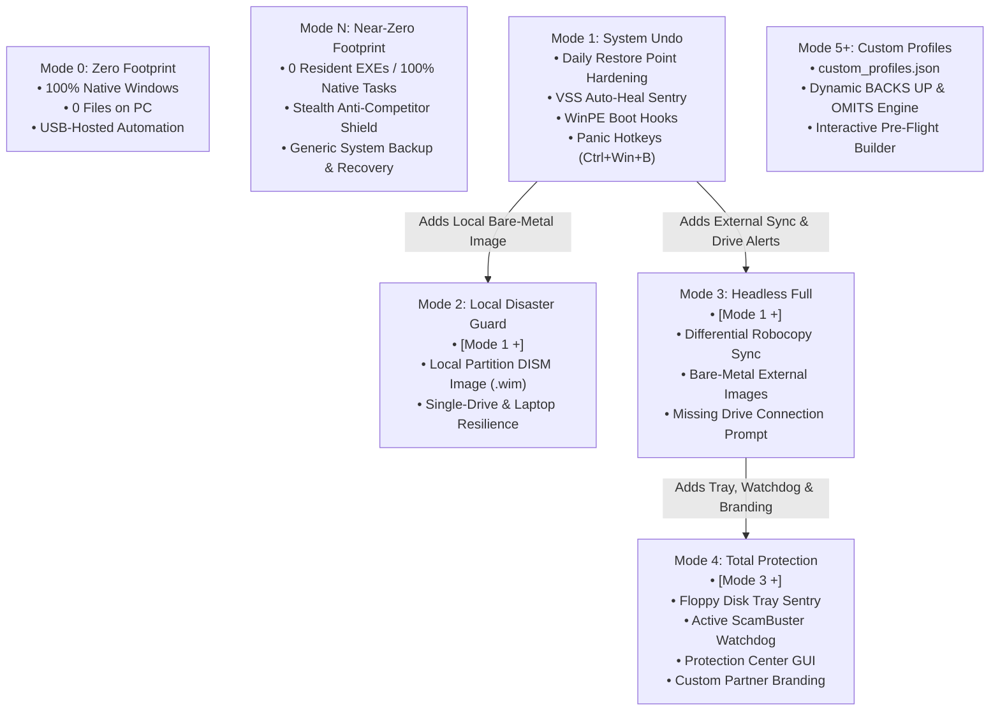

# WINBARS Suite Architecture & Design Philosophy

## 1. The Core Philosophy: Coordinator & Hardener, Not Proprietary Black Box

Traditional third-party backup applications invent proprietary, compressed database blobs (e.g. `.tib`, `.spf`, `.bkf`, `.qic`). While profitable for software vendors selling annual subscriptions, proprietary formats create severe risks for everyday computer users and technicians:
* **The Subscription Lock-In Trap**: If the subscription lapses or the software becomes incompatible with a new Windows build, the customer's data is trapped.
* **Corrupted Archive Blobs**: If a single block in a multi-gigabyte proprietary image archive is damaged, the entire multi-year archive can fail decompression.
* **Emergency Unavailability**: When a machine fails to boot into Windows, technicians cannot inspect or extract files without specialized live-rescue media loaded with proprietary drivers.

### 🛡️ The WINBARS Solution: Resilient Sentry for Battle-Tested Windows Engines
WINBARS (**Win**dows **B**ackup, **A**ssistance, **R**ecovery and **S**ecurity Suite) coordinates, monitors, and hardens the rock-solid recovery tools already engineered into Microsoft Windows:
* **Robocopy (`robocopy.exe /ZB /MT:8`)**: Standard uncompressed, 1:1 kernel-level file synchronization with restartable backup I/O semantics.
* **Volume Shadow Copy Service (`vssadmin` / WMI `Win32_ShadowCopy`)**: Live atomic system snapshots and automated mountpoints for locked database mirroring.
* **DISM (`dism.exe /Capture-Image`)**: Native Windows Image Format (`.wim`) bare-metal captures compatible with standard WinPE / Windows Setup USBs.
* **Registry Recovery (`reg.exe save`)**: Direct atomic hive extraction for offline BSOD recovery.
* **BitLocker (`manage-bde.exe`)**: Native hardware-accelerated volume encryption with automated key vaulting.
* **Windows Recovery Environment (`reagentc.exe`)**: Blue-screen boot menu integration for offline self-service restoration.

### 🔍 Enterprise Auditability & The Tamper-Proof Packaging Principle

Power users and enterprise system administrators frequently express healthy cynicism toward third-party closed binaries running under elevated `SYSTEM` authority. WINBARS directly addresses this through two foundational architectural principles:

1. **Auditability Over Secrecy (Transparent Host Footprint)**:
   While the orchestrator is compiled to protect binary integrity and ensure turnkey execution, **the tasks, scripts, and recovery paths it configures on the host PC are completely transparent and non-proprietary**:
   * **Task Scheduler Transparency**: All automated routines are registered under `\WindowsBackup\` using standard Task Scheduler definitions executing standard Windows binaries (`robocopy.exe`, `wbadmin.exe`, `powershell.exe`). Technicians can inspect every trigger, user principal, and parameter directly in `taskschd.msc`.
   * **Plaintext Scripting on Backup Media**: All auxiliary runner scripts (`Run-ZeroFootprintSync.ps1`, `Run-ManualTask.ps1`, `Toggle_Backup_Drive_Visibility.bat`) generated on the backup drive reside in 100% human-readable plaintext.
   * **No Hidden Drivers or Background Daemons**: WINBARS installs zero proprietary kernel-mode filter drivers, zero background services, and zero network telemetry agents.
   * **Open File Structure**: Backups are stored in 1:1 uncompressed NTFS folder hierarchies with a 30-day safety recycle bin (`_DeletedArchive`), inspectable in standard File Explorer without any specialized software.

2. **The "Tamper-Proof" Bench Appliance Angle**:
   * When deployment solutions rely on exposed raw `.ps1` or `.bat` script files stored in host directories, support benches experience high failure rates caused by well-meaning end users or junior technicians who open scripts to "tweak" a setting, accidentally damage quotation marks, corrupt variables, or encounter PowerShell `ExecutionPolicy` restrictions (`Restricted`, `AllSigned`).
   * Packaging WINBARS as a standalone compiled executable (`WINBARS.exe`) transforms the suite into an immutable appliance. It prevents accidental client tampering, guarantees that critical disaster recovery automation cannot be casually broken, and ensures uniform execution across heterogeneous Windows client environments.

> 🔍 **Complete Specification**: For a line-item inventory of registered tasks, filesystem paths, registry modifications, and a 60-second verification guide, see the [System Footprint & Security Audit Blueprint](SYSTEM_FOOTPRINT.md).

---

## 2. Advanced Resiliency Subsystems

### A. Live Robocopy via Frozen VSS Volume Shadow Copy Mount
* **The Locked-File Challenge**: While `robocopy /ZB` uses Windows backup privilege tokens to bypass NTFS discretionary ACLs, it cannot bypass exclusive write locks held by running applications (e.g., active Outlook `.pst`/`.ost` archives, live browser SQLite databases like Chrome/Edge `History` and `Cookies`, accounting databases, and hypervisor virtual disk `.vhdx` files).
* **Automated VSS Mount Architecture (`mklink /D`)**: When running with administrative or `SYSTEM` authority, WINBARS creates a temporary Volume Shadow Copy via WMI `Win32_ShadowCopy` and attaches a symbolic junction (`mklink /D "C:\ProgramData\WINBARS\VssMount_<id>" "\\?\GLOBALROOT\Device\HarddiskVolumeShadowCopyX\"`).
* **Clean Point-in-Time Reads**: The Robocopy mirror reads strictly from the frozen snapshot volume. Every open database, locked configuration, and in-use store is captured in a 100% consistent state with zero locked-file errors.
* **Deterministic Cleanup**: Upon mirror completion, the junction directory is removed via `rmdir` (leaving snapshot files intact) and the temporary shadow copy is cleanly released. If VSS is disabled or unsupported, the engine falls back gracefully to live `/ZB` mirroring.

### B. Native VSS COM Subsystem Self-Repair & Provider Negotiation
* **The Third-Party COM Corruption Problem**: Uninstalled or expired third-party backup tools (Acronis, Macrium, Veeam) frequently leave broken COM provider registrations under `HKLM:\SYSTEM\CurrentControlSet\Services\VSS\Providers`, causing Windows native VSS coordinator to fail with `0x80042306 (VSS_E_PROVIDER_VETO)`.
* **In-Memory COM Self-Healing (`Repair-WinbarsVssSubsystem`)**: When a snapshot creation fails, WINBARS stops the VSS service, re-registers core native Windows DLLs (`ole32.dll`, `oleaut32.dll`, `vss_ps.dll`, `swprv.dll`) using `regsvr32.exe /s`, and restarts the service.
* **Secondary Fallback**: If VSS is permanently disabled by policy, WINBARS falls back seamlessly to Robocopy restartable mode (`/ZB` using `SeBackupPrivilege`).

### C. Remote SMB / UNC & Cloud Canary Mirroring
* **Network & Cloud Storage Target Protection**: For backups targeting NAS appliances (`\\Server\Share`) or cloud mounts (S3/B2 via rclone), WINBARS deploys `.winbars_remote_canary.sha256` containing cryptographically hashed tokens.
* **Tamper-Evident Read Verification**: Unbuffered reads verify token integrity before and after sync passes.
* **Automated Network Isolation**: If the remote canary fails verification, WINBARS immediately unbinds the network session (`net use \\Server\Share /delete /y`), isolating the network share before ransomware can traverse the SMB credential cache.

### D. Conflict-Safe Smart Swap & Race Condition Shield
* **Bi-Directional USB Editing**: When users edit documents directly on the portable backup drive, WINBARS detects the newer timestamp upon connection.
* **Active File-In-Use Detection**: Prior to moving or replacing any file on the PC, WINBARS performs an active kernel file-sharing test (`[System.IO.File]::Open` checking for sharing violations).
* **Race Condition Prevention**:
  * **If Document Is Open/Locked on PC**: If the user left the document open in Word, Excel, or another program on the PC while modifying a copy on the USB, WINBARS **never overwrites or moves the live document**. Instead, it generates a machine-name and timestamped conflict copy alongside it:
    `FileName (Conflict from USB - <COMPUTERNAME> - YYYY-MM-DD_HHmmss).ext`, logs a warning, and issues a Windows Toast alert.
  * **If Document Is Closed**: The older PC copy is safely archived with machine identity as:
    `FileName (Older PC Copy - <COMPUTERNAME> - YYYY-MM-DD).ext` and mirrored into `_DeletedArchive`, before promoting the newer USB file to active and redirecting Windows Recent shortcuts.

---

## 3. External Storage Layout (`D:\`)

```
External Backup Drive (e.g. D:\)
│
├── Users\                              <-- 1:1 uncompressed replica of C:\Users
│   ├── <Username>\Documents\
│   ├── <Username>\Desktop\
│   └── Public\
│
├── _DeletedArchive\                    <-- 30-day safety recycle bin for modified/deleted files
│   └── YYYY-MM-DD\
│
├── Backup_Logs\
│   ├── Sync_History.log                <-- Historical mirror and Smart Swap execution logs
│   ├── Run-ZeroFootprintSync.ps1       <-- Standalone native scheduled task runner
│   ├── Boot_Rescue\
│   │   └── Latest\
│   │       ├── BCD_Backup              <-- Atomic binary BCD hive export
│   │       ├── BCD_Configuration_Audit.txt <-- Plaintext bootloader ledger
│   │       └── Restore_BCD_WinPE.bat   <-- 1-click WinRE bootloader repair script
│   └── Registry_Snapshots\
│       └── Latest\
│           ├── SYSTEM, SOFTWARE, SAM... <-- Offline registry hives
│           └── Restore_Registry_WinPE.bat <-- 1-click WinRE emergency rollback script
│
├── BitLocker_Recovery_Key.txt          <-- 48-digit numerical recovery passwords
├── Toggle_Backup_Drive_Visibility.bat  <-- 1-click Explorer cloaking/uncloaking script
└── README_RECOVERY.txt                 <-- Plain-text restoration and disaster recovery guide
```

---

## 4. Cryptographic & Security Specifications

| Subsystem | Algorithm / Protocol | Implementation Details |
| :--- | :--- | :--- |
| **White-Label Brand Tokens** | RSA-2048 Digital Signature | SHA-256 digital signature verification tied to Company Name. Enables store owners to customize dialog copy, phone numbers, and links while permanently locking branding to verified shop identity. |
| **Scam Buster Emergency Guard** | Win32 Process Control + IAudioSession | Closes runaway rogue browser tabs, clears session restart loops across 25+ browsers, and mutes browser audio sessions via Windows Core Audio endpoint APIs. |
| **OneDrive Scareware Defusal** | Group Policy & Registry Control | Blocks Known Folder Move takeover prompts (`KFMBlockOptIn = 1`), suppresses Settings & File Explorer 'Not Backed Up' ad banners (`ShowSyncProviderNotifications = 0`), and mutes promotional cloud upsells without impacting legitimate sync. |
| **Ransomware Canary Guard** | SHA-256 Decoy Sentinel | High-entropy decoy file validation (`.winbar_canary.dat`) halting backup passes instantly if honeypot files are altered or encrypted. |
| **Global Hotkey IPC** | Win32 RegisterHotKey / WM_HOTKEY | Non-intrusive message-only window handle (`DeviceChangeWindow`) with zero keyboard hooking or keystroke logging. |

---

## 5. Tiered Cumulative Deployment Architecture & Custom Profile Engine

WINBARS structures system deployment into a 6-profile architecture (Modes 0, N, 1, 2, 3, 4) plus dynamically calculated Custom Profiles (Mode 5+).



### A. Cumulative Tiering Specifications
1. **Mode 0 (`ZeroFootprint`)**:
   - Designed for technicians and MSPs servicing customer machines where no resident files may remain on `C:\`.
   - Automated via native Task Scheduler tasks in `\WindowsBackup\`.
   - Runner scripts and logs reside exclusively on the external drive (`D:\Backup_Logs\`).
   - Zero shortcuts, zero background services, zero registry branding.
2. **Mode N (`NearZeroFootprint`)**:
   - The **"Anti-Competitor Stealth Shield"** engineered for corporate clients and sensitive commercial accounts.
   - Installs **0 resident EXEs/background daemons**, operating entirely through native Windows Task Scheduler tasks (`\WindowsBackup\`).
   - Conceals WINBARS branding completely: backups route to `E:\WindowsBackup\`, Start Menu folder is generically named `System Backup & Recovery`, and standard 2 desktop shortcuts use generic titles (`Backup Personal Files` [Purple Floppy] and `Windows System Restore` [Blue Floppy]).
   - Restores with 100% native Windows tools: Explorer drag-and-drop / Robocopy for user files, `rstrui.exe` for System Restore, and WinRE (`shutdown.exe /r /o /t 0`) for bare-metal image restoration.
   - Protects your technician toolchain from predatory competitor MSPs attempting to audit and poach client accounts.
3. **Mode 1 (`SystemUndo` / `Minimal`)**:
   - The rapid OS rollback foundation.
   - Configures unthrottled daily Windows System Restore checkpoints and auto-heals VSS writer errors.
   - Injects offline WinPE boot recovery hooks and enables the emergency panic hotkey (`Ctrl+Win+B`, fallback `Ctrl+Alt+B`).
   - Near-zero resource consumption (< 5 MB RAM, on-demand execution).
4. **Mode 2 (`LocalDisasterGuard`)**:
   - Extends Mode 1 for computers without dedicated external backup drives (e.g. mobile laptops).
   - Captures monthly bare-metal DISM system images (`.wim`) to a local secondary drive or hidden partition.
5. **Mode 3 (`HeadlessFull`)**:
   - Extends Mode 1 for workstations with external backup drives requiring silent operation with zero desktop clutter.
   - Performs daily differential Robocopy personal file mirrors and scheduled bare-metal images.
   - Raises desktop alerts if the scheduled external backup drive is missing or disconnected.
6. **Mode 4 (`TotalProtection` / `FullInteractive`)**:
   - Extends Mode 3 into a complete interactive managed workstation suite.
   - Adds the dynamic Floppy Disk Tray monitor, active ScamBuster browser trap & remote tool watchdog, Protection Center GUI (`Ctrl+Win+W`), and organization partner branding.

### B. Dynamic Profile Calculation Engine (`custom_profiles.json`)
Custom profiles (Modes 5+) are stored in `custom_profiles.json` (at script root on USB drives or `$env:ProgramData\WINBARS\custom_profiles.json` on host machines).

The engine dynamically evaluates component flags (`UserData`, `SystemImage`, `RestorePoint`, `VSSHeal`, `WinRE`, `DrivePrompt`, `Hotkeys`, `Watchdog`, `Tray`, `Branding`) and automatically computes:
* **`BACKS UP:`** Human-readable summary of active backup targets.
* **`OMITS:`** Transparent audit of omitted features and unconfigured sentinels.
* **`NOTE:`** Real-time status of WinPE hooks, emergency panic hotkeys, and missing drive alerts.

### C. Pre-Flight Quick Defaults Engine
When selecting any profile (0–4 or 5+) in the CLI, WINBARS displays the instant **Pre-Flight Review Screen**:
* **Press `[ENTER]`**: Deploys immediately with hardened defaults.
* **Press `[1-9]`**: Toggles individual components in memory before deployment.
* **Press `[C]`**: Evaluates and switches target storage drive letters.
* **Press `[S]`**: Saves current toggle configuration as a new custom profile in `custom_profiles.json`.
* **Press `[M]`**: Opens the Custom Profile Manager to Add, Edit, Delete, or edit JSON directly in Notepad.

---

## 6. Technician Customer Persona Cheat Sheet (3-Second Decision Matrix)

| Profile | Customer / Machine Persona | Real-World Technician Scenario & Why It Fits |
| :--- | :--- | :--- |
| **Mode 0: `ZeroFootprint`** | **Strict Corporate Audits & MSP Sterile Compliance** | Corporate clients or regulated workstations where security policy strictly forbids leaving any third-party files or scripts on `C:\`. The entire runner script and logs reside on the technician's external drive. |
| **Mode N: `NearZeroFootprint`** | **Corporate Clients & Anti-Competitor Stealth Shield** | Corporate clients or businesses burned by prior IT competitors. You want recurring automation without revealing WINBARS to competing IT shops who might try to poach the account. **Zero background EXEs**, native Task Scheduler jobs (`\WindowsBackup\`), generic external folder (`E:\WindowsBackup\`), and generic shortcuts (`System Backup & Recovery`). Restores via native Explorer & WinRE. |
| **Mode 1: `SystemUndo`** ⏪ | **Standard Bench Tune-Ups & Routine Warranty Service** | **The Universal Service Warranty Baseline**: Designed for standard bench tune-ups and hardware repairs. Hardens Windows' native recovery engines (unthrottles restore point frequency, locks 10% VSS shadow storage headroom, and enables native RegBack) with an optional baseline image. Operates with **zero third-party resident binaries and zero shortcuts**, delivering dependable rollback protection without introducing software overhead. |
| **Mode 2: `LocalDisasterGuard`** 💽 | **Road Warriors, Students & Mobile Laptops** | Traveling sales reps and laptop users who rarely plug in an external drive, but *want* on-demand desktop recovery shortcuts. Configures recurring monthly bare-metal DISM system images (`.wim`) to a local recovery partition with desktop suite integration and emergency hotkeys. |
| **Mode 3: `HeadlessFull`** | **Silent Workstations, Accounting & Medical Clinics** | Production office environments (CPA firms, dental clinics, law offices) with dedicated external hard drives. Runs full daily Robocopy sync and bare-metal imaging 100% silently in the background with zero desktop clutter or user prompts—alerting only if the drive is unplugged. |
| **Mode 4: `TotalProtection`** | **Seniors, VIPs & Scam-Prone Non-Technical Clients** | Grandparents, non-technical clients, or high-value VIPs frequently targeted by browser pop-ups, fake virus sirens, and phone support scammers. Features the Floppy Disk Tray icon, active real-time ScamBuster and Remote Tool Interceptor (`[STOP] Disconnect & Block`), live GUI Protection Center, and your shop's emergency support hotline branding. |
| **Mode 5+: `Custom Profiles`** | **Specialized Enterprise & Boutique Deployments** | Tailored multi-drive configurations, specialized network shares, or specific retention tiers configured via `custom_profiles.json` or the Pre-Flight interactive builder. |

---

## 7. Intelligent Drive Sizing, Low Space Protection & Floppy Icon Roles

### A. Dynamic System-Derived Storage Sizing & USB Insertion Filter
* **Real System Capacity Calculation**: Rather than relying on static arbitrary thresholds, WINBARS inspects the actual machine's disk footprint during Preflight, deployment, and daily runs:
  * **User Files Footprint**: Measured from `C:\Users` + AppData stores with 25% growth buffer for 30-day `_DeletedArchive` retention.
  * **Bare-Metal System Image**: Calculated as `(Used Space on C: * 0.60) + 15 GB` headroom.
  * **Storage Requirements Cache (`storage_requirements.json`)**: Persisted in `C:\ProgramData\WINBARS\storage_requirements.json` (and `C:\ProgramData\SystemBackup\` in Mode N) containing `UserDataGB`, `SingleSystemImageGB`, `ExternalTotalRequiredGB`, and `RecommendedDriveTierGB`.
* **Zero-Nag USB Insertion Sentry**:
  * When an external USB drive is plugged in, the C# tray sentry immediately reads the cached requirements.
  * Any drive with total capacity or free space less than the real machine requirement is **silently ignored** without prompting.
  * Drives with sufficient capacity trigger a prompt with a bold safety guarantee:
    > *"🛡️ SAFE & NON-DESTRUCTIVE: WINBARS creates a separate backup folder on this drive. It will NEVER format your drive, and will NEVER delete or modify other files on it."*
* **Low Space Warning Guard**: If target free space drops below **15%** or **15 GB**, WINBARS raises Action Center balloon alerts and logs warnings before backups begin.

### B. Visual Floppy Disk Roles
* 🔵 **Classic Blue Floppy (`app.ico`)**: The command and status symbol representing the **WINBARS Protection Center Hub**, Suite Manager, and Windows System Restore.
* 🟣 **Signature Purple Floppy (`app_backup.ico`)**: The action-oriented sync symbol representing an active or on-demand **Backup Personal Files** data mirror pass.

---

## 8. Tabbed Settings Console, Active Profile Intelligence & Multi-Destination Management

The **Settings & Protection Console** serves as the central configuration and governance interface across all deployment modes:

### A. Dynamic Profile Intelligence & Header Badge
* **Profile Awareness**: The dialog dynamically inspects `DeploymentProfile` from `config.json` and renders an active status badge at the top:  
  `🛡 Active Profile: Mode X — ProfileName` (e.g. `Mode 4 — Total Protection (Full Sentry + Tray)`).
* **Mode 0 & Mode N Compliance Guardrail**: In Zero-Footprint modes, the Tray Sentry checkbox is disabled and grayed out:
  `🔒 Zero-Footprint Mode: Tray sentry disabled to preserve 0 host files.`
  This prevents accidental resident file installation when launched interactively from USB.
* **Mode 3 ↔ Mode 4 Seamless Profile Bridge**:
  * Checking `[✔] Show System Tray Icon` in Mode 3 (`HeadlessFull`) promotes the profile in `config.json` to Mode 4 (`TotalProtection`).
  * Unchecking the tray icon in Mode 4 cleanly demotes the profile to Mode 3 (`HeadlessFull`).
* **Mode 1 & Mode 2 File Sync Elevation**:
  * If a user in Mode 1 (`SystemUndo`) or Mode 2 (`LocalDisasterGuard`) adds an external destination in the Disk Management tab, WINBARS prompts to enable daily personal file synchronization and elevates the profile to Mode 4 (or Mode 3 if headless), immediately activating Task 2 scheduler triggers via `-Action UpdateTriggers`.

### B. Multi-Destination Disk Management & Guardrails
* **Arbitrary Drive Letters & Paths**: Supports standard drive letters (`E:`) and custom folder targets (`E:\Backups`).
* **1-Drive Minimum Guardrail**: Standard users cannot delete the final remaining backup destination, preventing accidental loss of backup protection.
* **Technician Override**: Technicians in Tech Mode (or via `-RemoveBackupDrive <Path> -Force`) can remove all drives when decommissioning hardware.
* **Silent Bare-Metal Local Fallback (`C:\SystemImages`)**: If no external backup drive is attached during a scheduled DISM pass, the image is cleanly captured to `C:\SystemImages` without raising false-alarm warning toasts.

### C. 1-Click Action Clarity: "Backup My Files Now"
* The primary 1-click action is explicitly labeled:
  ```text
  ▶  Backup My Files Now
  ⚡ 1-Click: Mirrors Personal Files + Checkpoint
  ```
  with tooltip: `⚡ 1-Click Backup: Creates System Checkpoint (Restore Point) and mirrors personal files to your backup drive.`
* Eliminates ambiguity between personal file mirrors, system checkpoints (restore points), and full bare-metal DISM system images.

---

## 9. Runner Location Shift, Dynamic Profile Storage & Visual Progress Architecture (v0.8.0)

### A. Intelligent Runner Location Shift & Execution Handoff
* **The Transient Media Dilemma**: Technicians frequently plug in a USB flash drive or copy `WINBARS.exe` to the Desktop to run a manual backup or trigger maintenance on a machine where WINBARS was already previously installed to `C:\Tools\WINBARS`. If background tasks or sentries are launched from that transient path, they depend on removable drive letters that disappear when the technician unplugs their drive.
* **Autonomous Execution Handoff**: `Resolve-SuiteRunnerContext` automatically identifies if the running executable is outside `C:\Tools\WINBARS` while `C:\Tools\WINBARS\WINBARS.exe` exists:
  * **Automated & Scheduled Invocations**: Tasks invoked via `-Action`, `-Tray`, `-AutoHeal`, or `-Unattended` silently transfer execution to `C:\Tools\WINBARS\WINBARS.exe` with all arguments intact, exiting the transient process immediately.
  * **Interactive Invocations**: Displays a 1-click Location Shift Pivot banner offering to Shift execution to `C:\Tools\WINBARS`, Update the local installation with the USB version, or Continue portably.
  * **Task Scheduler Anchoring**: `Install-SuiteTasks` explicitly registers tasks pointing to `C:\Tools\WINBARS\WINBARS.exe`, ensuring scheduled routines never point to removable drives.

### B. Dynamic Profile Storage Destination Resolution
* **Full Transparency on Data & Image Landings**: `Get-ProfileStorageDestinations` resolves where User Data (`Robocopy` mirror) and Bare-Metal System Images will be stored across each deployment profile:
  * **Stored Configurations**: Any explicit paths configured in `config.json` (`DataBackupPath`, `ImageBackupPath`, `PreferredExternalDriveLetter`) are surfaced and tagged `[Configured]`.
  * **Auto-Guessed Storage Fallback**: Unconfigured targets scan attached external drives and secondary physical partitions, displaying true free and total space with an `[Auto-Detected]` tag.
  * **Omitted Component Flags**: System Undo (Mode 1) and single-drive configurations accurately report omitted components (`[Omitted]`).
* **Pre-Flight Inline Customization**: The interactive profile builder (`Invoke-ProfilePreFlightMenu`) exposes direct single-key shortcuts to adjust paths prior to deployment:
  * `[C]` Change Target Storage Drive
  * `[D]` Adjust User Data Target Folder
  * `[I]` Adjust Bare-Metal Image Target Folder
  * `[F]` Launch Source Folders & User Profile Picker (`Show-FolderSelectionMenu`)

### C. Unified Dual-Progress Bar & Context-Aware Morphing Quick Bar
* **Dual-Progress Metric Synchronization**: Both the standalone dialog and the floating quick bar utilize a unified dual-progress architecture:
  * **Overall Progress (0–100%)**: Tracks macro lifecycle phases (Preflight -> Checkpoint -> Personal Files -> App Manifests -> Hardware Diagnostics).
  * **Step Progress (0–100%)**: Visualizes micro step throughput, active file transfer counts, and transfer rates.
  * **Cancellation Abort (`[X] Cancel`)**: Provides an immediate safe abort mechanism setting `active_backup.json` status to `"canceled"`.
* **Context-Aware Floating Quick-Action Bar**:
  * **Idle Mode**: Displays 5 instant action buttons (`Backup Files`, `Restore`, `Checkpoint`, `Scam Buster`, `Remote Support`) with crisp emoji rendering (`Segoe UI Emoji` / `Segoe UI Symbol`).
  * **Active Mode**: Transforms in real time into a live dual-progress bar monitor reading `active_backup.json` every 500ms, defensively locking out concurrent backup triggers.
* **Tray Sentry Single vs. Double-Click Debouncing**:
  * A 220ms timer separates single-click (toggles floating quick bar) from double-click (opens the System Health Info Card flicker-free).

### 5.4 Drive Capacity Warning & Sizing Guardrails

```
[External Drive Attached]
           │
           ▼
    Free Space Check
    ├── Free Space < 2.0 GB ──────> HALT: Physical Corruption Floor Safety Stop
    │
    ├── Free Space >= 25.0 GB ────> PASS: Baseline Backup Guaranteed (Never 'Too Small')
    │
    └── New Drive (Free Space < 25 GB & < reqUserGB)
           │
           ├── EnableDriveCapacityWarnings == True ──> Log WARN, Drop [!] BACKUP_DRIVE_TOO_SMALL.txt, Send Toast
           └── EnableDriveCapacityWarnings == False ─> Log INFO (Suppressed), Proceed Safely
```

* **Storage Configuration Keys** (`config.json` -> `StorageAndHardware`):
  * `EnableDriveCapacityWarnings` (bool, default `true`): Master switch for low space toasts and capacity alarm files.
  * `LowSpaceWarningThresholdGB` (int, default `15`): Threshold under which low space alerts are generated.
  * `AutoSizingBufferPercent` (int, default `25`): Safety buffer percentage added to dynamic storage estimates.

---

## 6. B-A-R-S Modular Engine & Zero-Dependency Bundling (`v0.9.0`)

Beginning in `v0.9.0`, WINBARS decomposed its legacy single-file script into a clean domain-driven architecture under `src/`:

```
src/
├── core/                  # Suite context, privilege escalation, JSON configuration, deployment profiles
│   ├── 00-ParamBlock.ps1
│   ├── Suite-Context.ps1
│   ├── Logging.ps1
│   ├── Config.ps1
│   ├── Deployment-Profiles.ps1
│   └── Shortcuts-Startup.ps1
├── backup/                # [B] Storage discovery, VSS engine, File History, System Images, manifests
│   ├── Storage-Drive.ps1
│   ├── FileHistory.ps1
│   ├── Vss-Engine.ps1
│   ├── SystemImage.ps1
│   └── Manifest-Exporter.ps1
├── assistance/            # [A] Sizing advisor, Quick Assist integration, diagnostics, cloud shields
│   ├── StorageAdvisor.ps1
│   ├── QuickAssist.ps1
│   ├── Diagnostics.ps1
│   └── Alerting-Webhook.ps1
├── recovery/              # [R] VSS restore points, BCD repair, disaster recovery orchestration
│   ├── RestorePoint.ps1
│   └── DisasterRecovery.ps1
├── security/              # [S] Canary guard ransomware tripwires, Scam Buster ad killer, auto-heal
│   ├── Canary-Guard.ps1
│   ├── ScamBuster.ps1
│   └── AutoHeal.ps1
├── gui/                   # Windows Forms Floppy Tray Sentry, Toast notifications, progress bars
│   ├── TraySentry.ps1
│   ├── tray_code.cs
│   ├── Toasts.ps1
│   └── ProgressWindow.ps1
└── cli/                   # Technician interactive console, setup wizard, CLI command dispatcher
    ├── Console-Menu.ps1
    └── Dispatcher.ps1
```

### Key Architectural Tenets of the Modular Engine:
1. **Zero External Runtime Dependencies**:
   While developed modularly under `src/`, `tools/bundle.ps1` deterministically concatenates and injects embedded C# code into a single monolithic `WINBARS.ps1` with strict AST verification and UTF-8 BOM headers. This script is compiled via PS2EXE into the standalone `WINBARS.exe`.
2. **Dual-Repository Separation**:
   - **Private Source Repository (`remarkablepc/WINBARS-src`)**: Contains all 25 modular source files, bundlers, and regression test harnesses.
   - **Public Release Repository (`remarkablepc/WINBARS`)**: An isolated, sterile repository generated under `dist/` containing only standalone binaries (`WINBARS.exe`), turnkey `.bat` launchers, configuration schemas, and public documentation. Enforced by an unbypassable sterility audit (`Publish-GithubRepos.ps1`).
3. **Turnkey Launcher Wrappers**:
   Technicians can deploy any profile with 0 to 2 keystrokes using dedicated `.bat` launchers (`Install-Mode0-ZeroFootprint.bat` through `Install-Mode4-TotalProtection.bat`), completely eliminating syntax errors or UAC friction in the field.

